Lab 1: Exploratory Data Analysis
================
Paul Nguyen

------------------------------------------------------------------------

#### Exercise 1

``` r
library(MASS)
?Boston
head(Boston)
```

    ##      crim zn indus chas   nox    rm  age    dis rad tax ptratio  black
    ## 1 0.00632 18  2.31    0 0.538 6.575 65.2 4.0900   1 296    15.3 396.90
    ## 2 0.02731  0  7.07    0 0.469 6.421 78.9 4.9671   2 242    17.8 396.90
    ## 3 0.02729  0  7.07    0 0.469 7.185 61.1 4.9671   2 242    17.8 392.83
    ## 4 0.03237  0  2.18    0 0.458 6.998 45.8 6.0622   3 222    18.7 394.63
    ## 5 0.06905  0  2.18    0 0.458 7.147 54.2 6.0622   3 222    18.7 396.90
    ## 6 0.02985  0  2.18    0 0.458 6.430 58.7 6.0622   3 222    18.7 394.12
    ##   lstat medv
    ## 1  4.98 24.0
    ## 2  9.14 21.6
    ## 3  4.03 34.7
    ## 4  2.94 33.4
    ## 5  5.33 36.2
    ## 6  5.21 28.7

There are 506 rows and 14 columns in this dataset. Each row represents one town, and each column represents a different variable.

#### Exercise 2

``` r
data(Boston)
library(ggplot2)
Boston1 <- Boston
plot(x = Boston1$dis, y = Boston1$tax, xlab = "Distance to Businesses", ylab = "Property Tax per $10,000", col = "purple1")
```

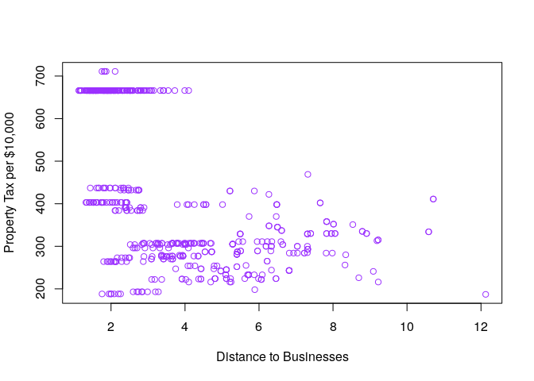

``` r
ggplot(Boston1, aes(x = dis, y = tax)) +
  geom_point(alpha = .6, color = "purple2")
```

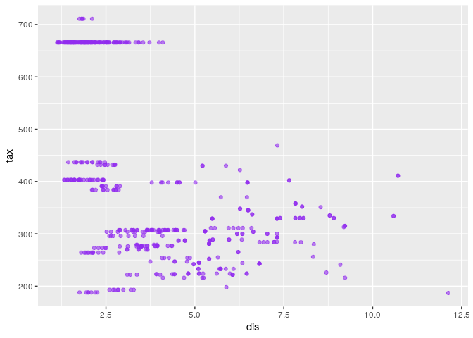

``` r
plot(x = Boston1$crim, y = Boston1$tax, xlab = "Per Capita Crime Rate", ylab = "Property Tax per $10,000", col = "purple2")
```

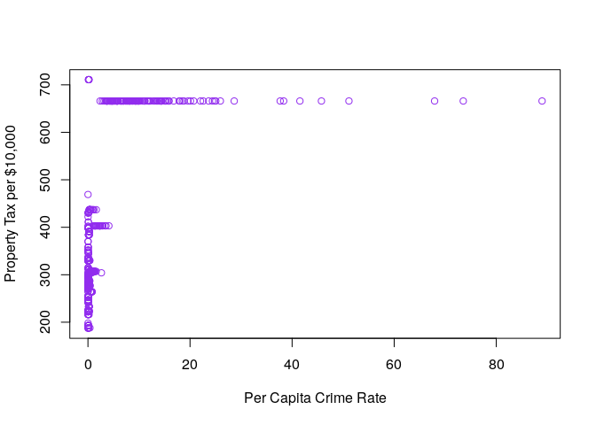

``` r
plot(x = Boston1$black, y = Boston1$ptratio, xlab = "Black Population", ylab = "Pupil to Teacher Ratio", col = "purple3")
```

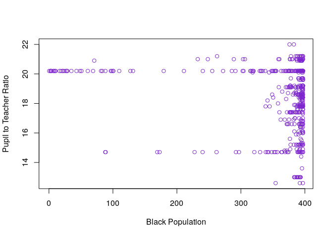

``` r
library(dplyr)
```

    ## 
    ## Attaching package: 'dplyr'

    ## The following object is masked from 'package:MASS':
    ## 
    ##     select

    ## The following objects are masked from 'package:stats':
    ## 
    ##     filter, lag

    ## The following objects are masked from 'package:base':
    ## 
    ##     intersect, setdiff, setequal, union

``` r
Boston2 <- Boston1 %>%
  mutate(blackprop = (((black/1000)^(.5))+.63))

library(ggplot2)
ggplot(data = Boston1, mapping = aes(x = medv, y = crim)) +
  geom_point(alpha = .6, col = "purple2")
```

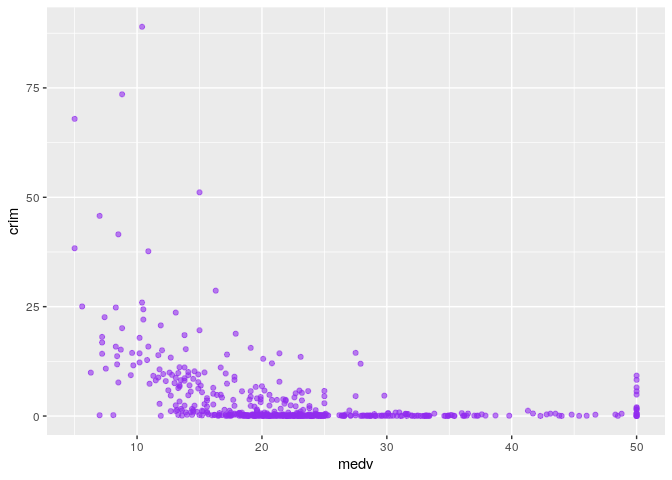

``` r
ggplot(Boston1, aes(x = black, y = ptratio)) +
  geom_point(alpha = .6, col = "purple2")
```

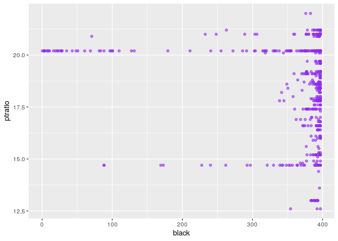

``` r
ggplot(Boston1, aes(x = crim, y = tax)) +
  geom_point(alpha = .7, col = "plum")
```

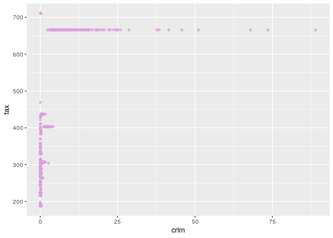

Some things I found through the making of these graphs: From the first ggplot, it seems that as the median value of owner occupied homes (medv) goes up, we see that the crime rate decreases until the very end where the values reach around 50k. Finally, in the last ggplot, we compare property tax to crime rates. It seems in the majority of towns, the property tax is below 5,000,000, and for these towns, the crime rate is relatively low. However, once we reach the 6,500,000 mark, the crime rate increases. The towns stay at a little bit above $6,500,000, but different towns have different crime rates around here, and they have a pretty wide range. Note: I had a graph or two that had the variable "black", but I don't feel comfortable trying to extract a meaning from these graphs because I do not understand how they derived "black" from the proportion of black people by town. I tried to reverse engineer the proportion of black people from the equation they gave "1000(Bk - 0.63)^2 where Bk is the proportion of blacks by town.", but my proportions ended being over 1 in my Boston2 Data. I can say that when the variable black started hiting the ~320 mark, the pupil to teacher ratio started to branch out from the 20 that it was stuck at for a while.

#### Exercise 3

``` r
ggplot(data = Boston1, aes(x = zn, y = crim)) + 
  geom_point(color = "purple2", alpha = .7) +
  xlab ("prop of residential land zoned for large lots") +
  ylab ("crime")
```

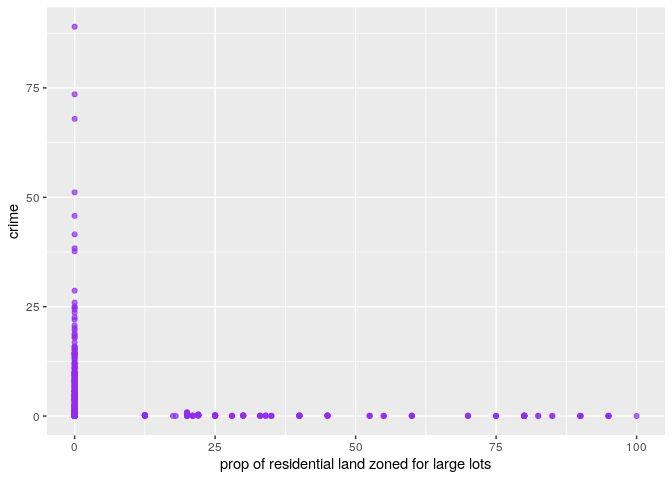

``` r
ggplot(data = Boston1, aes(x = indus, y = crim)) + 
  geom_point(color = "purple2", alpha = .7) +
  xlab ("prop of non retail business") +
  ylab ("crime")
```

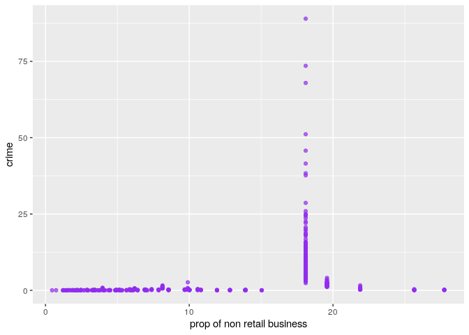

``` r
ggplot(data = Boston1, aes(x = chas, y = crim)) + 
  geom_point(color = "purple2", alpha = .7) +
  xlab ("Nearby Charles River?") +
  ylab ("crime")
```

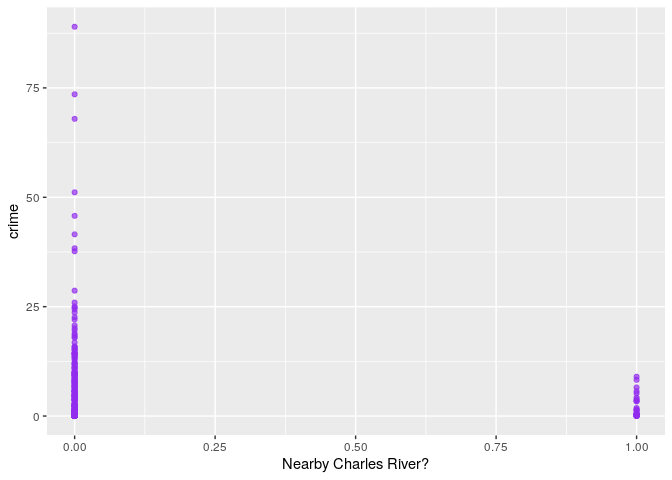

``` r
ggplot(data = Boston1, aes(x = nox, y = crim)) + 
  geom_point(color = "purple2", alpha = .7) +
  xlab ("nitrous oxides concentration") +
  ylab ("crime")
```

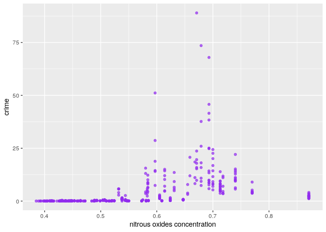

``` r
ggplot(data = Boston1, aes(x = rm, y = crim)) + 
  geom_point(color = "purple2", alpha = .7) +
  xlab ("rooms per dwelling") +
  ylab ("crime")
```

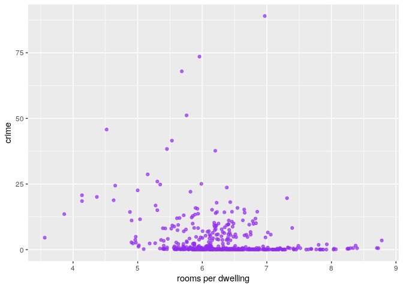

``` r
ggplot(data = Boston1, aes(x = age , y = crim)) + 
  geom_point(color = "purple2", alpha = .7) +
  xlab ("prop houses built before 1940") +
  ylab ("crime")
```

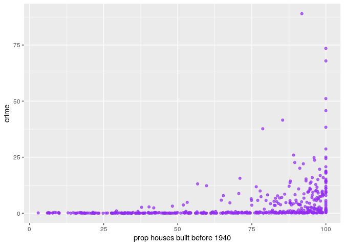

``` r
ggplot(data = Boston1, aes(x = dis, y = crim)) + 
  geom_point(color = "purple2", alpha = .7) +
  xlab ("distance to businesses") +
  ylab ("crime")
```

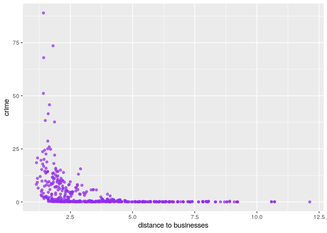

``` r
ggplot(data = Boston1, aes(x = rad, y = crim)) + 
  geom_point(color = "purple2", alpha = .7) +
  xlab ("accessibility to highways") +
  ylab ("crime")
```

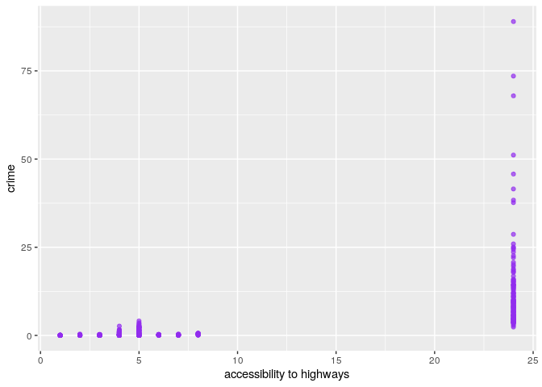

``` r
ggplot(data = Boston1, aes(x = tax, y = crim)) + 
  geom_point(color = "purple2", alpha = .7) +
  xlab ("property tax rate per 10k") +
  ylab ("crime")
```

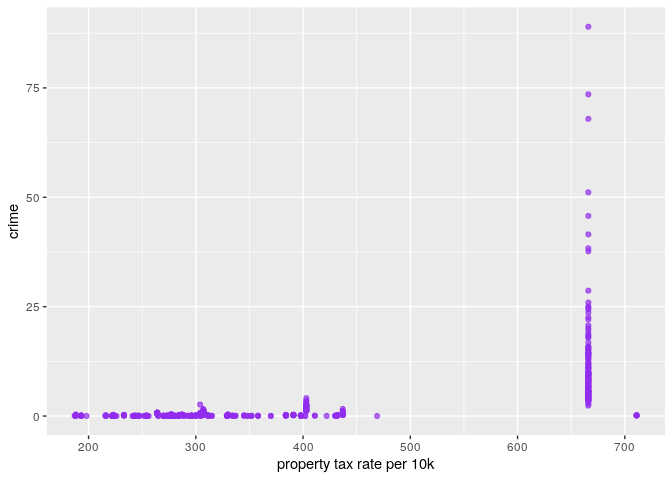

``` r
ggplot(data = Boston1, aes(x = ptratio, y = crim)) + 
  geom_point(color = "purple2", alpha = .7) +
  xlab ("pupil teacher ratio") +
  ylab ("crime")
```

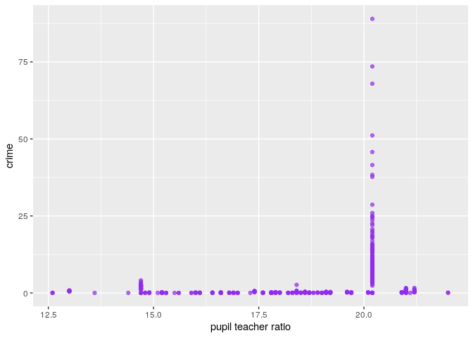

``` r
ggplot(data = Boston1, aes(x = lstat, y = crim)) + 
  geom_point(color = "purple2", alpha = .7) +
  xlab ("lower status of population percent") +
  ylab ("crime")
```

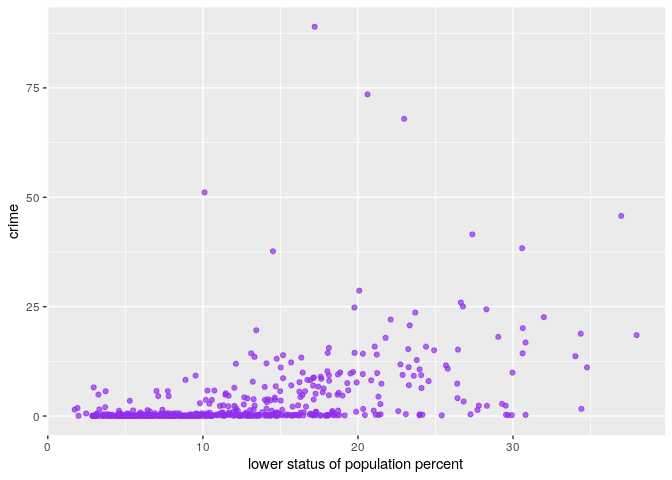

``` r
ggplot(data = Boston1, aes(x = medv, y = crim)) + 
  geom_point(color = "purple2", alpha = .7) +
  xlab ("median home price") +
  ylab ("crime")
```

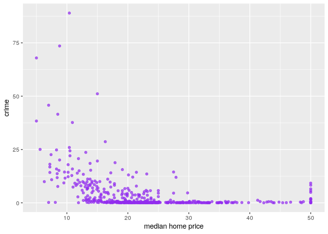

I found that some predictors have a relationship with crime rate. The first one I noticed was nitrous oxides concentration. I noticed that as the concentration increased, the crime rate increased as well. Next, I noticed that when the average rooms per dwelling decreased, crime rate decreased. I also saw that the towns where the houses were more recent had lower crime rates than the towns with a high proportion of houses built before 1940. I also saw distance to businesses being important in regards to crime rate: the closest towns to boston's employment centers had higher crime rates than towns further away. The lower status graph also demonstrated that in towns where more people were considered "lower class", crime rate increased. In my last graph, I saw that higher median home prices are correlated with lower crime rates.

#### Exercise 4

``` r
range(Boston1$crim)
```

    ## [1]  0.00632 88.97620

``` r
arrange(Boston1, desc(crim))
```

    ##         crim    zn indus chas    nox    rm   age     dis rad tax ptratio
    ## 1   88.97620   0.0 18.10    0 0.6710 6.968  91.9  1.4165  24 666    20.2
    ## 2   73.53410   0.0 18.10    0 0.6790 5.957 100.0  1.8026  24 666    20.2
    ## 3   67.92080   0.0 18.10    0 0.6930 5.683 100.0  1.4254  24 666    20.2
    ## 4   51.13580   0.0 18.10    0 0.5970 5.757 100.0  1.4130  24 666    20.2
    ## 5   45.74610   0.0 18.10    0 0.6930 4.519 100.0  1.6582  24 666    20.2
    ## 6   41.52920   0.0 18.10    0 0.6930 5.531  85.4  1.6074  24 666    20.2
    ## 7   38.35180   0.0 18.10    0 0.6930 5.453 100.0  1.4896  24 666    20.2
    ## 8   37.66190   0.0 18.10    0 0.6790 6.202  78.7  1.8629  24 666    20.2
    ## 9   28.65580   0.0 18.10    0 0.5970 5.155 100.0  1.5894  24 666    20.2
    ## 10  25.94060   0.0 18.10    0 0.6790 5.304  89.1  1.6475  24 666    20.2
    ## 11  25.04610   0.0 18.10    0 0.6930 5.987 100.0  1.5888  24 666    20.2
    ## 12  24.80170   0.0 18.10    0 0.6930 5.349  96.0  1.7028  24 666    20.2
    ## 13  24.39380   0.0 18.10    0 0.7000 4.652 100.0  1.4672  24 666    20.2
    ## 14  23.64820   0.0 18.10    0 0.6710 6.380  96.2  1.3861  24 666    20.2
    ## 15  22.59710   0.0 18.10    0 0.7000 5.000  89.5  1.5184  24 666    20.2
    ## 16  22.05110   0.0 18.10    0 0.7400 5.818  92.4  1.8662  24 666    20.2
    ## 17  20.71620   0.0 18.10    0 0.6590 4.138 100.0  1.1781  24 666    20.2
    ## 18  20.08490   0.0 18.10    0 0.7000 4.368  91.2  1.4395  24 666    20.2
    ## 19  19.60910   0.0 18.10    0 0.6710 7.313  97.9  1.3163  24 666    20.2
    ## 20  18.81100   0.0 18.10    0 0.5970 4.628 100.0  1.5539  24 666    20.2
    ## 21  18.49820   0.0 18.10    0 0.6680 4.138 100.0  1.1370  24 666    20.2
    ## 22  18.08460   0.0 18.10    0 0.6790 6.434 100.0  1.8347  24 666    20.2
    ## 23  17.86670   0.0 18.10    0 0.6710 6.223 100.0  1.3861  24 666    20.2
    ## 24  16.81180   0.0 18.10    0 0.7000 5.277  98.1  1.4261  24 666    20.2
    ## 25  15.87440   0.0 18.10    0 0.6710 6.545  99.1  1.5192  24 666    20.2
    ## 26  15.86030   0.0 18.10    0 0.6790 5.896  95.4  1.9096  24 666    20.2
    ## 27  15.57570   0.0 18.10    0 0.5800 5.926  71.0  2.9084  24 666    20.2
    ## 28  15.28800   0.0 18.10    0 0.6710 6.649  93.3  1.3449  24 666    20.2
    ## 29  15.17720   0.0 18.10    0 0.7400 6.152 100.0  1.9142  24 666    20.2
    ## 30  15.02340   0.0 18.10    0 0.6140 5.304  97.3  2.1007  24 666    20.2
    ## 31  14.43830   0.0 18.10    0 0.5970 6.852 100.0  1.4655  24 666    20.2
    ## 32  14.42080   0.0 18.10    0 0.7400 6.461  93.3  2.0026  24 666    20.2
    ## 33  14.33370   0.0 18.10    0 0.7000 4.880 100.0  1.5895  24 666    20.2
    ## 34  14.33370   0.0 18.10    0 0.6140 6.229  88.0  1.9512  24 666    20.2
    ## 35  14.23620   0.0 18.10    0 0.6930 6.343 100.0  1.5741  24 666    20.2
    ## 36  14.05070   0.0 18.10    0 0.5970 6.657 100.0  1.5275  24 666    20.2
    ## 37  13.91340   0.0 18.10    0 0.7130 6.208  95.0  2.2222  24 666    20.2
    ## 38  13.67810   0.0 18.10    0 0.7400 5.935  87.9  1.8206  24 666    20.2
    ## 39  13.52220   0.0 18.10    0 0.6310 3.863 100.0  1.5106  24 666    20.2
    ## 40  13.35980   0.0 18.10    0 0.6930 5.887  94.7  1.7821  24 666    20.2
    ## 41  13.07510   0.0 18.10    0 0.5800 5.713  56.7  2.8237  24 666    20.2
    ## 42  12.80230   0.0 18.10    0 0.7400 5.854  96.6  1.8956  24 666    20.2
    ## 43  12.24720   0.0 18.10    0 0.5840 5.837  59.7  1.9976  24 666    20.2
    ## 44  12.04820   0.0 18.10    0 0.6140 5.648  87.6  1.9512  24 666    20.2
    ## 45  11.95110   0.0 18.10    0 0.6590 5.608 100.0  1.2852  24 666    20.2
    ## 46  11.81230   0.0 18.10    0 0.7180 6.824  76.5  1.7940  24 666    20.2
    ## 47  11.57790   0.0 18.10    0 0.7000 5.036  97.0  1.7700  24 666    20.2
    ## 48  11.16040   0.0 18.10    0 0.7400 6.629  94.6  2.1247  24 666    20.2
    ## 49  11.10810   0.0 18.10    0 0.6680 4.906 100.0  1.1742  24 666    20.2
    ## 50  11.08740   0.0 18.10    0 0.7180 6.411 100.0  1.8589  24 666    20.2
    ## 51  10.83420   0.0 18.10    0 0.6790 6.782  90.8  1.8195  24 666    20.2
    ## 52  10.67180   0.0 18.10    0 0.7400 6.459  94.8  1.9879  24 666    20.2
    ## 53  10.23300   0.0 18.10    0 0.6140 6.185  96.7  2.1705  24 666    20.2
    ## 54  10.06230   0.0 18.10    0 0.5840 6.833  94.3  2.0882  24 666    20.2
    ## 55   9.96654   0.0 18.10    0 0.7400 6.485 100.0  1.9784  24 666    20.2
    ## 56   9.92485   0.0 18.10    0 0.7400 6.251  96.6  2.1980  24 666    20.2
    ## 57   9.91655   0.0 18.10    0 0.6930 5.852  77.8  1.5004  24 666    20.2
    ## 58   9.82349   0.0 18.10    0 0.6710 6.794  98.8  1.3580  24 666    20.2
    ## 59   9.72418   0.0 18.10    0 0.7400 6.406  97.2  2.0651  24 666    20.2
    ## 60   9.59571   0.0 18.10    0 0.6930 6.404 100.0  1.6390  24 666    20.2
    ## 61   9.51363   0.0 18.10    0 0.7130 6.728  94.1  2.4961  24 666    20.2
    ## 62   9.39063   0.0 18.10    0 0.7400 5.627  93.9  1.8172  24 666    20.2
    ## 63   9.33889   0.0 18.10    0 0.6790 6.380  95.6  1.9682  24 666    20.2
    ## 64   9.32909   0.0 18.10    0 0.7130 6.185  98.7  2.2616  24 666    20.2
    ## 65   9.23230   0.0 18.10    0 0.6310 6.216 100.0  1.1691  24 666    20.2
    ## 66   9.18702   0.0 18.10    0 0.7000 5.536 100.0  1.5804  24 666    20.2
    ## 67   8.98296   0.0 18.10    1 0.7700 6.212  97.4  2.1222  24 666    20.2
    ## 68   8.79212   0.0 18.10    0 0.5840 5.565  70.6  2.0635  24 666    20.2
    ## 69   8.71675   0.0 18.10    0 0.6930 6.471  98.8  1.7257  24 666    20.2
    ## 70   8.64476   0.0 18.10    0 0.6930 6.193  92.6  1.7912  24 666    20.2
    ## 71   8.49213   0.0 18.10    0 0.5840 6.348  86.1  2.0527  24 666    20.2
    ## 72   8.26725   0.0 18.10    1 0.6680 5.875  89.6  1.1296  24 666    20.2
    ## 73   8.24809   0.0 18.10    0 0.7130 7.393  99.3  2.4527  24 666    20.2
    ## 74   8.20058   0.0 18.10    0 0.7130 5.936  80.3  2.7792  24 666    20.2
    ## 75   8.15174   0.0 18.10    0 0.7000 5.390  98.9  1.7281  24 666    20.2
    ## 76   8.05579   0.0 18.10    0 0.5840 5.427  95.4  2.4298  24 666    20.2
    ## 77   7.99248   0.0 18.10    0 0.7000 5.520 100.0  1.5331  24 666    20.2
    ## 78   7.83932   0.0 18.10    0 0.6550 6.209  65.4  2.9634  24 666    20.2
    ## 79   7.75223   0.0 18.10    0 0.7130 6.301  83.7  2.7831  24 666    20.2
    ## 80   7.67202   0.0 18.10    0 0.6930 5.747  98.9  1.6334  24 666    20.2
    ## 81   7.52601   0.0 18.10    0 0.7130 6.417  98.3  2.1850  24 666    20.2
    ## 82   7.40389   0.0 18.10    0 0.5970 5.617  97.9  1.4547  24 666    20.2
    ## 83   7.36711   0.0 18.10    0 0.6790 6.193  78.1  1.9356  24 666    20.2
    ## 84   7.05042   0.0 18.10    0 0.6140 6.103  85.1  2.0218  24 666    20.2
    ## 85   7.02259   0.0 18.10    0 0.7180 6.006  95.3  1.8746  24 666    20.2
    ## 86   6.96215   0.0 18.10    0 0.7000 5.713  97.0  1.9265  24 666    20.2
    ## 87   6.80117   0.0 18.10    0 0.7130 6.081  84.4  2.7175  24 666    20.2
    ## 88   6.71772   0.0 18.10    0 0.7130 6.749  92.6  2.3236  24 666    20.2
    ## 89   6.65492   0.0 18.10    0 0.7130 6.317  83.0  2.7344  24 666    20.2
    ## 90   6.53876   0.0 18.10    1 0.6310 7.016  97.5  1.2024  24 666    20.2
    ## 91   6.44405   0.0 18.10    0 0.5840 6.425  74.8  2.2004  24 666    20.2
    ## 92   6.39312   0.0 18.10    0 0.5840 6.162  97.4  2.2060  24 666    20.2
    ## 93   6.28807   0.0 18.10    0 0.7400 6.341  96.4  2.0720  24 666    20.2
    ## 94   5.87205   0.0 18.10    0 0.6930 6.405  96.0  1.6768  24 666    20.2
    ## 95   5.82401   0.0 18.10    0 0.5320 6.242  64.7  3.4242  24 666    20.2
    ## 96   5.82115   0.0 18.10    0 0.7130 6.513  89.9  2.8016  24 666    20.2
    ## 97   5.73116   0.0 18.10    0 0.5320 7.061  77.0  3.4106  24 666    20.2
    ## 98   5.70818   0.0 18.10    0 0.5320 6.750  74.9  3.3317  24 666    20.2
    ## 99   5.69175   0.0 18.10    0 0.5830 6.114  79.8  3.5459  24 666    20.2
    ## 100  5.66998   0.0 18.10    1 0.6310 6.683  96.8  1.3567  24 666    20.2
    ## 101  5.66637   0.0 18.10    0 0.7400 6.219 100.0  2.0048  24 666    20.2
    ## 102  5.58107   0.0 18.10    0 0.7130 6.436  87.9  2.3158  24 666    20.2
    ## 103  5.44114   0.0 18.10    0 0.7130 6.655  98.2  2.3552  24 666    20.2
    ## 104  5.29305   0.0 18.10    0 0.7000 6.051  82.5  2.1678  24 666    20.2
    ## 105  5.20177   0.0 18.10    1 0.7700 6.127  83.4  2.7227  24 666    20.2
    ## 106  5.09017   0.0 18.10    0 0.7130 6.297  91.8  2.3682  24 666    20.2
    ## 107  4.89822   0.0 18.10    0 0.6310 4.970 100.0  1.3325  24 666    20.2
    ## 108  4.87141   0.0 18.10    0 0.6140 6.484  93.6  2.3053  24 666    20.2
    ## 109  4.83567   0.0 18.10    0 0.5830 5.905  53.2  3.1523  24 666    20.2
    ## 110  4.81213   0.0 18.10    0 0.7130 6.701  90.0  2.5975  24 666    20.2
    ## 111  4.75237   0.0 18.10    0 0.7130 6.525  86.5  2.4358  24 666    20.2
    ## 112  4.66883   0.0 18.10    0 0.7130 5.976  87.9  2.5806  24 666    20.2
    ## 113  4.64689   0.0 18.10    0 0.6140 6.980  67.6  2.5329  24 666    20.2
    ## 114  4.55587   0.0 18.10    0 0.7180 3.561  87.9  1.6132  24 666    20.2
    ## 115  4.54192   0.0 18.10    0 0.7700 6.398  88.0  2.5182  24 666    20.2
    ## 116  4.42228   0.0 18.10    0 0.5840 6.003  94.5  2.5403  24 666    20.2
    ## 117  4.34879   0.0 18.10    0 0.5800 6.167  84.0  3.0334  24 666    20.2
    ## 118  4.26131   0.0 18.10    0 0.7700 6.112  81.3  2.5091  24 666    20.2
    ## 119  4.22239   0.0 18.10    1 0.7700 5.803  89.0  1.9047  24 666    20.2
    ## 120  4.09740   0.0 19.58    0 0.8710 5.468 100.0  1.4118   5 403    14.7
    ## 121  4.03841   0.0 18.10    0 0.5320 6.229  90.7  3.0993  24 666    20.2
    ## 122  3.84970   0.0 18.10    1 0.7700 6.395  91.0  2.5052  24 666    20.2
    ## 123  3.83684   0.0 18.10    0 0.7700 6.251  91.1  2.2955  24 666    20.2
    ## 124  3.77498   0.0 18.10    0 0.6550 5.952  84.7  2.8715  24 666    20.2
    ## 125  3.69695   0.0 18.10    0 0.7180 4.963  91.4  1.7523  24 666    20.2
    ## 126  3.69311   0.0 18.10    0 0.7130 6.376  88.4  2.5671  24 666    20.2
    ## 127  3.67822   0.0 18.10    0 0.7700 5.362  96.2  2.1036  24 666    20.2
    ## 128  3.67367   0.0 18.10    0 0.5830 6.312  51.9  3.9917  24 666    20.2
    ## 129  3.56868   0.0 18.10    0 0.5800 6.437  75.0  2.8965  24 666    20.2
    ## 130  3.53501   0.0 19.58    1 0.8710 6.152  82.6  1.7455   5 403    14.7
    ## 131  3.47428   0.0 18.10    1 0.7180 8.780  82.9  1.9047  24 666    20.2
    ## 132  3.32105   0.0 19.58    1 0.8710 5.403 100.0  1.3216   5 403    14.7
    ## 133  3.16360   0.0 18.10    0 0.6550 5.759  48.2  3.0665  24 666    20.2
    ## 134  2.92400   0.0 19.58    0 0.6050 6.101  93.0  2.2834   5 403    14.7
    ## 135  2.81838   0.0 18.10    0 0.5320 5.762  40.3  4.0983  24 666    20.2
    ## 136  2.77974   0.0 19.58    0 0.8710 4.903  97.8  1.3459   5 403    14.7
    ## 137  2.73397   0.0 19.58    0 0.8710 5.597  94.9  1.5257   5 403    14.7
    ## 138  2.63548   0.0  9.90    0 0.5440 4.973  37.8  2.5194   4 304    18.4
    ## 139  2.44953   0.0 19.58    0 0.6050 6.402  95.2  2.2625   5 403    14.7
    ## 140  2.44668   0.0 19.58    0 0.8710 5.272  94.0  1.7364   5 403    14.7
    ## 141  2.37934   0.0 19.58    0 0.8710 6.130 100.0  1.4191   5 403    14.7
    ## 142  2.37857   0.0 18.10    0 0.5830 5.871  41.9  3.7240  24 666    20.2
    ## 143  2.36862   0.0 19.58    0 0.8710 4.926  95.7  1.4608   5 403    14.7
    ## 144  2.33099   0.0 19.58    0 0.8710 5.186  93.8  1.5296   5 403    14.7
    ## 145  2.31390   0.0 19.58    0 0.6050 5.880  97.3  2.3887   5 403    14.7
    ## 146  2.30040   0.0 19.58    0 0.6050 6.319  96.1  2.1000   5 403    14.7
    ## 147  2.24236   0.0 19.58    0 0.6050 5.854  91.8  2.4220   5 403    14.7
    ## 148  2.15505   0.0 19.58    0 0.8710 5.628 100.0  1.5166   5 403    14.7
    ## 149  2.14918   0.0 19.58    0 0.8710 5.709  98.5  1.6232   5 403    14.7
    ## 150  2.01019   0.0 19.58    0 0.6050 7.929  96.2  2.0459   5 403    14.7
    ## 151  1.83377   0.0 19.58    1 0.6050 7.802  98.2  2.0407   5 403    14.7
    ## 152  1.80028   0.0 19.58    0 0.6050 5.877  79.2  2.4259   5 403    14.7
    ## 153  1.65660   0.0 19.58    0 0.8710 6.122  97.3  1.6180   5 403    14.7
    ## 154  1.62864   0.0 21.89    0 0.6240 5.019 100.0  1.4394   4 437    21.2
    ## 155  1.61282   0.0  8.14    0 0.5380 6.096  96.9  3.7598   4 307    21.0
    ## 156  1.51902   0.0 19.58    1 0.6050 8.375  93.9  2.1620   5 403    14.7
    ## 157  1.49632   0.0 19.58    0 0.8710 5.404 100.0  1.5916   5 403    14.7
    ## 158  1.46336   0.0 19.58    0 0.6050 7.489  90.8  1.9709   5 403    14.7
    ## 159  1.42502   0.0 19.58    0 0.8710 6.510 100.0  1.7659   5 403    14.7
    ## 160  1.41385   0.0 19.58    1 0.8710 6.129  96.0  1.7494   5 403    14.7
    ## 161  1.38799   0.0  8.14    0 0.5380 5.950  82.0  3.9900   4 307    21.0
    ## 162  1.35472   0.0  8.14    0 0.5380 6.072 100.0  4.1750   4 307    21.0
    ## 163  1.34284   0.0 19.58    0 0.6050 6.066 100.0  1.7573   5 403    14.7
    ## 164  1.27346   0.0 19.58    1 0.6050 6.250  92.6  1.7984   5 403    14.7
    ## 165  1.25179   0.0  8.14    0 0.5380 5.570  98.1  3.7979   4 307    21.0
    ## 166  1.23247   0.0  8.14    0 0.5380 6.142  91.7  3.9769   4 307    21.0
    ## 167  1.22358   0.0 19.58    0 0.6050 6.943  97.4  1.8773   5 403    14.7
    ## 168  1.20742   0.0 19.58    0 0.6050 5.875  94.6  2.4259   5 403    14.7
    ## 169  1.19294   0.0 21.89    0 0.6240 6.326  97.7  2.2710   4 437    21.2
    ## 170  1.15172   0.0  8.14    0 0.5380 5.701  95.0  3.7872   4 307    21.0
    ## 171  1.13081   0.0  8.14    0 0.5380 5.713  94.1  4.2330   4 307    21.0
    ## 172  1.12658   0.0 19.58    1 0.8710 5.012  88.0  1.6102   5 403    14.7
    ## 173  1.05393   0.0  8.14    0 0.5380 5.935  29.3  4.4986   4 307    21.0
    ## 174  1.00245   0.0  8.14    0 0.5380 6.674  87.3  4.2390   4 307    21.0
    ## 175  0.98843   0.0  8.14    0 0.5380 5.813 100.0  4.0952   4 307    21.0
    ## 176  0.97617   0.0 21.89    0 0.6240 5.757  98.4  2.3460   4 437    21.2
    ## 177  0.95577   0.0  8.14    0 0.5380 6.047  88.8  4.4534   4 307    21.0
    ## 178  0.88125   0.0 21.89    0 0.6240 5.637  94.7  1.9799   4 437    21.2
    ## 179  0.85204   0.0  8.14    0 0.5380 5.965  89.2  4.0123   4 307    21.0
    ## 180  0.84054   0.0  8.14    0 0.5380 5.599  85.7  4.4546   4 307    21.0
    ## 181  0.82526  20.0  3.97    0 0.6470 7.327  94.5  2.0788   5 264    13.0
    ## 182  0.80271   0.0  8.14    0 0.5380 5.456  36.6  3.7965   4 307    21.0
    ## 183  0.79041   0.0  9.90    0 0.5440 6.122  52.8  2.6403   4 304    18.4
    ## 184  0.78570  20.0  3.97    0 0.6470 7.014  84.6  2.1329   5 264    13.0
    ## 185  0.78420   0.0  8.14    0 0.5380 5.990  81.7  4.2579   4 307    21.0
    ## 186  0.77299   0.0  8.14    0 0.5380 6.495  94.4  4.4547   4 307    21.0
    ## 187  0.76162  20.0  3.97    0 0.6470 5.560  62.8  1.9865   5 264    13.0
    ## 188  0.75026   0.0  8.14    0 0.5380 5.924  94.1  4.3996   4 307    21.0
    ## 189  0.72580   0.0  8.14    0 0.5380 5.727  69.5  3.7965   4 307    21.0
    ## 190  0.67191   0.0  8.14    0 0.5380 5.813  90.3  4.6820   4 307    21.0
    ## 191  0.66351  20.0  3.97    0 0.6470 7.333 100.0  1.8946   5 264    13.0
    ## 192  0.65665  20.0  3.97    0 0.6470 6.842 100.0  2.0107   5 264    13.0
    ## 193  0.63796   0.0  8.14    0 0.5380 6.096  84.5  4.4619   4 307    21.0
    ## 194  0.62976   0.0  8.14    0 0.5380 5.949  61.8  4.7075   4 307    21.0
    ## 195  0.62739   0.0  8.14    0 0.5380 5.834  56.5  4.4986   4 307    21.0
    ## 196  0.62356   0.0  6.20    1 0.5070 6.879  77.7  3.2721   8 307    17.4
    ## 197  0.61470   0.0  6.20    0 0.5070 6.618  80.8  3.2721   8 307    17.4
    ## 198  0.61154  20.0  3.97    0 0.6470 8.704  86.9  1.8010   5 264    13.0
    ## 199  0.59005   0.0 21.89    0 0.6240 6.372  97.9  2.3274   4 437    21.2
    ## 200  0.57834  20.0  3.97    0 0.5750 8.297  67.0  2.4216   5 264    13.0
    ## 201  0.57529   0.0  6.20    0 0.5070 8.337  73.3  3.8384   8 307    17.4
    ## 202  0.55778   0.0 21.89    0 0.6240 6.335  98.2  2.1107   4 437    21.2
    ## 203  0.55007  20.0  3.97    0 0.6470 7.206  91.6  1.9301   5 264    13.0
    ## 204  0.54452   0.0 21.89    0 0.6240 6.151  97.9  1.6687   4 437    21.2
    ## 205  0.54050  20.0  3.97    0 0.5750 7.470  52.6  2.8720   5 264    13.0
    ## 206  0.54011  20.0  3.97    0 0.6470 7.203  81.8  2.1121   5 264    13.0
    ## 207  0.53700   0.0  6.20    0 0.5040 5.981  68.1  3.6715   8 307    17.4
    ## 208  0.53412  20.0  3.97    0 0.6470 7.520  89.4  2.1398   5 264    13.0
    ## 209  0.52693   0.0  6.20    0 0.5040 8.725  83.0  2.8944   8 307    17.4
    ## 210  0.52058   0.0  6.20    1 0.5070 6.631  76.5  4.1480   8 307    17.4
    ## 211  0.52014  20.0  3.97    0 0.6470 8.398  91.5  2.2885   5 264    13.0
    ## 212  0.51183   0.0  6.20    0 0.5070 7.358  71.6  4.1480   8 307    17.4
    ## 213  0.49298   0.0  9.90    0 0.5440 6.635  82.5  3.3175   4 304    18.4
    ## 214  0.47547   0.0  9.90    0 0.5440 6.113  58.8  4.0019   4 304    18.4
    ## 215  0.46296   0.0  6.20    0 0.5040 7.412  76.9  3.6715   8 307    17.4
    ## 216  0.44791   0.0  6.20    1 0.5070 6.726  66.5  3.6519   8 307    17.4
    ## 217  0.44178   0.0  6.20    0 0.5040 6.552  21.4  3.3751   8 307    17.4
    ## 218  0.43571   0.0 10.59    1 0.4890 5.344 100.0  3.8750   4 277    18.6
    ## 219  0.41238   0.0  6.20    0 0.5040 7.163  79.9  3.2157   8 307    17.4
    ## 220  0.40771   0.0  6.20    1 0.5070 6.164  91.3  3.0480   8 307    17.4
    ## 221  0.40202   0.0  9.90    0 0.5440 6.382  67.2  3.5325   4 304    18.4
    ## 222  0.38735   0.0 25.65    0 0.5810 5.613  95.6  1.7572   2 188    19.1
    ## 223  0.38214   0.0  6.20    0 0.5040 8.040  86.5  3.2157   8 307    17.4
    ## 224  0.37578   0.0 10.59    1 0.4890 5.404  88.6  3.6650   4 277    18.6
    ## 225  0.36920   0.0  9.90    0 0.5440 6.567  87.3  3.6023   4 304    18.4
    ## 226  0.36894  22.0  5.86    0 0.4310 8.259   8.4  8.9067   7 330    19.1
    ## 227  0.35809   0.0  6.20    1 0.5070 6.951  88.5  2.8617   8 307    17.4
    ## 228  0.35233   0.0 21.89    0 0.6240 6.454  98.4  1.8498   4 437    21.2
    ## 229  0.35114   0.0  7.38    0 0.4930 6.041  49.9  4.7211   5 287    19.6
    ## 230  0.34940   0.0  9.90    0 0.5440 5.972  76.7  3.1025   4 304    18.4
    ## 231  0.34109   0.0  7.38    0 0.4930 6.415  40.1  4.7211   5 287    19.6
    ## 232  0.34006   0.0 21.89    0 0.6240 6.458  98.9  2.1185   4 437    21.2
    ## 233  0.33983  22.0  5.86    0 0.4310 6.108  34.9  8.0555   7 330    19.1
    ## 234  0.33147   0.0  6.20    0 0.5070 8.247  70.4  3.6519   8 307    17.4
    ## 235  0.33045   0.0  6.20    0 0.5070 6.086  61.5  3.6519   8 307    17.4
    ## 236  0.32982   0.0 21.89    0 0.6240 5.822  95.4  2.4699   4 437    21.2
    ## 237  0.32543   0.0 21.89    0 0.6240 6.431  98.8  1.8125   4 437    21.2
    ## 238  0.32264   0.0 21.89    0 0.6240 5.942  93.5  1.9669   4 437    21.2
    ## 239  0.31827   0.0  9.90    0 0.5440 5.914  83.2  3.9986   4 304    18.4
    ## 240  0.31533   0.0  6.20    0 0.5040 8.266  78.3  2.8944   8 307    17.4
    ## 241  0.30347   0.0  7.38    0 0.4930 6.312  28.9  5.4159   5 287    19.6
    ## 242  0.29916  20.0  6.96    0 0.4640 5.856  42.1  4.4290   3 223    18.6
    ## 243  0.29819   0.0  6.20    0 0.5040 7.686  17.0  3.3751   8 307    17.4
    ## 244  0.29090   0.0 21.89    0 0.6240 6.174  93.6  1.6119   4 437    21.2
    ## 245  0.28960   0.0  9.69    0 0.5850 5.390  72.9  2.7986   6 391    19.2
    ## 246  0.28955   0.0 10.59    0 0.4890 5.412   9.8  3.5875   4 277    18.6
    ## 247  0.28392   0.0  7.38    0 0.4930 5.708  74.3  4.7211   5 287    19.6
    ## 248  0.27957   0.0  9.69    0 0.5850 5.926  42.6  2.3817   6 391    19.2
    ## 249  0.26938   0.0  9.90    0 0.5440 6.266  82.8  3.2628   4 304    18.4
    ## 250  0.26838   0.0  9.69    0 0.5850 5.794  70.6  2.8927   6 391    19.2
    ## 251  0.26363   0.0  8.56    0 0.5200 6.229  91.2  2.5451   5 384    20.9
    ## 252  0.26169   0.0  9.90    0 0.5440 6.023  90.4  2.8340   4 304    18.4
    ## 253  0.25915   0.0 21.89    0 0.6240 5.693  96.0  1.7883   4 437    21.2
    ## 254  0.25387   0.0  6.91    0 0.4480 5.399  95.3  5.8700   3 233    17.9
    ## 255  0.25356   0.0  9.90    0 0.5440 5.705  77.7  3.9450   4 304    18.4
    ## 256  0.25199   0.0 10.59    0 0.4890 5.783  72.7  4.3549   4 277    18.6
    ## 257  0.24980   0.0 21.89    0 0.6240 5.857  98.2  1.6686   4 437    21.2
    ## 258  0.24522   0.0  9.90    0 0.5440 5.782  71.7  4.0317   4 304    18.4
    ## 259  0.24103   0.0  7.38    0 0.4930 6.083  43.7  5.4159   5 287    19.6
    ## 260  0.23912   0.0  9.69    0 0.5850 6.019  65.3  2.4091   6 391    19.2
    ## 261  0.22969   0.0 10.59    0 0.4890 6.326  52.5  4.3549   4 277    18.6
    ## 262  0.22927   0.0  6.91    0 0.4480 6.030  85.5  5.6894   3 233    17.9
    ## 263  0.22876   0.0  8.56    0 0.5200 6.405  85.4  2.7147   5 384    20.9
    ## 264  0.22489  12.5  7.87    0 0.5240 6.377  94.3  6.3467   5 311    15.2
    ## 265  0.22438   0.0  9.69    0 0.5850 6.027  79.7  2.4982   6 391    19.2
    ## 266  0.22212   0.0 10.01    0 0.5470 6.092  95.4  2.5480   6 432    17.8
    ## 267  0.22188  20.0  6.96    1 0.4640 7.691  51.8  4.3665   3 223    18.6
    ## 268  0.21977   0.0  6.91    0 0.4480 5.602  62.0  6.0877   3 233    17.9
    ## 269  0.21719   0.0 10.59    1 0.4890 5.807  53.8  3.6526   4 277    18.6
    ## 270  0.21409  22.0  5.86    0 0.4310 6.438   8.9  7.3967   7 330    19.1
    ## 271  0.21161   0.0  8.56    0 0.5200 6.137  87.4  2.7147   5 384    20.9
    ## 272  0.21124  12.5  7.87    0 0.5240 5.631 100.0  6.0821   5 311    15.2
    ## 273  0.21038  20.0  3.33    0 0.4429 6.812  32.2  4.1007   5 216    14.9
    ## 274  0.20746   0.0 27.74    0 0.6090 5.093  98.0  1.8226   4 711    20.1
    ## 275  0.20608  22.0  5.86    0 0.4310 5.593  76.5  7.9549   7 330    19.1
    ## 276  0.19802   0.0 10.59    0 0.4890 6.182  42.4  3.9454   4 277    18.6
    ## 277  0.19657  22.0  5.86    0 0.4310 6.226  79.2  8.0555   7 330    19.1
    ## 278  0.19539   0.0 10.81    0 0.4130 6.245   6.2  5.2873   4 305    19.2
    ## 279  0.19186   0.0  7.38    0 0.4930 6.431  14.7  5.4159   5 287    19.6
    ## 280  0.19133  22.0  5.86    0 0.4310 5.605  70.2  7.9549   7 330    19.1
    ## 281  0.19073  22.0  5.86    0 0.4310 6.718  17.5  7.8265   7 330    19.1
    ## 282  0.18836   0.0  6.91    0 0.4480 5.786  33.3  5.1004   3 233    17.9
    ## 283  0.18337   0.0 27.74    0 0.6090 5.414  98.3  1.7554   4 711    20.1
    ## 284  0.18159   0.0  7.38    0 0.4930 6.376  54.3  4.5404   5 287    19.6
    ## 285  0.17899   0.0  9.69    0 0.5850 5.670  28.8  2.7986   6 391    19.2
    ## 286  0.17783   0.0  9.69    0 0.5850 5.569  73.5  2.3999   6 391    19.2
    ## 287  0.17505   0.0  5.96    0 0.4990 5.966  30.2  3.8473   5 279    19.2
    ## 288  0.17446   0.0 10.59    1 0.4890 5.960  92.1  3.8771   4 277    18.6
    ## 289  0.17331   0.0  9.69    0 0.5850 5.707  54.0  2.3817   6 391    19.2
    ## 290  0.17171  25.0  5.13    0 0.4530 5.966  93.4  6.8185   8 284    19.7
    ## 291  0.17142   0.0  6.91    0 0.4480 5.682  33.8  5.1004   3 233    17.9
    ## 292  0.17134   0.0 10.01    0 0.5470 5.928  88.2  2.4631   6 432    17.8
    ## 293  0.17120   0.0  8.56    0 0.5200 5.836  91.9  2.2110   5 384    20.9
    ## 294  0.17004  12.5  7.87    0 0.5240 6.004  85.9  6.5921   5 311    15.2
    ## 295  0.16902   0.0 25.65    0 0.5810 5.986  88.4  1.9929   2 188    19.1
    ## 296  0.16760   0.0  7.38    0 0.4930 6.426  52.3  4.5404   5 287    19.6
    ## 297  0.16439  22.0  5.86    0 0.4310 6.433  49.1  7.8265   7 330    19.1
    ## 298  0.16211  20.0  6.96    0 0.4640 6.240  16.3  4.4290   3 223    18.6
    ## 299  0.15936   0.0  6.91    0 0.4480 6.211   6.5  5.7209   3 233    17.9
    ## 300  0.15876   0.0 10.81    0 0.4130 5.961  17.5  5.2873   4 305    19.2
    ## 301  0.15445  25.0  5.13    0 0.4530 6.145  29.2  7.8148   8 284    19.7
    ## 302  0.15098   0.0 10.01    0 0.5470 6.021  82.6  2.7474   6 432    17.8
    ## 303  0.15086   0.0 27.74    0 0.6090 5.454  92.7  1.8209   4 711    20.1
    ## 304  0.15038   0.0 25.65    0 0.5810 5.856  97.0  1.9444   2 188    19.1
    ## 305  0.14932  25.0  5.13    0 0.4530 5.741  66.2  7.2254   8 284    19.7
    ## 306  0.14866   0.0  8.56    0 0.5200 6.727  79.9  2.7778   5 384    20.9
    ## 307  0.14476   0.0 10.01    0 0.5470 5.731  65.2  2.7592   6 432    17.8
    ## 308  0.14455  12.5  7.87    0 0.5240 6.172  96.1  5.9505   5 311    15.2
    ## 309  0.14231   0.0 10.01    0 0.5470 6.254  84.2  2.2565   6 432    17.8
    ## 310  0.14150   0.0  6.91    0 0.4480 6.169   6.6  5.7209   3 233    17.9
    ## 311  0.14103   0.0 13.92    0 0.4370 5.790  58.0  6.3200   4 289    16.0
    ## 312  0.14052   0.0 10.59    0 0.4890 6.375  32.3  3.9454   4 277    18.6
    ## 313  0.14030  22.0  5.86    0 0.4310 6.487  13.0  7.3967   7 330    19.1
    ## 314  0.13960   0.0  8.56    0 0.5200 6.167  90.0  2.4210   5 384    20.9
    ## 315  0.13914   0.0  4.05    0 0.5100 5.572  88.5  2.5961   5 296    16.6
    ## 316  0.13642   0.0 10.59    0 0.4890 5.891  22.3  3.9454   4 277    18.6
    ## 317  0.13587   0.0 10.59    1 0.4890 6.064  59.1  4.2392   4 277    18.6
    ## 318  0.13554  12.5  6.07    0 0.4090 5.594  36.8  6.4980   4 345    18.9
    ## 319  0.13262   0.0  8.56    0 0.5200 5.851  96.7  2.1069   5 384    20.9
    ## 320  0.13158   0.0 10.01    0 0.5470 6.176  72.5  2.7301   6 432    17.8
    ## 321  0.13117   0.0  8.56    0 0.5200 6.127  85.2  2.1224   5 384    20.9
    ## 322  0.13058   0.0 10.01    0 0.5470 5.872  73.1  2.4775   6 432    17.8
    ## 323  0.12932   0.0 13.92    0 0.4370 6.678  31.1  5.9604   4 289    16.0
    ## 324  0.12816  12.5  6.07    0 0.4090 5.885  33.0  6.4980   4 345    18.9
    ## 325  0.12802   0.0  8.56    0 0.5200 6.474  97.1  2.4329   5 384    20.9
    ## 326  0.12757  30.0  4.93    0 0.4280 6.393   7.8  7.0355   6 300    16.6
    ## 327  0.12744   0.0  6.91    0 0.4480 6.770   2.9  5.7209   3 233    17.9
    ## 328  0.12650  25.0  5.13    0 0.4530 6.762  43.4  7.9809   8 284    19.7
    ## 329  0.12579  45.0  3.44    0 0.4370 6.556  29.1  4.5667   5 398    15.2
    ## 330  0.12329   0.0 10.01    0 0.5470 5.913  92.9  2.3534   6 432    17.8
    ## 331  0.12269   0.0  6.91    0 0.4480 6.069  40.0  5.7209   3 233    17.9
    ## 332  0.12204   0.0  2.89    0 0.4450 6.625  57.8  3.4952   2 276    18.0
    ## 333  0.12083   0.0  2.89    0 0.4450 8.069  76.0  3.4952   2 276    18.0
    ## 334  0.11747  12.5  7.87    0 0.5240 6.009  82.9  6.2267   5 311    15.2
    ## 335  0.11504   0.0  2.89    0 0.4450 6.163  69.6  3.4952   2 276    18.0
    ## 336  0.11460  20.0  6.96    0 0.4640 6.538  58.7  3.9175   3 223    18.6
    ## 337  0.11432   0.0  8.56    0 0.5200 6.781  71.3  2.8561   5 384    20.9
    ## 338  0.11425   0.0 13.89    1 0.5500 6.373  92.4  3.3633   5 276    16.4
    ## 339  0.11329  30.0  4.93    0 0.4280 6.897  54.3  6.3361   6 300    16.6
    ## 340  0.11132   0.0 27.74    0 0.6090 5.983  83.5  2.1099   4 711    20.1
    ## 341  0.11069   0.0 13.89    1 0.5500 5.951  93.8  2.8893   5 276    16.4
    ## 342  0.11027  25.0  5.13    0 0.4530 6.456  67.8  7.2255   8 284    19.7
    ## 343  0.10959   0.0 11.93    0 0.5730 6.794  89.3  2.3889   1 273    21.0
    ## 344  0.10793   0.0  8.56    0 0.5200 6.195  54.4  2.7778   5 384    20.9
    ## 345  0.10659  80.0  1.91    0 0.4130 5.936  19.5 10.5857   4 334    22.0
    ## 346  0.10612  30.0  4.93    0 0.4280 6.095  65.1  6.3361   6 300    16.6
    ## 347  0.10574   0.0 27.74    0 0.6090 5.983  98.8  1.8681   4 711    20.1
    ## 348  0.10469  40.0  6.41    1 0.4470 7.267  49.0  4.7872   4 254    17.6
    ## 349  0.10328  25.0  5.13    0 0.4530 5.927  47.2  6.9320   8 284    19.7
    ## 350  0.10290  30.0  4.93    0 0.4280 6.358  52.9  7.0355   6 300    16.6
    ## 351  0.10153   0.0 12.83    0 0.4370 6.279  74.5  4.0522   5 398    18.7
    ## 352  0.10084   0.0 10.01    0 0.5470 6.715  81.6  2.6775   6 432    17.8
    ## 353  0.10008   0.0  2.46    0 0.4880 6.563  95.6  2.8470   3 193    17.8
    ## 354  0.10000  34.0  6.09    0 0.4330 6.982  17.7  5.4917   7 329    16.1
    ## 355  0.09849   0.0 25.65    0 0.5810 5.879  95.8  2.0063   2 188    19.1
    ## 356  0.09744   0.0  5.96    0 0.4990 5.841  61.4  3.3779   5 279    19.2
    ## 357  0.09604  40.0  6.41    0 0.4470 6.854  42.8  4.2673   4 254    17.6
    ## 358  0.09512   0.0 12.83    0 0.4370 6.286  45.0  4.5026   5 398    18.7
    ## 359  0.09378  12.5  7.87    0 0.5240 5.889  39.0  5.4509   5 311    15.2
    ## 360  0.09299   0.0 25.65    0 0.5810 5.961  92.9  2.0869   2 188    19.1
    ## 361  0.09266  34.0  6.09    0 0.4330 6.495  18.4  5.4917   7 329    16.1
    ## 362  0.09252  30.0  4.93    0 0.4280 6.606  42.2  6.1899   6 300    16.6
    ## 363  0.09178   0.0  4.05    0 0.5100 6.416  84.1  2.6463   5 296    16.6
    ## 364  0.09164   0.0 10.81    0 0.4130 6.065   7.8  5.2873   4 305    19.2
    ## 365  0.09103   0.0  2.46    0 0.4880 7.155  92.2  2.7006   3 193    17.8
    ## 366  0.09068  45.0  3.44    0 0.4370 6.951  21.5  6.4798   5 398    15.2
    ## 367  0.09065  20.0  6.96    1 0.4640 5.920  61.5  3.9175   3 223    18.6
    ## 368  0.08873  21.0  5.64    0 0.4390 5.963  45.7  6.8147   4 243    16.8
    ## 369  0.08829  12.5  7.87    0 0.5240 6.012  66.6  5.5605   5 311    15.2
    ## 370  0.08826   0.0 10.81    0 0.4130 6.417   6.6  5.2873   4 305    19.2
    ## 371  0.08707   0.0 12.83    0 0.4370 6.140  45.8  4.0905   5 398    18.7
    ## 372  0.08664  45.0  3.44    0 0.4370 7.178  26.3  6.4798   5 398    15.2
    ## 373  0.08447   0.0  4.05    0 0.5100 5.859  68.7  2.7019   5 296    16.6
    ## 374  0.08387   0.0 12.83    0 0.4370 5.874  36.6  4.5026   5 398    18.7
    ## 375  0.08370  45.0  3.44    0 0.4370 7.185  38.9  4.5667   5 398    15.2
    ## 376  0.08308   0.0  2.46    0 0.4880 5.604  89.8  2.9879   3 193    17.8
    ## 377  0.08265   0.0 13.92    0 0.4370 6.127  18.4  5.5027   4 289    16.0
    ## 378  0.08244  30.0  4.93    0 0.4280 6.481  18.5  6.1899   6 300    16.6
    ## 379  0.08221  22.0  5.86    0 0.4310 6.957   6.8  8.9067   7 330    19.1
    ## 380  0.08199   0.0 13.92    0 0.4370 6.009  42.3  5.5027   4 289    16.0
    ## 381  0.08187   0.0  2.89    0 0.4450 7.820  36.9  3.4952   2 276    18.0
    ## 382  0.08014   0.0  5.96    0 0.4990 5.850  41.5  3.9342   5 279    19.2
    ## 383  0.07978  40.0  6.41    0 0.4470 6.482  32.1  4.1403   4 254    17.6
    ## 384  0.07950  60.0  1.69    0 0.4110 6.579  35.9 10.7103   4 411    18.3
    ## 385  0.07896   0.0 12.83    0 0.4370 6.273   6.0  4.2515   5 398    18.7
    ## 386  0.07886  80.0  4.95    0 0.4110 7.148  27.7  5.1167   4 245    19.2
    ## 387  0.07875  45.0  3.44    0 0.4370 6.782  41.1  3.7886   5 398    15.2
    ## 388  0.07503  33.0  2.18    0 0.4720 7.420  71.9  3.0992   7 222    18.4
    ## 389  0.07244  60.0  1.69    0 0.4110 5.884  18.5 10.7103   4 411    18.3
    ## 390  0.07165   0.0 25.65    0 0.5810 6.004  84.1  2.1974   2 188    19.1
    ## 391  0.07151   0.0  4.49    0 0.4490 6.121  56.8  3.7476   3 247    18.5
    ## 392  0.07022   0.0  4.05    0 0.5100 6.020  47.2  3.5549   5 296    16.6
    ## 393  0.07013   0.0 13.89    0 0.5500 6.642  85.1  3.4211   5 276    16.4
    ## 394  0.06911  45.0  3.44    0 0.4370 6.739  30.8  6.4798   5 398    15.2
    ## 395  0.06905   0.0  2.18    0 0.4580 7.147  54.2  6.0622   3 222    18.7
    ## 396  0.06899   0.0 25.65    0 0.5810 5.870  69.7  2.2577   2 188    19.1
    ## 397  0.06888   0.0  2.46    0 0.4880 6.144  62.2  2.5979   3 193    17.8
    ## 398  0.06860   0.0  2.89    0 0.4450 7.416  62.5  3.4952   2 276    18.0
    ## 399  0.06724   0.0  3.24    0 0.4600 6.333  17.2  5.2146   4 430    16.9
    ## 400  0.06664   0.0  4.05    0 0.5100 6.546  33.1  3.1323   5 296    16.6
    ## 401  0.06642   0.0  4.05    0 0.5100 6.860  74.4  2.9153   5 296    16.6
    ## 402  0.06617   0.0  3.24    0 0.4600 5.868  25.8  5.2146   4 430    16.9
    ## 403  0.06588   0.0  2.46    0 0.4880 7.765  83.3  2.7410   3 193    17.8
    ## 404  0.06466  70.0  2.24    0 0.4000 6.345  20.1  7.8278   5 358    14.8
    ## 405  0.06417   0.0  5.96    0 0.4990 5.933  68.2  3.3603   5 279    19.2
    ## 406  0.06263   0.0 11.93    0 0.5730 6.593  69.1  2.4786   1 273    21.0
    ## 407  0.06211  40.0  1.25    0 0.4290 6.490  44.4  8.7921   1 335    19.7
    ## 408  0.06162   0.0  4.39    0 0.4420 5.898  52.3  8.0136   3 352    18.8
    ## 409  0.06151   0.0  5.19    0 0.5150 5.968  58.5  4.8122   5 224    20.2
    ## 410  0.06129  20.0  3.33    1 0.4429 7.645  49.7  5.2119   5 216    14.9
    ## 411  0.06127  40.0  6.41    1 0.4470 6.826  27.6  4.8628   4 254    17.6
    ## 412  0.06076   0.0 11.93    0 0.5730 6.976  91.0  2.1675   1 273    21.0
    ## 413  0.06047   0.0  2.46    0 0.4880 6.153  68.8  3.2797   3 193    17.8
    ## 414  0.05789  12.5  6.07    0 0.4090 5.878  21.4  6.4980   4 345    18.9
    ## 415  0.05780   0.0  2.46    0 0.4880 6.980  58.4  2.8290   3 193    17.8
    ## 416  0.05735   0.0  4.49    0 0.4490 6.630  56.1  4.4377   3 247    18.5
    ## 417  0.05660   0.0  3.41    0 0.4890 7.007  86.3  3.4217   2 270    17.8
    ## 418  0.05646   0.0 12.83    0 0.4370 6.232  53.7  5.0141   5 398    18.7
    ## 419  0.05644  40.0  6.41    1 0.4470 6.758  32.9  4.0776   4 254    17.6
    ## 420  0.05602   0.0  2.46    0 0.4880 7.831  53.6  3.1992   3 193    17.8
    ## 421  0.05561  70.0  2.24    0 0.4000 7.041  10.0  7.8278   5 358    14.8
    ## 422  0.05515  33.0  2.18    0 0.4720 7.236  41.1  4.0220   7 222    18.4
    ## 423  0.05497   0.0  5.19    0 0.5150 5.985  45.4  4.8122   5 224    20.2
    ## 424  0.05479  33.0  2.18    0 0.4720 6.616  58.1  3.3700   7 222    18.4
    ## 425  0.05425   0.0  4.05    0 0.5100 6.315  73.4  3.3175   5 296    16.6
    ## 426  0.05372   0.0 13.92    0 0.4370 6.549  51.0  5.9604   4 289    16.0
    ## 427  0.05360  21.0  5.64    0 0.4390 6.511  21.1  6.8147   4 243    16.8
    ## 428  0.05302   0.0  3.41    0 0.4890 7.079  63.1  3.4145   2 270    17.8
    ## 429  0.05188   0.0  4.49    0 0.4490 6.015  45.1  4.4272   3 247    18.5
    ## 430  0.05083   0.0  5.19    0 0.5150 6.316  38.1  6.4584   5 224    20.2
    ## 431  0.05059   0.0  4.49    0 0.4490 6.389  48.0  4.7794   3 247    18.5
    ## 432  0.05023  35.0  6.06    0 0.4379 5.706  28.4  6.6407   1 304    16.9
    ## 433  0.04981  21.0  5.64    0 0.4390 5.998  21.4  6.8147   4 243    16.8
    ## 434  0.04932  33.0  2.18    0 0.4720 6.849  70.3  3.1827   7 222    18.4
    ## 435  0.04819  80.0  3.64    0 0.3920 6.108  32.0  9.2203   1 315    16.4
    ## 436  0.04741   0.0 11.93    0 0.5730 6.030  80.8  2.5050   1 273    21.0
    ## 437  0.04684   0.0  3.41    0 0.4890 6.417  66.1  3.0923   2 270    17.8
    ## 438  0.04666  80.0  1.52    0 0.4040 7.107  36.6  7.3090   2 329    12.6
    ## 439  0.04590  52.5  5.32    0 0.4050 6.315  45.6  7.3172   6 293    16.6
    ## 440  0.04560   0.0 13.89    1 0.5500 5.888  56.0  3.1121   5 276    16.4
    ## 441  0.04544   0.0  3.24    0 0.4600 6.144  32.2  5.8736   4 430    16.9
    ## 442  0.04527   0.0 11.93    0 0.5730 6.120  76.7  2.2875   1 273    21.0
    ## 443  0.04462  25.0  4.86    0 0.4260 6.619  70.4  5.4007   4 281    19.0
    ## 444  0.04417  70.0  2.24    0 0.4000 6.871  47.4  7.8278   5 358    14.8
    ## 445  0.04379  80.0  3.37    0 0.3980 5.787  31.1  6.6115   4 337    16.1
    ## 446  0.04337  21.0  5.64    0 0.4390 6.115  63.0  6.8147   4 243    16.8
    ## 447  0.04301  80.0  1.91    0 0.4130 5.663  21.9 10.5857   4 334    22.0
    ## 448  0.04297  52.5  5.32    0 0.4050 6.565  22.9  7.3172   6 293    16.6
    ## 449  0.04294  28.0 15.04    0 0.4640 6.249  77.3  3.6150   4 270    18.2
    ## 450  0.04203  28.0 15.04    0 0.4640 6.442  53.6  3.6659   4 270    18.2
    ## 451  0.04113  25.0  4.86    0 0.4260 6.727  33.5  5.4007   4 281    19.0
    ## 452  0.04011  80.0  1.52    0 0.4040 7.287  34.1  7.3090   2 329    12.6
    ## 453  0.03961   0.0  5.19    0 0.5150 6.037  34.5  5.9853   5 224    20.2
    ## 454  0.03932   0.0  3.41    0 0.4890 6.405  73.9  3.0921   2 270    17.8
    ## 455  0.03871  52.5  5.32    0 0.4050 6.209  31.3  7.3172   6 293    16.6
    ## 456  0.03768  80.0  1.52    0 0.4040 7.274  38.3  7.3090   2 329    12.6
    ## 457  0.03738   0.0  5.19    0 0.5150 6.310  38.5  6.4584   5 224    20.2
    ## 458  0.03705  20.0  3.33    0 0.4429 6.968  37.2  5.2447   5 216    14.9
    ## 459  0.03659  25.0  4.86    0 0.4260 6.302  32.2  5.4007   4 281    19.0
    ## 460  0.03615  80.0  4.95    0 0.4110 6.630  23.4  5.1167   4 245    19.2
    ## 461  0.03584  80.0  3.37    0 0.3980 6.290  17.8  6.6115   4 337    16.1
    ## 462  0.03578  20.0  3.33    0 0.4429 7.820  64.5  4.6947   5 216    14.9
    ## 463  0.03551  25.0  4.86    0 0.4260 6.167  46.7  5.4007   4 281    19.0
    ## 464  0.03548  80.0  3.64    0 0.3920 5.876  19.1  9.2203   1 315    16.4
    ## 465  0.03537  34.0  6.09    0 0.4330 6.590  40.4  5.4917   7 329    16.1
    ## 466  0.03510  95.0  2.68    0 0.4161 7.853  33.2  5.1180   4 224    14.7
    ## 467  0.03502  80.0  4.95    0 0.4110 6.861  27.9  5.1167   4 245    19.2
    ## 468  0.03466  35.0  6.06    0 0.4379 6.031  23.3  6.6407   1 304    16.9
    ## 469  0.03445  82.5  2.03    0 0.4150 6.162  38.4  6.2700   2 348    14.7
    ## 470  0.03427   0.0  5.19    0 0.5150 5.869  46.3  5.2311   5 224    20.2
    ## 471  0.03359  75.0  2.95    0 0.4280 7.024  15.8  5.4011   3 252    18.3
    ## 472  0.03306   0.0  5.19    0 0.5150 6.059  37.3  4.8122   5 224    20.2
    ## 473  0.03237   0.0  2.18    0 0.4580 6.998  45.8  6.0622   3 222    18.7
    ## 474  0.03150  95.0  1.47    0 0.4030 6.975  15.3  7.6534   3 402    17.0
    ## 475  0.03113   0.0  4.39    0 0.4420 6.014  48.5  8.0136   3 352    18.8
    ## 476  0.03049  55.0  3.78    0 0.4840 6.874  28.1  6.4654   5 370    17.6
    ## 477  0.03041   0.0  5.19    0 0.5150 5.895  59.6  5.6150   5 224    20.2
    ## 478  0.02985   0.0  2.18    0 0.4580 6.430  58.7  6.0622   3 222    18.7
    ## 479  0.02899  40.0  1.25    0 0.4290 6.939  34.5  8.7921   1 335    19.7
    ## 480  0.02875  28.0 15.04    0 0.4640 6.211  28.9  3.6659   4 270    18.2
    ## 481  0.02763  75.0  2.95    0 0.4280 6.595  21.8  5.4011   3 252    18.3
    ## 482  0.02731   0.0  7.07    0 0.4690 6.421  78.9  4.9671   2 242    17.8
    ## 483  0.02729   0.0  7.07    0 0.4690 7.185  61.1  4.9671   2 242    17.8
    ## 484  0.02543  55.0  3.78    0 0.4840 6.696  56.4  5.7321   5 370    17.6
    ## 485  0.02498   0.0  1.89    0 0.5180 6.540  59.7  6.2669   1 422    15.9
    ## 486  0.02187  60.0  2.93    0 0.4010 6.800   9.9  6.2196   1 265    15.6
    ## 487  0.02177  82.5  2.03    0 0.4150 7.610  15.7  6.2700   2 348    14.7
    ## 488  0.02055  85.0  0.74    0 0.4100 6.383  35.7  9.1876   2 313    17.3
    ## 489  0.02009  95.0  2.68    0 0.4161 8.034  31.9  5.1180   4 224    14.7
    ## 490  0.01965  80.0  1.76    0 0.3850 6.230  31.5  9.0892   1 241    18.2
    ## 491  0.01951  17.5  1.38    0 0.4161 7.104  59.5  9.2229   3 216    18.6
    ## 492  0.01870  85.0  4.15    0 0.4290 6.516  27.7  8.5353   4 351    17.9
    ## 493  0.01778  95.0  1.47    0 0.4030 7.135  13.9  7.6534   3 402    17.0
    ## 494  0.01709  90.0  2.02    0 0.4100 6.728  36.1 12.1265   5 187    17.0
    ## 495  0.01538  90.0  3.75    0 0.3940 7.454  34.2  6.3361   3 244    15.9
    ## 496  0.01501  90.0  1.21    1 0.4010 7.923  24.8  5.8850   1 198    13.6
    ## 497  0.01501  80.0  2.01    0 0.4350 6.635  29.7  8.3440   4 280    17.0
    ## 498  0.01439  60.0  2.93    0 0.4010 6.604  18.8  6.2196   1 265    15.6
    ## 499  0.01432 100.0  1.32    0 0.4110 6.816  40.5  8.3248   5 256    15.1
    ## 500  0.01381  80.0  0.46    0 0.4220 7.875  32.0  5.6484   4 255    14.4
    ## 501  0.01360  75.0  4.00    0 0.4100 5.888  47.6  7.3197   3 469    21.1
    ## 502  0.01311  90.0  1.22    0 0.4030 7.249  21.9  8.6966   5 226    17.9
    ## 503  0.01301  35.0  1.52    0 0.4420 7.241  49.3  7.0379   1 284    15.5
    ## 504  0.01096  55.0  2.25    0 0.3890 6.453  31.9  7.3073   1 300    15.3
    ## 505  0.00906  90.0  2.97    0 0.4000 7.088  20.8  7.3073   1 285    15.3
    ## 506  0.00632  18.0  2.31    0 0.5380 6.575  65.2  4.0900   1 296    15.3
    ##      black lstat medv
    ## 1   396.90 17.21 10.4
    ## 2    16.45 20.62  8.8
    ## 3   384.97 22.98  5.0
    ## 4     2.60 10.11 15.0
    ## 5    88.27 36.98  7.0
    ## 6   329.46 27.38  8.5
    ## 7   396.90 30.59  5.0
    ## 8    18.82 14.52 10.9
    ## 9   210.97 20.08 16.3
    ## 10  127.36 26.64 10.4
    ## 11  396.90 26.77  5.6
    ## 12  396.90 19.77  8.3
    ## 13  396.90 28.28 10.5
    ## 14  396.90 23.69 13.1
    ## 15  396.90 31.99  7.4
    ## 16  391.45 22.11 10.5
    ## 17  370.22 23.34 11.9
    ## 18  285.83 30.63  8.8
    ## 19  396.90 13.44 15.0
    ## 20   28.79 34.37 17.9
    ## 21  396.90 37.97 13.8
    ## 22   27.25 29.05  7.2
    ## 23  393.74 21.78 10.2
    ## 24  396.90 30.81  7.2
    ## 25  396.90 21.08 10.9
    ## 26    7.68 24.39  8.3
    ## 27  368.74 18.13 19.1
    ## 28  363.02 23.24 13.9
    ## 29    9.32 26.45  8.7
    ## 30  349.48 24.91 12.0
    ## 31  179.36 19.78 27.5
    ## 32   27.49 18.05  9.6
    ## 33  372.92 30.62 10.2
    ## 34  383.32 13.11 21.4
    ## 35  396.90 20.32  7.2
    ## 36   35.05 21.22 17.2
    ## 37  100.63 15.17 11.7
    ## 38   68.95 34.02  8.4
    ## 39  131.42 13.33 23.1
    ## 40  396.90 16.35 12.7
    ## 41  396.90 14.76 20.1
    ## 42  240.52 23.79 10.8
    ## 43   24.65 15.69 10.2
    ## 44  291.55 14.10 20.8
    ## 45  332.09 12.13 27.9
    ## 46   48.45 22.74  8.4
    ## 47  396.90 25.68  9.7
    ## 48  109.85 23.27 13.4
    ## 49  396.90 34.77 13.8
    ## 50  318.75 15.02 16.7
    ## 51   21.57 25.79  7.5
    ## 52   43.06 23.98 11.8
    ## 53  379.70 18.03 14.6
    ## 54   81.33 19.69 14.1
    ## 55  386.73 18.85 15.4
    ## 56  388.52 16.44 12.6
    ## 57  338.16 29.97  6.3
    ## 58  396.90 21.24 13.3
    ## 59  385.96 19.52 17.1
    ## 60  376.11 20.31 12.1
    ## 61    6.68 18.71 14.9
    ## 62  396.90 22.88 12.8
    ## 63   60.72 24.08  9.5
    ## 64  396.90 18.13 14.1
    ## 65  366.15  9.53 50.0
    ## 66  396.90 23.60 11.3
    ## 67  377.73 17.60 17.8
    ## 68    3.65 17.16 11.7
    ## 69  391.98 17.12 13.1
    ## 70  396.90 15.17 13.8
    ## 71   83.45 17.64 14.5
    ## 72  347.88  8.88 50.0
    ## 73  375.87 16.74 17.8
    ## 74    3.50 16.94 13.5
    ## 75  396.90 20.85 11.5
    ## 76  352.58 18.14 13.8
    ## 77  396.90 24.56 12.3
    ## 78  396.90 13.22 21.4
    ## 79  272.21 16.23 14.9
    ## 80  393.10 19.92  8.5
    ## 81  304.21 19.31 13.0
    ## 82  314.64 26.40 17.2
    ## 83   96.73 21.52 11.0
    ## 84    2.52 23.29 13.4
    ## 85  319.98 15.70 14.2
    ## 86  394.43 17.11 15.1
    ## 87  396.90 14.70 20.0
    ## 88    0.32 17.44 13.4
    ## 89  396.90 13.99 19.5
    ## 90  392.05  2.96 50.0
    ## 91   97.95 12.03 16.1
    ## 92  302.76 24.10 13.3
    ## 93  318.01 17.79 14.9
    ## 94  396.90 19.37 12.5
    ## 95  396.90 10.74 23.0
    ## 96  393.82 10.29 20.2
    ## 97  395.28  7.01 25.0
    ## 98  393.07  7.74 23.7
    ## 99  392.68 14.98 19.1
    ## 100 375.33  3.73 50.0
    ## 101 395.69 16.59 18.4
    ## 102 100.19 16.22 14.3
    ## 103 355.29 17.73 15.2
    ## 104 378.38 18.76 23.2
    ## 105 395.43 11.48 22.7
    ## 106 385.09 17.27 16.1
    ## 107 375.52  3.26 50.0
    ## 108 396.21 18.68 16.7
    ## 109 388.22 11.45 20.6
    ## 110 255.23 16.42 16.4
    ## 111  50.92 18.13 14.1
    ## 112  10.48 19.01 12.7
    ## 113 374.68 11.66 29.8
    ## 114 354.70  7.12 27.5
    ## 115 374.56  7.79 25.0
    ## 116 331.29 21.32 19.1
    ## 117 396.90 16.29 19.9
    ## 118 390.74 12.67 22.6
    ## 119 353.04 14.64 16.8
    ## 120 396.90 26.42 15.6
    ## 121 395.33 12.87 19.6
    ## 122 391.34 13.27 21.7
    ## 123 350.65 14.19 19.9
    ## 124  22.01 17.15 19.0
    ## 125 316.03 14.00 21.9
    ## 126 391.43 14.65 17.7
    ## 127 380.79 10.19 20.8
    ## 128 388.62 10.58 21.2
    ## 129 393.37 14.36 23.2
    ## 130  88.01 15.02 15.6
    ## 131 354.55  5.29 21.9
    ## 132 396.90 26.82 13.4
    ## 133 334.40 14.13 19.9
    ## 134 240.16  9.81 25.0
    ## 135 392.92 10.42 21.8
    ## 136 396.90 29.29 11.8
    ## 137 351.85 21.45 15.4
    ## 138 350.45 12.64 16.1
    ## 139 330.04 11.32 22.3
    ## 140  88.63 16.14 13.1
    ## 141 172.91 27.80 13.8
    ## 142 370.73 13.34 20.6
    ## 143 391.71 29.53 14.6
    ## 144 356.99 28.32 17.8
    ## 145 348.13 12.03 19.1
    ## 146 297.09 11.10 23.8
    ## 147 395.11 11.64 22.7
    ## 148 169.27 16.65 15.6
    ## 149 261.95 15.79 19.4
    ## 150 369.30  3.70 50.0
    ## 151 389.61  1.92 50.0
    ## 152 227.61 12.14 23.8
    ## 153 372.80 14.10 21.5
    ## 154 396.90 34.41 14.4
    ## 155 248.31 20.34 13.5
    ## 156 388.45  3.32 50.0
    ## 157 341.60 13.28 19.6
    ## 158 374.43  1.73 50.0
    ## 159 364.31  7.39 23.3
    ## 160 321.02 15.12 17.0
    ## 161 232.60 27.71 13.2
    ## 162 376.73 13.04 14.5
    ## 163 353.89  6.43 24.3
    ## 164 338.92  5.50 27.0
    ## 165 376.57 21.02 13.6
    ## 166 396.90 18.72 15.2
    ## 167 363.43  4.59 41.3
    ## 168 292.29 14.43 17.4
    ## 169 396.90 12.26 19.6
    ## 170 358.77 18.35 13.1
    ## 171 360.17 22.60 12.7
    ## 172 343.28 12.12 15.3
    ## 173 386.85  6.58 23.1
    ## 174 380.23 11.98 21.0
    ## 175 394.54 19.88 14.5
    ## 176 262.76 17.31 15.6
    ## 177 306.38 17.28 14.8
    ## 178 396.90 18.34 14.3
    ## 179 392.53 13.83 19.6
    ## 180 303.42 16.51 13.9
    ## 181 393.42 11.25 31.0
    ## 182 288.99 11.69 20.2
    ## 183 396.90  5.98 22.1
    ## 184 384.07 14.79 30.7
    ## 185 386.75 14.67 17.5
    ## 186 387.94 12.80 18.4
    ## 187 392.40 10.45 22.8
    ## 188 394.33 16.30 15.6
    ## 189 390.95 11.28 18.2
    ## 190 376.88 14.81 16.6
    ## 191 383.29  7.79 36.0
    ## 192 391.93  6.90 30.1
    ## 193 380.02 10.26 18.2
    ## 194 396.90  8.26 20.4
    ## 195 395.62  8.47 19.9
    ## 196 390.39  9.93 27.5
    ## 197 396.90  7.60 30.1
    ## 198 389.70  5.12 50.0
    ## 199 385.76 11.12 23.0
    ## 200 384.54  7.44 50.0
    ## 201 385.91  2.47 41.7
    ## 202 394.67 16.96 18.1
    ## 203 387.89  8.10 36.5
    ## 204 396.90 18.46 17.8
    ## 205 390.30  3.16 43.5
    ## 206 392.80  9.59 33.8
    ## 207 378.35 11.65 24.3
    ## 208 388.37  7.26 43.1
    ## 209 382.00  4.63 50.0
    ## 210 388.45  9.54 25.1
    ## 211 386.86  5.91 48.8
    ## 212 390.07  4.73 31.5
    ## 213 396.90  4.54 22.8
    ## 214 396.23 12.73 21.0
    ## 215 376.14  5.25 31.7
    ## 216 360.20  8.05 29.0
    ## 217 380.34  3.76 31.5
    ## 218 396.90 23.09 20.0
    ## 219 372.08  6.36 31.6
    ## 220 395.24 21.46 21.7
    ## 221 395.21 10.36 23.1
    ## 222 359.29 27.26 15.7
    ## 223 387.38  3.13 37.6
    ## 224 395.24 23.98 19.3
    ## 225 395.69  9.28 23.8
    ## 226 396.90  3.54 42.8
    ## 227 391.70  9.71 26.7
    ## 228 394.08 14.59 17.1
    ## 229 396.90  7.70 20.4
    ## 230 396.24  9.97 20.3
    ## 231 396.90  6.12 25.0
    ## 232 395.04 12.60 19.2
    ## 233 390.18  9.16 24.3
    ## 234 378.95  3.95 48.3
    ## 235 376.75 10.88 24.0
    ## 236 388.69 15.03 18.4
    ## 237 396.90 15.39 18.0
    ## 238 378.25 16.90 17.4
    ## 239 390.70 18.33 17.8
    ## 240 385.05  4.14 44.8
    ## 241 396.90  6.15 23.0
    ## 242 388.65 13.00 21.1
    ## 243 377.51  3.92 46.7
    ## 244 388.08 24.16 14.0
    ## 245 396.90 21.14 19.7
    ## 246 348.93 29.55 23.7
    ## 247 391.13 11.74 18.5
    ## 248 396.90 13.59 24.5
    ## 249 393.39  7.90 21.6
    ## 250 396.90 14.10 18.3
    ## 251 391.23 15.55 19.4
    ## 252 396.30 11.72 19.4
    ## 253 392.11 17.19 16.2
    ## 254 396.90 30.81 14.4
    ## 255 396.42 11.50 16.2
    ## 256 389.43 18.06 22.5
    ## 257 392.04 21.32 13.3
    ## 258 396.90 15.94 19.8
    ## 259 396.90 12.79 22.2
    ## 260 396.90 12.92 21.2
    ## 261 394.87 10.97 24.4
    ## 262 392.74 18.80 16.6
    ## 263  70.80 10.63 18.6
    ## 264 392.52 20.45 15.0
    ## 265 396.90 14.33 16.8
    ## 266 396.90 17.09 18.7
    ## 267 390.77  6.58 35.2
    ## 268 396.90 16.20 19.4
    ## 269 390.94 16.03 22.4
    ## 270 377.07  3.59 24.8
    ## 271 394.47 13.44 19.3
    ## 272 386.63 29.93 16.5
    ## 273 396.90  4.85 35.1
    ## 274 318.43 29.68  8.1
    ## 275 372.49 12.50 17.6
    ## 276 393.63  9.47 25.0
    ## 277 376.14 10.15 20.5
    ## 278 377.17  7.54 23.4
    ## 279 393.68  5.08 24.6
    ## 280 389.13 18.46 18.5
    ## 281 393.74  6.56 26.2
    ## 282 396.90 14.15 20.0
    ## 283 344.05 23.97  7.0
    ## 284 396.90  6.87 23.1
    ## 285 393.29 17.60 23.1
    ## 286 395.77 15.10 17.5
    ## 287 393.43 10.13 24.7
    ## 288 393.25 17.27 21.7
    ## 289 396.90 12.01 21.8
    ## 290 378.08 14.44 16.0
    ## 291 396.90 10.21 19.3
    ## 292 344.91 15.76 18.3
    ## 293 395.67 18.66 19.5
    ## 294 386.71 17.10 18.9
    ## 295 385.02 14.81 21.4
    ## 296 396.90  7.20 23.8
    ## 297 374.71  9.52 24.5
    ## 298 396.90  6.59 25.2
    ## 299 394.46  7.44 24.7
    ## 300 376.94  9.88 21.7
    ## 301 390.68  6.86 23.3
    ## 302 394.51 10.30 19.2
    ## 303 395.09 18.06 15.2
    ## 304 370.31 25.41 17.3
    ## 305 395.11 13.15 18.7
    ## 306 394.76  9.42 27.5
    ## 307 391.50 13.61 19.3
    ## 308 396.90 19.15 27.1
    ## 309 388.74 10.45 18.5
    ## 310 383.37  5.81 25.3
    ## 311 396.90 15.84 20.3
    ## 312 385.81  9.38 28.1
    ## 313 396.28  5.90 24.4
    ## 314 392.69 12.33 20.1
    ## 315 396.90 14.69 23.1
    ## 316 396.90 10.87 22.6
    ## 317 381.32 14.66 24.4
    ## 318 396.90 13.09 17.4
    ## 319 394.05 16.47 19.5
    ## 320 393.30 12.04 21.2
    ## 321 387.69 14.09 20.4
    ## 322 338.63 15.37 20.4
    ## 323 396.90  6.27 28.6
    ## 324 396.90  8.79 20.9
    ## 325 395.24 12.27 19.8
    ## 326 374.71  5.19 23.7
    ## 327 385.41  4.84 26.6
    ## 328 395.58  9.50 25.0
    ## 329 382.84  4.56 29.8
    ## 330 394.95 16.21 18.8
    ## 331 389.39  9.55 21.2
    ## 332 357.98  6.65 28.4
    ## 333 396.90  4.21 38.7
    ## 334 396.90 13.27 18.9
    ## 335 391.83 11.34 21.4
    ## 336 394.96  7.73 24.4
    ## 337 395.58  7.67 26.5
    ## 338 393.74 10.50 23.0
    ## 339 391.25 11.38 22.0
    ## 340 396.90 13.35 20.1
    ## 341 396.90 17.92 21.5
    ## 342 396.90  6.73 22.2
    ## 343 393.45  6.48 22.0
    ## 344 393.49 13.00 21.7
    ## 345 376.04  5.57 20.6
    ## 346 394.62 12.40 20.1
    ## 347 390.11 18.07 13.6
    ## 348 389.25  6.05 33.2
    ## 349 396.90  9.22 19.6
    ## 350 372.75 11.22 22.2
    ## 351 373.66 11.97 20.0
    ## 352 395.59 10.16 22.8
    ## 353 396.90  5.68 32.5
    ## 354 390.43  4.86 33.1
    ## 355 379.38 17.58 18.8
    ## 356 377.56 11.41 20.0
    ## 357 396.90  2.98 32.0
    ## 358 383.23  8.94 21.4
    ## 359 390.50 15.71 21.7
    ## 360 378.09 17.93 20.5
    ## 361 383.61  8.67 26.4
    ## 362 383.78  7.37 23.3
    ## 363 395.50  9.04 23.6
    ## 364 390.91  5.52 22.8
    ## 365 394.12  4.82 37.9
    ## 366 377.68  5.10 37.0
    ## 367 391.34 13.65 20.7
    ## 368 395.56 13.45 19.7
    ## 369 395.60 12.43 22.9
    ## 370 383.73  6.72 24.2
    ## 371 386.96 10.27 20.8
    ## 372 390.49  2.87 36.4
    ## 373 393.23  9.64 22.6
    ## 374 396.06  9.10 20.3
    ## 375 396.90  5.39 34.9
    ## 376 391.00 13.98 26.4
    ## 377 396.90  8.58 23.9
    ## 378 379.41  6.36 23.7
    ## 379 386.09  3.53 29.6
    ## 380 396.90 10.40 21.7
    ## 381 393.53  3.57 43.8
    ## 382 396.90  8.77 21.0
    ## 383 396.90  7.19 29.1
    ## 384 370.78  5.49 24.1
    ## 385 394.92  6.78 24.1
    ## 386 396.90  3.56 37.3
    ## 387 393.87  6.68 32.0
    ## 388 396.90  6.47 33.4
    ## 389 392.33  7.79 18.6
    ## 390 377.67 14.27 20.3
    ## 391 395.15  8.44 22.2
    ## 392 393.23 10.11 23.2
    ## 393 392.78  9.69 28.7
    ## 394 389.71  4.69 30.5
    ## 395 396.90  5.33 36.2
    ## 396 389.15 14.37 22.0
    ## 397 396.90  9.45 36.2
    ## 398 396.90  6.19 33.2
    ## 399 375.21  7.34 22.6
    ## 400 390.96  5.33 29.4
    ## 401 391.27  6.92 29.9
    ## 402 382.44  9.97 19.3
    ## 403 395.56  7.56 39.8
    ## 404 368.24  4.97 22.5
    ## 405 396.90  9.68 18.9
    ## 406 391.99  9.67 22.4
    ## 407 396.90  5.98 22.9
    ## 408 364.61 12.67 17.2
    ## 409 396.90  9.29 18.7
    ## 410 377.07  3.01 46.0
    ## 411 393.45  4.16 33.1
    ## 412 396.90  5.64 23.9
    ## 413 387.11 13.15 29.6
    ## 414 396.21  8.10 22.0
    ## 415 396.90  5.04 37.2
    ## 416 392.30  6.53 26.6
    ## 417 396.90  5.50 23.6
    ## 418 386.40 12.34 21.2
    ## 419 396.90  3.53 32.4
    ## 420 392.63  4.45 50.0
    ## 421 371.58  4.74 29.0
    ## 422 393.68  6.93 36.1
    ## 423 396.90  9.74 19.0
    ## 424 393.36  8.93 28.4
    ## 425 395.60  6.29 24.6
    ## 426 392.85  7.39 27.1
    ## 427 396.90  5.28 25.0
    ## 428 396.06  5.70 28.7
    ## 429 395.99 12.86 22.5
    ## 430 389.71  5.68 22.2
    ## 431 396.90  9.62 23.9
    ## 432 394.02 12.43 17.1
    ## 433 396.90  8.43 23.4
    ## 434 396.90  7.53 28.2
    ## 435 392.89  6.57 21.9
    ## 436 396.90  7.88 11.9
    ## 437 392.18  8.81 22.6
    ## 438 354.31  8.61 30.3
    ## 439 396.90  7.60 22.3
    ## 440 392.80 13.51 23.3
    ## 441 368.57  9.09 19.8
    ## 442 396.90  9.08 20.6
    ## 443 395.63  7.22 23.9
    ## 444 390.86  6.07 24.8
    ## 445 396.90 10.24 19.4
    ## 446 393.97  9.43 20.5
    ## 447 382.80  8.05 18.2
    ## 448 371.72  9.51 24.8
    ## 449 396.90 10.59 20.6
    ## 450 395.01  8.16 22.9
    ## 451 396.90  5.29 28.0
    ## 452 396.90  4.08 33.3
    ## 453 396.90  8.01 21.1
    ## 454 393.55  8.20 22.0
    ## 455 396.90  7.14 23.2
    ## 456 392.20  6.62 34.6
    ## 457 389.40  6.75 20.7
    ## 458 392.23  4.59 35.4
    ## 459 396.90  6.72 24.8
    ## 460 396.90  4.70 27.9
    ## 461 396.90  4.67 23.5
    ## 462 387.31  3.76 45.4
    ## 463 390.64  7.51 22.9
    ## 464 395.18  9.25 20.9
    ## 465 395.75  9.50 22.0
    ## 466 392.78  3.81 48.5
    ## 467 396.90  3.33 28.5
    ## 468 362.25  7.83 19.4
    ## 469 393.77  7.43 24.1
    ## 470 396.90  9.80 19.5
    ## 471 395.62  1.98 34.9
    ## 472 396.14  8.51 20.6
    ## 473 394.63  2.94 33.4
    ## 474 396.90  4.56 34.9
    ## 475 385.64 10.53 17.5
    ## 476 387.97  4.61 31.2
    ## 477 394.81 10.56 18.5
    ## 478 394.12  5.21 28.7
    ## 479 389.85  5.89 26.6
    ## 480 396.33  6.21 25.0
    ## 481 395.63  4.32 30.8
    ## 482 396.90  9.14 21.6
    ## 483 392.83  4.03 34.7
    ## 484 396.90  7.18 23.9
    ## 485 389.96  8.65 16.5
    ## 486 393.37  5.03 31.1
    ## 487 395.38  3.11 42.3
    ## 488 396.90  5.77 24.7
    ## 489 390.55  2.88 50.0
    ## 490 341.60 12.93 20.1
    ## 491 393.24  8.05 33.0
    ## 492 392.43  6.36 23.1
    ## 493 384.30  4.45 32.9
    ## 494 384.46  4.50 30.1
    ## 495 386.34  3.11 44.0
    ## 496 395.52  3.16 50.0
    ## 497 390.94  5.99 24.5
    ## 498 376.70  4.38 29.1
    ## 499 392.90  3.95 31.6
    ## 500 394.23  2.97 50.0
    ## 501 396.90 14.80 18.9
    ## 502 395.93  4.81 35.4
    ## 503 394.74  5.49 32.7
    ## 504 394.72  8.23 22.0
    ## 505 394.72  7.85 32.2
    ## 506 396.90  4.98 24.0

``` r
range(Boston1$tax)
```

    ## [1] 187 711

``` r
arrange(Boston1, desc(tax))
```

    ##         crim    zn indus chas    nox    rm   age     dis rad tax ptratio
    ## 1    0.15086   0.0 27.74    0 0.6090 5.454  92.7  1.8209   4 711    20.1
    ## 2    0.18337   0.0 27.74    0 0.6090 5.414  98.3  1.7554   4 711    20.1
    ## 3    0.20746   0.0 27.74    0 0.6090 5.093  98.0  1.8226   4 711    20.1
    ## 4    0.10574   0.0 27.74    0 0.6090 5.983  98.8  1.8681   4 711    20.1
    ## 5    0.11132   0.0 27.74    0 0.6090 5.983  83.5  2.1099   4 711    20.1
    ## 6    8.98296   0.0 18.10    1 0.7700 6.212  97.4  2.1222  24 666    20.2
    ## 7    3.84970   0.0 18.10    1 0.7700 6.395  91.0  2.5052  24 666    20.2
    ## 8    5.20177   0.0 18.10    1 0.7700 6.127  83.4  2.7227  24 666    20.2
    ## 9    4.26131   0.0 18.10    0 0.7700 6.112  81.3  2.5091  24 666    20.2
    ## 10   4.54192   0.0 18.10    0 0.7700 6.398  88.0  2.5182  24 666    20.2
    ## 11   3.83684   0.0 18.10    0 0.7700 6.251  91.1  2.2955  24 666    20.2
    ## 12   3.67822   0.0 18.10    0 0.7700 5.362  96.2  2.1036  24 666    20.2
    ## 13   4.22239   0.0 18.10    1 0.7700 5.803  89.0  1.9047  24 666    20.2
    ## 14   3.47428   0.0 18.10    1 0.7180 8.780  82.9  1.9047  24 666    20.2
    ## 15   4.55587   0.0 18.10    0 0.7180 3.561  87.9  1.6132  24 666    20.2
    ## 16   3.69695   0.0 18.10    0 0.7180 4.963  91.4  1.7523  24 666    20.2
    ## 17  13.52220   0.0 18.10    0 0.6310 3.863 100.0  1.5106  24 666    20.2
    ## 18   4.89822   0.0 18.10    0 0.6310 4.970 100.0  1.3325  24 666    20.2
    ## 19   5.66998   0.0 18.10    1 0.6310 6.683  96.8  1.3567  24 666    20.2
    ## 20   6.53876   0.0 18.10    1 0.6310 7.016  97.5  1.2024  24 666    20.2
    ## 21   9.23230   0.0 18.10    0 0.6310 6.216 100.0  1.1691  24 666    20.2
    ## 22   8.26725   0.0 18.10    1 0.6680 5.875  89.6  1.1296  24 666    20.2
    ## 23  11.10810   0.0 18.10    0 0.6680 4.906 100.0  1.1742  24 666    20.2
    ## 24  18.49820   0.0 18.10    0 0.6680 4.138 100.0  1.1370  24 666    20.2
    ## 25  19.60910   0.0 18.10    0 0.6710 7.313  97.9  1.3163  24 666    20.2
    ## 26  15.28800   0.0 18.10    0 0.6710 6.649  93.3  1.3449  24 666    20.2
    ## 27   9.82349   0.0 18.10    0 0.6710 6.794  98.8  1.3580  24 666    20.2
    ## 28  23.64820   0.0 18.10    0 0.6710 6.380  96.2  1.3861  24 666    20.2
    ## 29  17.86670   0.0 18.10    0 0.6710 6.223 100.0  1.3861  24 666    20.2
    ## 30  88.97620   0.0 18.10    0 0.6710 6.968  91.9  1.4165  24 666    20.2
    ## 31  15.87440   0.0 18.10    0 0.6710 6.545  99.1  1.5192  24 666    20.2
    ## 32   9.18702   0.0 18.10    0 0.7000 5.536 100.0  1.5804  24 666    20.2
    ## 33   7.99248   0.0 18.10    0 0.7000 5.520 100.0  1.5331  24 666    20.2
    ## 34  20.08490   0.0 18.10    0 0.7000 4.368  91.2  1.4395  24 666    20.2
    ## 35  16.81180   0.0 18.10    0 0.7000 5.277  98.1  1.4261  24 666    20.2
    ## 36  24.39380   0.0 18.10    0 0.7000 4.652 100.0  1.4672  24 666    20.2
    ## 37  22.59710   0.0 18.10    0 0.7000 5.000  89.5  1.5184  24 666    20.2
    ## 38  14.33370   0.0 18.10    0 0.7000 4.880 100.0  1.5895  24 666    20.2
    ## 39   8.15174   0.0 18.10    0 0.7000 5.390  98.9  1.7281  24 666    20.2
    ## 40   6.96215   0.0 18.10    0 0.7000 5.713  97.0  1.9265  24 666    20.2
    ## 41   5.29305   0.0 18.10    0 0.7000 6.051  82.5  2.1678  24 666    20.2
    ## 42  11.57790   0.0 18.10    0 0.7000 5.036  97.0  1.7700  24 666    20.2
    ## 43   8.64476   0.0 18.10    0 0.6930 6.193  92.6  1.7912  24 666    20.2
    ## 44  13.35980   0.0 18.10    0 0.6930 5.887  94.7  1.7821  24 666    20.2
    ## 45   8.71675   0.0 18.10    0 0.6930 6.471  98.8  1.7257  24 666    20.2
    ## 46   5.87205   0.0 18.10    0 0.6930 6.405  96.0  1.6768  24 666    20.2
    ## 47   7.67202   0.0 18.10    0 0.6930 5.747  98.9  1.6334  24 666    20.2
    ## 48  38.35180   0.0 18.10    0 0.6930 5.453 100.0  1.4896  24 666    20.2
    ## 49   9.91655   0.0 18.10    0 0.6930 5.852  77.8  1.5004  24 666    20.2
    ## 50  25.04610   0.0 18.10    0 0.6930 5.987 100.0  1.5888  24 666    20.2
    ## 51  14.23620   0.0 18.10    0 0.6930 6.343 100.0  1.5741  24 666    20.2
    ## 52   9.59571   0.0 18.10    0 0.6930 6.404 100.0  1.6390  24 666    20.2
    ## 53  24.80170   0.0 18.10    0 0.6930 5.349  96.0  1.7028  24 666    20.2
    ## 54  41.52920   0.0 18.10    0 0.6930 5.531  85.4  1.6074  24 666    20.2
    ## 55  67.92080   0.0 18.10    0 0.6930 5.683 100.0  1.4254  24 666    20.2
    ## 56  20.71620   0.0 18.10    0 0.6590 4.138 100.0  1.1781  24 666    20.2
    ## 57  11.95110   0.0 18.10    0 0.6590 5.608 100.0  1.2852  24 666    20.2
    ## 58   7.40389   0.0 18.10    0 0.5970 5.617  97.9  1.4547  24 666    20.2
    ## 59  14.43830   0.0 18.10    0 0.5970 6.852 100.0  1.4655  24 666    20.2
    ## 60  51.13580   0.0 18.10    0 0.5970 5.757 100.0  1.4130  24 666    20.2
    ## 61  14.05070   0.0 18.10    0 0.5970 6.657 100.0  1.5275  24 666    20.2
    ## 62  18.81100   0.0 18.10    0 0.5970 4.628 100.0  1.5539  24 666    20.2
    ## 63  28.65580   0.0 18.10    0 0.5970 5.155 100.0  1.5894  24 666    20.2
    ## 64  45.74610   0.0 18.10    0 0.6930 4.519 100.0  1.6582  24 666    20.2
    ## 65  18.08460   0.0 18.10    0 0.6790 6.434 100.0  1.8347  24 666    20.2
    ## 66  10.83420   0.0 18.10    0 0.6790 6.782  90.8  1.8195  24 666    20.2
    ## 67  25.94060   0.0 18.10    0 0.6790 5.304  89.1  1.6475  24 666    20.2
    ## 68  73.53410   0.0 18.10    0 0.6790 5.957 100.0  1.8026  24 666    20.2
    ## 69  11.81230   0.0 18.10    0 0.7180 6.824  76.5  1.7940  24 666    20.2
    ## 70  11.08740   0.0 18.10    0 0.7180 6.411 100.0  1.8589  24 666    20.2
    ## 71   7.02259   0.0 18.10    0 0.7180 6.006  95.3  1.8746  24 666    20.2
    ## 72  12.04820   0.0 18.10    0 0.6140 5.648  87.6  1.9512  24 666    20.2
    ## 73   7.05042   0.0 18.10    0 0.6140 6.103  85.1  2.0218  24 666    20.2
    ## 74   8.79212   0.0 18.10    0 0.5840 5.565  70.6  2.0635  24 666    20.2
    ## 75  15.86030   0.0 18.10    0 0.6790 5.896  95.4  1.9096  24 666    20.2
    ## 76  12.24720   0.0 18.10    0 0.5840 5.837  59.7  1.9976  24 666    20.2
    ## 77  37.66190   0.0 18.10    0 0.6790 6.202  78.7  1.8629  24 666    20.2
    ## 78   7.36711   0.0 18.10    0 0.6790 6.193  78.1  1.9356  24 666    20.2
    ## 79   9.33889   0.0 18.10    0 0.6790 6.380  95.6  1.9682  24 666    20.2
    ## 80   8.49213   0.0 18.10    0 0.5840 6.348  86.1  2.0527  24 666    20.2
    ## 81  10.06230   0.0 18.10    0 0.5840 6.833  94.3  2.0882  24 666    20.2
    ## 82   6.44405   0.0 18.10    0 0.5840 6.425  74.8  2.2004  24 666    20.2
    ## 83   5.58107   0.0 18.10    0 0.7130 6.436  87.9  2.3158  24 666    20.2
    ## 84  13.91340   0.0 18.10    0 0.7130 6.208  95.0  2.2222  24 666    20.2
    ## 85  11.16040   0.0 18.10    0 0.7400 6.629  94.6  2.1247  24 666    20.2
    ## 86  14.42080   0.0 18.10    0 0.7400 6.461  93.3  2.0026  24 666    20.2
    ## 87  15.17720   0.0 18.10    0 0.7400 6.152 100.0  1.9142  24 666    20.2
    ## 88  13.67810   0.0 18.10    0 0.7400 5.935  87.9  1.8206  24 666    20.2
    ## 89   9.39063   0.0 18.10    0 0.7400 5.627  93.9  1.8172  24 666    20.2
    ## 90  22.05110   0.0 18.10    0 0.7400 5.818  92.4  1.8662  24 666    20.2
    ## 91   9.72418   0.0 18.10    0 0.7400 6.406  97.2  2.0651  24 666    20.2
    ## 92   5.66637   0.0 18.10    0 0.7400 6.219 100.0  2.0048  24 666    20.2
    ## 93   9.96654   0.0 18.10    0 0.7400 6.485 100.0  1.9784  24 666    20.2
    ## 94  12.80230   0.0 18.10    0 0.7400 5.854  96.6  1.8956  24 666    20.2
    ## 95  10.67180   0.0 18.10    0 0.7400 6.459  94.8  1.9879  24 666    20.2
    ## 96   6.28807   0.0 18.10    0 0.7400 6.341  96.4  2.0720  24 666    20.2
    ## 97   9.92485   0.0 18.10    0 0.7400 6.251  96.6  2.1980  24 666    20.2
    ## 98   9.32909   0.0 18.10    0 0.7130 6.185  98.7  2.2616  24 666    20.2
    ## 99   7.52601   0.0 18.10    0 0.7130 6.417  98.3  2.1850  24 666    20.2
    ## 100  6.71772   0.0 18.10    0 0.7130 6.749  92.6  2.3236  24 666    20.2
    ## 101  5.44114   0.0 18.10    0 0.7130 6.655  98.2  2.3552  24 666    20.2
    ## 102  5.09017   0.0 18.10    0 0.7130 6.297  91.8  2.3682  24 666    20.2
    ## 103  8.24809   0.0 18.10    0 0.7130 7.393  99.3  2.4527  24 666    20.2
    ## 104  9.51363   0.0 18.10    0 0.7130 6.728  94.1  2.4961  24 666    20.2
    ## 105  4.75237   0.0 18.10    0 0.7130 6.525  86.5  2.4358  24 666    20.2
    ## 106  4.66883   0.0 18.10    0 0.7130 5.976  87.9  2.5806  24 666    20.2
    ## 107  8.20058   0.0 18.10    0 0.7130 5.936  80.3  2.7792  24 666    20.2
    ## 108  7.75223   0.0 18.10    0 0.7130 6.301  83.7  2.7831  24 666    20.2
    ## 109  6.80117   0.0 18.10    0 0.7130 6.081  84.4  2.7175  24 666    20.2
    ## 110  4.81213   0.0 18.10    0 0.7130 6.701  90.0  2.5975  24 666    20.2
    ## 111  3.69311   0.0 18.10    0 0.7130 6.376  88.4  2.5671  24 666    20.2
    ## 112  6.65492   0.0 18.10    0 0.7130 6.317  83.0  2.7344  24 666    20.2
    ## 113  5.82115   0.0 18.10    0 0.7130 6.513  89.9  2.8016  24 666    20.2
    ## 114  7.83932   0.0 18.10    0 0.6550 6.209  65.4  2.9634  24 666    20.2
    ## 115  3.16360   0.0 18.10    0 0.6550 5.759  48.2  3.0665  24 666    20.2
    ## 116  3.77498   0.0 18.10    0 0.6550 5.952  84.7  2.8715  24 666    20.2
    ## 117  4.42228   0.0 18.10    0 0.5840 6.003  94.5  2.5403  24 666    20.2
    ## 118 15.57570   0.0 18.10    0 0.5800 5.926  71.0  2.9084  24 666    20.2
    ## 119 13.07510   0.0 18.10    0 0.5800 5.713  56.7  2.8237  24 666    20.2
    ## 120  4.34879   0.0 18.10    0 0.5800 6.167  84.0  3.0334  24 666    20.2
    ## 121  4.03841   0.0 18.10    0 0.5320 6.229  90.7  3.0993  24 666    20.2
    ## 122  3.56868   0.0 18.10    0 0.5800 6.437  75.0  2.8965  24 666    20.2
    ## 123  4.64689   0.0 18.10    0 0.6140 6.980  67.6  2.5329  24 666    20.2
    ## 124  8.05579   0.0 18.10    0 0.5840 5.427  95.4  2.4298  24 666    20.2
    ## 125  6.39312   0.0 18.10    0 0.5840 6.162  97.4  2.2060  24 666    20.2
    ## 126  4.87141   0.0 18.10    0 0.6140 6.484  93.6  2.3053  24 666    20.2
    ## 127 15.02340   0.0 18.10    0 0.6140 5.304  97.3  2.1007  24 666    20.2
    ## 128 10.23300   0.0 18.10    0 0.6140 6.185  96.7  2.1705  24 666    20.2
    ## 129 14.33370   0.0 18.10    0 0.6140 6.229  88.0  1.9512  24 666    20.2
    ## 130  5.82401   0.0 18.10    0 0.5320 6.242  64.7  3.4242  24 666    20.2
    ## 131  5.70818   0.0 18.10    0 0.5320 6.750  74.9  3.3317  24 666    20.2
    ## 132  5.73116   0.0 18.10    0 0.5320 7.061  77.0  3.4106  24 666    20.2
    ## 133  2.81838   0.0 18.10    0 0.5320 5.762  40.3  4.0983  24 666    20.2
    ## 134  2.37857   0.0 18.10    0 0.5830 5.871  41.9  3.7240  24 666    20.2
    ## 135  3.67367   0.0 18.10    0 0.5830 6.312  51.9  3.9917  24 666    20.2
    ## 136  5.69175   0.0 18.10    0 0.5830 6.114  79.8  3.5459  24 666    20.2
    ## 137  4.83567   0.0 18.10    0 0.5830 5.905  53.2  3.1523  24 666    20.2
    ## 138  0.01360  75.0  4.00    0 0.4100 5.888  47.6  7.3197   3 469    21.1
    ## 139  0.25915   0.0 21.89    0 0.6240 5.693  96.0  1.7883   4 437    21.2
    ## 140  0.32543   0.0 21.89    0 0.6240 6.431  98.8  1.8125   4 437    21.2
    ## 141  0.88125   0.0 21.89    0 0.6240 5.637  94.7  1.9799   4 437    21.2
    ## 142  0.34006   0.0 21.89    0 0.6240 6.458  98.9  2.1185   4 437    21.2
    ## 143  1.19294   0.0 21.89    0 0.6240 6.326  97.7  2.2710   4 437    21.2
    ## 144  0.59005   0.0 21.89    0 0.6240 6.372  97.9  2.3274   4 437    21.2
    ## 145  0.32982   0.0 21.89    0 0.6240 5.822  95.4  2.4699   4 437    21.2
    ## 146  0.97617   0.0 21.89    0 0.6240 5.757  98.4  2.3460   4 437    21.2
    ## 147  0.55778   0.0 21.89    0 0.6240 6.335  98.2  2.1107   4 437    21.2
    ## 148  0.32264   0.0 21.89    0 0.6240 5.942  93.5  1.9669   4 437    21.2
    ## 149  0.35233   0.0 21.89    0 0.6240 6.454  98.4  1.8498   4 437    21.2
    ## 150  0.24980   0.0 21.89    0 0.6240 5.857  98.2  1.6686   4 437    21.2
    ## 151  0.54452   0.0 21.89    0 0.6240 6.151  97.9  1.6687   4 437    21.2
    ## 152  0.29090   0.0 21.89    0 0.6240 6.174  93.6  1.6119   4 437    21.2
    ## 153  1.62864   0.0 21.89    0 0.6240 5.019 100.0  1.4394   4 437    21.2
    ## 154  0.10084   0.0 10.01    0 0.5470 6.715  81.6  2.6775   6 432    17.8
    ## 155  0.12329   0.0 10.01    0 0.5470 5.913  92.9  2.3534   6 432    17.8
    ## 156  0.22212   0.0 10.01    0 0.5470 6.092  95.4  2.5480   6 432    17.8
    ## 157  0.14231   0.0 10.01    0 0.5470 6.254  84.2  2.2565   6 432    17.8
    ## 158  0.17134   0.0 10.01    0 0.5470 5.928  88.2  2.4631   6 432    17.8
    ## 159  0.13158   0.0 10.01    0 0.5470 6.176  72.5  2.7301   6 432    17.8
    ## 160  0.15098   0.0 10.01    0 0.5470 6.021  82.6  2.7474   6 432    17.8
    ## 161  0.13058   0.0 10.01    0 0.5470 5.872  73.1  2.4775   6 432    17.8
    ## 162  0.14476   0.0 10.01    0 0.5470 5.731  65.2  2.7592   6 432    17.8
    ## 163  0.06617   0.0  3.24    0 0.4600 5.868  25.8  5.2146   4 430    16.9
    ## 164  0.06724   0.0  3.24    0 0.4600 6.333  17.2  5.2146   4 430    16.9
    ## 165  0.04544   0.0  3.24    0 0.4600 6.144  32.2  5.8736   4 430    16.9
    ## 166  0.02498   0.0  1.89    0 0.5180 6.540  59.7  6.2669   1 422    15.9
    ## 167  0.07950  60.0  1.69    0 0.4110 6.579  35.9 10.7103   4 411    18.3
    ## 168  0.07244  60.0  1.69    0 0.4110 5.884  18.5 10.7103   4 411    18.3
    ## 169  3.32105   0.0 19.58    1 0.8710 5.403 100.0  1.3216   5 403    14.7
    ## 170  4.09740   0.0 19.58    0 0.8710 5.468 100.0  1.4118   5 403    14.7
    ## 171  2.77974   0.0 19.58    0 0.8710 4.903  97.8  1.3459   5 403    14.7
    ## 172  2.37934   0.0 19.58    0 0.8710 6.130 100.0  1.4191   5 403    14.7
    ## 173  2.15505   0.0 19.58    0 0.8710 5.628 100.0  1.5166   5 403    14.7
    ## 174  2.36862   0.0 19.58    0 0.8710 4.926  95.7  1.4608   5 403    14.7
    ## 175  2.33099   0.0 19.58    0 0.8710 5.186  93.8  1.5296   5 403    14.7
    ## 176  2.73397   0.0 19.58    0 0.8710 5.597  94.9  1.5257   5 403    14.7
    ## 177  1.65660   0.0 19.58    0 0.8710 6.122  97.3  1.6180   5 403    14.7
    ## 178  1.49632   0.0 19.58    0 0.8710 5.404 100.0  1.5916   5 403    14.7
    ## 179  1.12658   0.0 19.58    1 0.8710 5.012  88.0  1.6102   5 403    14.7
    ## 180  2.14918   0.0 19.58    0 0.8710 5.709  98.5  1.6232   5 403    14.7
    ## 181  1.41385   0.0 19.58    1 0.8710 6.129  96.0  1.7494   5 403    14.7
    ## 182  3.53501   0.0 19.58    1 0.8710 6.152  82.6  1.7455   5 403    14.7
    ## 183  2.44668   0.0 19.58    0 0.8710 5.272  94.0  1.7364   5 403    14.7
    ## 184  1.22358   0.0 19.58    0 0.6050 6.943  97.4  1.8773   5 403    14.7
    ## 185  1.34284   0.0 19.58    0 0.6050 6.066 100.0  1.7573   5 403    14.7
    ## 186  1.42502   0.0 19.58    0 0.8710 6.510 100.0  1.7659   5 403    14.7
    ## 187  1.27346   0.0 19.58    1 0.6050 6.250  92.6  1.7984   5 403    14.7
    ## 188  1.46336   0.0 19.58    0 0.6050 7.489  90.8  1.9709   5 403    14.7
    ## 189  1.83377   0.0 19.58    1 0.6050 7.802  98.2  2.0407   5 403    14.7
    ## 190  1.51902   0.0 19.58    1 0.6050 8.375  93.9  2.1620   5 403    14.7
    ## 191  2.24236   0.0 19.58    0 0.6050 5.854  91.8  2.4220   5 403    14.7
    ## 192  2.92400   0.0 19.58    0 0.6050 6.101  93.0  2.2834   5 403    14.7
    ## 193  2.01019   0.0 19.58    0 0.6050 7.929  96.2  2.0459   5 403    14.7
    ## 194  1.80028   0.0 19.58    0 0.6050 5.877  79.2  2.4259   5 403    14.7
    ## 195  2.30040   0.0 19.58    0 0.6050 6.319  96.1  2.1000   5 403    14.7
    ## 196  2.44953   0.0 19.58    0 0.6050 6.402  95.2  2.2625   5 403    14.7
    ## 197  1.20742   0.0 19.58    0 0.6050 5.875  94.6  2.4259   5 403    14.7
    ## 198  2.31390   0.0 19.58    0 0.6050 5.880  97.3  2.3887   5 403    14.7
    ## 199  0.03150  95.0  1.47    0 0.4030 6.975  15.3  7.6534   3 402    17.0
    ## 200  0.01778  95.0  1.47    0 0.4030 7.135  13.9  7.6534   3 402    17.0
    ## 201  0.07896   0.0 12.83    0 0.4370 6.273   6.0  4.2515   5 398    18.7
    ## 202  0.09512   0.0 12.83    0 0.4370 6.286  45.0  4.5026   5 398    18.7
    ## 203  0.10153   0.0 12.83    0 0.4370 6.279  74.5  4.0522   5 398    18.7
    ## 204  0.08707   0.0 12.83    0 0.4370 6.140  45.8  4.0905   5 398    18.7
    ## 205  0.05646   0.0 12.83    0 0.4370 6.232  53.7  5.0141   5 398    18.7
    ## 206  0.08387   0.0 12.83    0 0.4370 5.874  36.6  4.5026   5 398    18.7
    ## 207  0.07875  45.0  3.44    0 0.4370 6.782  41.1  3.7886   5 398    15.2
    ## 208  0.12579  45.0  3.44    0 0.4370 6.556  29.1  4.5667   5 398    15.2
    ## 209  0.08370  45.0  3.44    0 0.4370 7.185  38.9  4.5667   5 398    15.2
    ## 210  0.09068  45.0  3.44    0 0.4370 6.951  21.5  6.4798   5 398    15.2
    ## 211  0.06911  45.0  3.44    0 0.4370 6.739  30.8  6.4798   5 398    15.2
    ## 212  0.08664  45.0  3.44    0 0.4370 7.178  26.3  6.4798   5 398    15.2
    ## 213  0.17331   0.0  9.69    0 0.5850 5.707  54.0  2.3817   6 391    19.2
    ## 214  0.27957   0.0  9.69    0 0.5850 5.926  42.6  2.3817   6 391    19.2
    ## 215  0.17899   0.0  9.69    0 0.5850 5.670  28.8  2.7986   6 391    19.2
    ## 216  0.28960   0.0  9.69    0 0.5850 5.390  72.9  2.7986   6 391    19.2
    ## 217  0.26838   0.0  9.69    0 0.5850 5.794  70.6  2.8927   6 391    19.2
    ## 218  0.23912   0.0  9.69    0 0.5850 6.019  65.3  2.4091   6 391    19.2
    ## 219  0.17783   0.0  9.69    0 0.5850 5.569  73.5  2.3999   6 391    19.2
    ## 220  0.22438   0.0  9.69    0 0.5850 6.027  79.7  2.4982   6 391    19.2
    ## 221  0.14866   0.0  8.56    0 0.5200 6.727  79.9  2.7778   5 384    20.9
    ## 222  0.11432   0.0  8.56    0 0.5200 6.781  71.3  2.8561   5 384    20.9
    ## 223  0.22876   0.0  8.56    0 0.5200 6.405  85.4  2.7147   5 384    20.9
    ## 224  0.21161   0.0  8.56    0 0.5200 6.137  87.4  2.7147   5 384    20.9
    ## 225  0.13960   0.0  8.56    0 0.5200 6.167  90.0  2.4210   5 384    20.9
    ## 226  0.13262   0.0  8.56    0 0.5200 5.851  96.7  2.1069   5 384    20.9
    ## 227  0.17120   0.0  8.56    0 0.5200 5.836  91.9  2.2110   5 384    20.9
    ## 228  0.13117   0.0  8.56    0 0.5200 6.127  85.2  2.1224   5 384    20.9
    ## 229  0.12802   0.0  8.56    0 0.5200 6.474  97.1  2.4329   5 384    20.9
    ## 230  0.26363   0.0  8.56    0 0.5200 6.229  91.2  2.5451   5 384    20.9
    ## 231  0.10793   0.0  8.56    0 0.5200 6.195  54.4  2.7778   5 384    20.9
    ## 232  0.02543  55.0  3.78    0 0.4840 6.696  56.4  5.7321   5 370    17.6
    ## 233  0.03049  55.0  3.78    0 0.4840 6.874  28.1  6.4654   5 370    17.6
    ## 234  0.06466  70.0  2.24    0 0.4000 6.345  20.1  7.8278   5 358    14.8
    ## 235  0.05561  70.0  2.24    0 0.4000 7.041  10.0  7.8278   5 358    14.8
    ## 236  0.04417  70.0  2.24    0 0.4000 6.871  47.4  7.8278   5 358    14.8
    ## 237  0.03113   0.0  4.39    0 0.4420 6.014  48.5  8.0136   3 352    18.8
    ## 238  0.06162   0.0  4.39    0 0.4420 5.898  52.3  8.0136   3 352    18.8
    ## 239  0.01870  85.0  4.15    0 0.4290 6.516  27.7  8.5353   4 351    17.9
    ## 240  0.03445  82.5  2.03    0 0.4150 6.162  38.4  6.2700   2 348    14.7
    ## 241  0.02177  82.5  2.03    0 0.4150 7.610  15.7  6.2700   2 348    14.7
    ## 242  0.05789  12.5  6.07    0 0.4090 5.878  21.4  6.4980   4 345    18.9
    ## 243  0.13554  12.5  6.07    0 0.4090 5.594  36.8  6.4980   4 345    18.9
    ## 244  0.12816  12.5  6.07    0 0.4090 5.885  33.0  6.4980   4 345    18.9
    ## 245  0.03584  80.0  3.37    0 0.3980 6.290  17.8  6.6115   4 337    16.1
    ## 246  0.04379  80.0  3.37    0 0.3980 5.787  31.1  6.6115   4 337    16.1
    ## 247  0.02899  40.0  1.25    0 0.4290 6.939  34.5  8.7921   1 335    19.7
    ## 248  0.06211  40.0  1.25    0 0.4290 6.490  44.4  8.7921   1 335    19.7
    ## 249  0.04301  80.0  1.91    0 0.4130 5.663  21.9 10.5857   4 334    22.0
    ## 250  0.10659  80.0  1.91    0 0.4130 5.936  19.5 10.5857   4 334    22.0
    ## 251  0.20608  22.0  5.86    0 0.4310 5.593  76.5  7.9549   7 330    19.1
    ## 252  0.19133  22.0  5.86    0 0.4310 5.605  70.2  7.9549   7 330    19.1
    ## 253  0.33983  22.0  5.86    0 0.4310 6.108  34.9  8.0555   7 330    19.1
    ## 254  0.19657  22.0  5.86    0 0.4310 6.226  79.2  8.0555   7 330    19.1
    ## 255  0.16439  22.0  5.86    0 0.4310 6.433  49.1  7.8265   7 330    19.1
    ## 256  0.19073  22.0  5.86    0 0.4310 6.718  17.5  7.8265   7 330    19.1
    ## 257  0.14030  22.0  5.86    0 0.4310 6.487  13.0  7.3967   7 330    19.1
    ## 258  0.21409  22.0  5.86    0 0.4310 6.438   8.9  7.3967   7 330    19.1
    ## 259  0.08221  22.0  5.86    0 0.4310 6.957   6.8  8.9067   7 330    19.1
    ## 260  0.36894  22.0  5.86    0 0.4310 8.259   8.4  8.9067   7 330    19.1
    ## 261  0.04011  80.0  1.52    0 0.4040 7.287  34.1  7.3090   2 329    12.6
    ## 262  0.04666  80.0  1.52    0 0.4040 7.107  36.6  7.3090   2 329    12.6
    ## 263  0.03768  80.0  1.52    0 0.4040 7.274  38.3  7.3090   2 329    12.6
    ## 264  0.03537  34.0  6.09    0 0.4330 6.590  40.4  5.4917   7 329    16.1
    ## 265  0.09266  34.0  6.09    0 0.4330 6.495  18.4  5.4917   7 329    16.1
    ## 266  0.10000  34.0  6.09    0 0.4330 6.982  17.7  5.4917   7 329    16.1
    ## 267  0.04819  80.0  3.64    0 0.3920 6.108  32.0  9.2203   1 315    16.4
    ## 268  0.03548  80.0  3.64    0 0.3920 5.876  19.1  9.2203   1 315    16.4
    ## 269  0.02055  85.0  0.74    0 0.4100 6.383  35.7  9.1876   2 313    17.3
    ## 270  0.08829  12.5  7.87    0 0.5240 6.012  66.6  5.5605   5 311    15.2
    ## 271  0.14455  12.5  7.87    0 0.5240 6.172  96.1  5.9505   5 311    15.2
    ## 272  0.21124  12.5  7.87    0 0.5240 5.631 100.0  6.0821   5 311    15.2
    ## 273  0.17004  12.5  7.87    0 0.5240 6.004  85.9  6.5921   5 311    15.2
    ## 274  0.22489  12.5  7.87    0 0.5240 6.377  94.3  6.3467   5 311    15.2
    ## 275  0.11747  12.5  7.87    0 0.5240 6.009  82.9  6.2267   5 311    15.2
    ## 276  0.09378  12.5  7.87    0 0.5240 5.889  39.0  5.4509   5 311    15.2
    ## 277  0.62976   0.0  8.14    0 0.5380 5.949  61.8  4.7075   4 307    21.0
    ## 278  0.63796   0.0  8.14    0 0.5380 6.096  84.5  4.4619   4 307    21.0
    ## 279  0.62739   0.0  8.14    0 0.5380 5.834  56.5  4.4986   4 307    21.0
    ## 280  1.05393   0.0  8.14    0 0.5380 5.935  29.3  4.4986   4 307    21.0
    ## 281  0.78420   0.0  8.14    0 0.5380 5.990  81.7  4.2579   4 307    21.0
    ## 282  0.80271   0.0  8.14    0 0.5380 5.456  36.6  3.7965   4 307    21.0
    ## 283  0.72580   0.0  8.14    0 0.5380 5.727  69.5  3.7965   4 307    21.0
    ## 284  1.25179   0.0  8.14    0 0.5380 5.570  98.1  3.7979   4 307    21.0
    ## 285  0.85204   0.0  8.14    0 0.5380 5.965  89.2  4.0123   4 307    21.0
    ## 286  1.23247   0.0  8.14    0 0.5380 6.142  91.7  3.9769   4 307    21.0
    ## 287  0.98843   0.0  8.14    0 0.5380 5.813 100.0  4.0952   4 307    21.0
    ## 288  0.75026   0.0  8.14    0 0.5380 5.924  94.1  4.3996   4 307    21.0
    ## 289  0.84054   0.0  8.14    0 0.5380 5.599  85.7  4.4546   4 307    21.0
    ## 290  0.67191   0.0  8.14    0 0.5380 5.813  90.3  4.6820   4 307    21.0
    ## 291  0.95577   0.0  8.14    0 0.5380 6.047  88.8  4.4534   4 307    21.0
    ## 292  0.77299   0.0  8.14    0 0.5380 6.495  94.4  4.4547   4 307    21.0
    ## 293  1.00245   0.0  8.14    0 0.5380 6.674  87.3  4.2390   4 307    21.0
    ## 294  1.13081   0.0  8.14    0 0.5380 5.713  94.1  4.2330   4 307    21.0
    ## 295  1.35472   0.0  8.14    0 0.5380 6.072 100.0  4.1750   4 307    21.0
    ## 296  1.38799   0.0  8.14    0 0.5380 5.950  82.0  3.9900   4 307    21.0
    ## 297  1.15172   0.0  8.14    0 0.5380 5.701  95.0  3.7872   4 307    21.0
    ## 298  1.61282   0.0  8.14    0 0.5380 6.096  96.9  3.7598   4 307    21.0
    ## 299  0.35809   0.0  6.20    1 0.5070 6.951  88.5  2.8617   8 307    17.4
    ## 300  0.40771   0.0  6.20    1 0.5070 6.164  91.3  3.0480   8 307    17.4
    ## 301  0.62356   0.0  6.20    1 0.5070 6.879  77.7  3.2721   8 307    17.4
    ## 302  0.61470   0.0  6.20    0 0.5070 6.618  80.8  3.2721   8 307    17.4
    ## 303  0.31533   0.0  6.20    0 0.5040 8.266  78.3  2.8944   8 307    17.4
    ## 304  0.52693   0.0  6.20    0 0.5040 8.725  83.0  2.8944   8 307    17.4
    ## 305  0.38214   0.0  6.20    0 0.5040 8.040  86.5  3.2157   8 307    17.4
    ## 306  0.41238   0.0  6.20    0 0.5040 7.163  79.9  3.2157   8 307    17.4
    ## 307  0.29819   0.0  6.20    0 0.5040 7.686  17.0  3.3751   8 307    17.4
    ## 308  0.44178   0.0  6.20    0 0.5040 6.552  21.4  3.3751   8 307    17.4
    ## 309  0.53700   0.0  6.20    0 0.5040 5.981  68.1  3.6715   8 307    17.4
    ## 310  0.46296   0.0  6.20    0 0.5040 7.412  76.9  3.6715   8 307    17.4
    ## 311  0.57529   0.0  6.20    0 0.5070 8.337  73.3  3.8384   8 307    17.4
    ## 312  0.33147   0.0  6.20    0 0.5070 8.247  70.4  3.6519   8 307    17.4
    ## 313  0.44791   0.0  6.20    1 0.5070 6.726  66.5  3.6519   8 307    17.4
    ## 314  0.33045   0.0  6.20    0 0.5070 6.086  61.5  3.6519   8 307    17.4
    ## 315  0.52058   0.0  6.20    1 0.5070 6.631  76.5  4.1480   8 307    17.4
    ## 316  0.51183   0.0  6.20    0 0.5070 7.358  71.6  4.1480   8 307    17.4
    ## 317  0.08826   0.0 10.81    0 0.4130 6.417   6.6  5.2873   4 305    19.2
    ## 318  0.15876   0.0 10.81    0 0.4130 5.961  17.5  5.2873   4 305    19.2
    ## 319  0.09164   0.0 10.81    0 0.4130 6.065   7.8  5.2873   4 305    19.2
    ## 320  0.19539   0.0 10.81    0 0.4130 6.245   6.2  5.2873   4 305    19.2
    ## 321  0.49298   0.0  9.90    0 0.5440 6.635  82.5  3.3175   4 304    18.4
    ## 322  0.34940   0.0  9.90    0 0.5440 5.972  76.7  3.1025   4 304    18.4
    ## 323  2.63548   0.0  9.90    0 0.5440 4.973  37.8  2.5194   4 304    18.4
    ## 324  0.79041   0.0  9.90    0 0.5440 6.122  52.8  2.6403   4 304    18.4
    ## 325  0.26169   0.0  9.90    0 0.5440 6.023  90.4  2.8340   4 304    18.4
    ## 326  0.26938   0.0  9.90    0 0.5440 6.266  82.8  3.2628   4 304    18.4
    ## 327  0.36920   0.0  9.90    0 0.5440 6.567  87.3  3.6023   4 304    18.4
    ## 328  0.25356   0.0  9.90    0 0.5440 5.705  77.7  3.9450   4 304    18.4
    ## 329  0.31827   0.0  9.90    0 0.5440 5.914  83.2  3.9986   4 304    18.4
    ## 330  0.24522   0.0  9.90    0 0.5440 5.782  71.7  4.0317   4 304    18.4
    ## 331  0.40202   0.0  9.90    0 0.5440 6.382  67.2  3.5325   4 304    18.4
    ## 332  0.47547   0.0  9.90    0 0.5440 6.113  58.8  4.0019   4 304    18.4
    ## 333  0.05023  35.0  6.06    0 0.4379 5.706  28.4  6.6407   1 304    16.9
    ## 334  0.03466  35.0  6.06    0 0.4379 6.031  23.3  6.6407   1 304    16.9
    ## 335  0.08244  30.0  4.93    0 0.4280 6.481  18.5  6.1899   6 300    16.6
    ## 336  0.09252  30.0  4.93    0 0.4280 6.606  42.2  6.1899   6 300    16.6
    ## 337  0.11329  30.0  4.93    0 0.4280 6.897  54.3  6.3361   6 300    16.6
    ## 338  0.10612  30.0  4.93    0 0.4280 6.095  65.1  6.3361   6 300    16.6
    ## 339  0.10290  30.0  4.93    0 0.4280 6.358  52.9  7.0355   6 300    16.6
    ## 340  0.12757  30.0  4.93    0 0.4280 6.393   7.8  7.0355   6 300    16.6
    ## 341  0.01096  55.0  2.25    0 0.3890 6.453  31.9  7.3073   1 300    15.3
    ## 342  0.00632  18.0  2.31    0 0.5380 6.575  65.2  4.0900   1 296    15.3
    ## 343  0.13914   0.0  4.05    0 0.5100 5.572  88.5  2.5961   5 296    16.6
    ## 344  0.09178   0.0  4.05    0 0.5100 6.416  84.1  2.6463   5 296    16.6
    ## 345  0.08447   0.0  4.05    0 0.5100 5.859  68.7  2.7019   5 296    16.6
    ## 346  0.06664   0.0  4.05    0 0.5100 6.546  33.1  3.1323   5 296    16.6
    ## 347  0.07022   0.0  4.05    0 0.5100 6.020  47.2  3.5549   5 296    16.6
    ## 348  0.05425   0.0  4.05    0 0.5100 6.315  73.4  3.3175   5 296    16.6
    ## 349  0.06642   0.0  4.05    0 0.5100 6.860  74.4  2.9153   5 296    16.6
    ## 350  0.03871  52.5  5.32    0 0.4050 6.209  31.3  7.3172   6 293    16.6
    ## 351  0.04590  52.5  5.32    0 0.4050 6.315  45.6  7.3172   6 293    16.6
    ## 352  0.04297  52.5  5.32    0 0.4050 6.565  22.9  7.3172   6 293    16.6
    ## 353  0.08265   0.0 13.92    0 0.4370 6.127  18.4  5.5027   4 289    16.0
    ## 354  0.08199   0.0 13.92    0 0.4370 6.009  42.3  5.5027   4 289    16.0
    ## 355  0.12932   0.0 13.92    0 0.4370 6.678  31.1  5.9604   4 289    16.0
    ## 356  0.05372   0.0 13.92    0 0.4370 6.549  51.0  5.9604   4 289    16.0
    ## 357  0.14103   0.0 13.92    0 0.4370 5.790  58.0  6.3200   4 289    16.0
    ## 358  0.16760   0.0  7.38    0 0.4930 6.426  52.3  4.5404   5 287    19.6
    ## 359  0.18159   0.0  7.38    0 0.4930 6.376  54.3  4.5404   5 287    19.6
    ## 360  0.35114   0.0  7.38    0 0.4930 6.041  49.9  4.7211   5 287    19.6
    ## 361  0.28392   0.0  7.38    0 0.4930 5.708  74.3  4.7211   5 287    19.6
    ## 362  0.34109   0.0  7.38    0 0.4930 6.415  40.1  4.7211   5 287    19.6
    ## 363  0.19186   0.0  7.38    0 0.4930 6.431  14.7  5.4159   5 287    19.6
    ## 364  0.30347   0.0  7.38    0 0.4930 6.312  28.9  5.4159   5 287    19.6
    ## 365  0.24103   0.0  7.38    0 0.4930 6.083  43.7  5.4159   5 287    19.6
    ## 366  0.00906  90.0  2.97    0 0.4000 7.088  20.8  7.3073   1 285    15.3
    ## 367  0.15445  25.0  5.13    0 0.4530 6.145  29.2  7.8148   8 284    19.7
    ## 368  0.10328  25.0  5.13    0 0.4530 5.927  47.2  6.9320   8 284    19.7
    ## 369  0.14932  25.0  5.13    0 0.4530 5.741  66.2  7.2254   8 284    19.7
    ## 370  0.17171  25.0  5.13    0 0.4530 5.966  93.4  6.8185   8 284    19.7
    ## 371  0.11027  25.0  5.13    0 0.4530 6.456  67.8  7.2255   8 284    19.7
    ## 372  0.12650  25.0  5.13    0 0.4530 6.762  43.4  7.9809   8 284    19.7
    ## 373  0.01301  35.0  1.52    0 0.4420 7.241  49.3  7.0379   1 284    15.5
    ## 374  0.04113  25.0  4.86    0 0.4260 6.727  33.5  5.4007   4 281    19.0
    ## 375  0.04462  25.0  4.86    0 0.4260 6.619  70.4  5.4007   4 281    19.0
    ## 376  0.03659  25.0  4.86    0 0.4260 6.302  32.2  5.4007   4 281    19.0
    ## 377  0.03551  25.0  4.86    0 0.4260 6.167  46.7  5.4007   4 281    19.0
    ## 378  0.01501  80.0  2.01    0 0.4350 6.635  29.7  8.3440   4 280    17.0
    ## 379  0.06417   0.0  5.96    0 0.4990 5.933  68.2  3.3603   5 279    19.2
    ## 380  0.09744   0.0  5.96    0 0.4990 5.841  61.4  3.3779   5 279    19.2
    ## 381  0.08014   0.0  5.96    0 0.4990 5.850  41.5  3.9342   5 279    19.2
    ## 382  0.17505   0.0  5.96    0 0.4990 5.966  30.2  3.8473   5 279    19.2
    ## 383  0.13642   0.0 10.59    0 0.4890 5.891  22.3  3.9454   4 277    18.6
    ## 384  0.22969   0.0 10.59    0 0.4890 6.326  52.5  4.3549   4 277    18.6
    ## 385  0.25199   0.0 10.59    0 0.4890 5.783  72.7  4.3549   4 277    18.6
    ## 386  0.13587   0.0 10.59    1 0.4890 6.064  59.1  4.2392   4 277    18.6
    ## 387  0.43571   0.0 10.59    1 0.4890 5.344 100.0  3.8750   4 277    18.6
    ## 388  0.17446   0.0 10.59    1 0.4890 5.960  92.1  3.8771   4 277    18.6
    ## 389  0.37578   0.0 10.59    1 0.4890 5.404  88.6  3.6650   4 277    18.6
    ## 390  0.21719   0.0 10.59    1 0.4890 5.807  53.8  3.6526   4 277    18.6
    ## 391  0.14052   0.0 10.59    0 0.4890 6.375  32.3  3.9454   4 277    18.6
    ## 392  0.28955   0.0 10.59    0 0.4890 5.412   9.8  3.5875   4 277    18.6
    ## 393  0.19802   0.0 10.59    0 0.4890 6.182  42.4  3.9454   4 277    18.6
    ## 394  0.12204   0.0  2.89    0 0.4450 6.625  57.8  3.4952   2 276    18.0
    ## 395  0.11504   0.0  2.89    0 0.4450 6.163  69.6  3.4952   2 276    18.0
    ## 396  0.12083   0.0  2.89    0 0.4450 8.069  76.0  3.4952   2 276    18.0
    ## 397  0.08187   0.0  2.89    0 0.4450 7.820  36.9  3.4952   2 276    18.0
    ## 398  0.06860   0.0  2.89    0 0.4450 7.416  62.5  3.4952   2 276    18.0
    ## 399  0.04560   0.0 13.89    1 0.5500 5.888  56.0  3.1121   5 276    16.4
    ## 400  0.07013   0.0 13.89    0 0.5500 6.642  85.1  3.4211   5 276    16.4
    ## 401  0.11069   0.0 13.89    1 0.5500 5.951  93.8  2.8893   5 276    16.4
    ## 402  0.11425   0.0 13.89    1 0.5500 6.373  92.4  3.3633   5 276    16.4
    ## 403  0.06263   0.0 11.93    0 0.5730 6.593  69.1  2.4786   1 273    21.0
    ## 404  0.04527   0.0 11.93    0 0.5730 6.120  76.7  2.2875   1 273    21.0
    ## 405  0.06076   0.0 11.93    0 0.5730 6.976  91.0  2.1675   1 273    21.0
    ## 406  0.10959   0.0 11.93    0 0.5730 6.794  89.3  2.3889   1 273    21.0
    ## 407  0.04741   0.0 11.93    0 0.5730 6.030  80.8  2.5050   1 273    21.0
    ## 408  0.05660   0.0  3.41    0 0.4890 7.007  86.3  3.4217   2 270    17.8
    ## 409  0.05302   0.0  3.41    0 0.4890 7.079  63.1  3.4145   2 270    17.8
    ## 410  0.04684   0.0  3.41    0 0.4890 6.417  66.1  3.0923   2 270    17.8
    ## 411  0.03932   0.0  3.41    0 0.4890 6.405  73.9  3.0921   2 270    17.8
    ## 412  0.04203  28.0 15.04    0 0.4640 6.442  53.6  3.6659   4 270    18.2
    ## 413  0.02875  28.0 15.04    0 0.4640 6.211  28.9  3.6659   4 270    18.2
    ## 414  0.04294  28.0 15.04    0 0.4640 6.249  77.3  3.6150   4 270    18.2
    ## 415  0.02187  60.0  2.93    0 0.4010 6.800   9.9  6.2196   1 265    15.6
    ## 416  0.01439  60.0  2.93    0 0.4010 6.604  18.8  6.2196   1 265    15.6
    ## 417  0.61154  20.0  3.97    0 0.6470 8.704  86.9  1.8010   5 264    13.0
    ## 418  0.66351  20.0  3.97    0 0.6470 7.333 100.0  1.8946   5 264    13.0
    ## 419  0.65665  20.0  3.97    0 0.6470 6.842 100.0  2.0107   5 264    13.0
    ## 420  0.54011  20.0  3.97    0 0.6470 7.203  81.8  2.1121   5 264    13.0
    ## 421  0.53412  20.0  3.97    0 0.6470 7.520  89.4  2.1398   5 264    13.0
    ## 422  0.52014  20.0  3.97    0 0.6470 8.398  91.5  2.2885   5 264    13.0
    ## 423  0.82526  20.0  3.97    0 0.6470 7.327  94.5  2.0788   5 264    13.0
    ## 424  0.55007  20.0  3.97    0 0.6470 7.206  91.6  1.9301   5 264    13.0
    ## 425  0.76162  20.0  3.97    0 0.6470 5.560  62.8  1.9865   5 264    13.0
    ## 426  0.78570  20.0  3.97    0 0.6470 7.014  84.6  2.1329   5 264    13.0
    ## 427  0.57834  20.0  3.97    0 0.5750 8.297  67.0  2.4216   5 264    13.0
    ## 428  0.54050  20.0  3.97    0 0.5750 7.470  52.6  2.8720   5 264    13.0
    ## 429  0.01432 100.0  1.32    0 0.4110 6.816  40.5  8.3248   5 256    15.1
    ## 430  0.01381  80.0  0.46    0 0.4220 7.875  32.0  5.6484   4 255    14.4
    ## 431  0.05644  40.0  6.41    1 0.4470 6.758  32.9  4.0776   4 254    17.6
    ## 432  0.09604  40.0  6.41    0 0.4470 6.854  42.8  4.2673   4 254    17.6
    ## 433  0.10469  40.0  6.41    1 0.4470 7.267  49.0  4.7872   4 254    17.6
    ## 434  0.06127  40.0  6.41    1 0.4470 6.826  27.6  4.8628   4 254    17.6
    ## 435  0.07978  40.0  6.41    0 0.4470 6.482  32.1  4.1403   4 254    17.6
    ## 436  0.02763  75.0  2.95    0 0.4280 6.595  21.8  5.4011   3 252    18.3
    ## 437  0.03359  75.0  2.95    0 0.4280 7.024  15.8  5.4011   3 252    18.3
    ## 438  0.05059   0.0  4.49    0 0.4490 6.389  48.0  4.7794   3 247    18.5
    ## 439  0.05735   0.0  4.49    0 0.4490 6.630  56.1  4.4377   3 247    18.5
    ## 440  0.05188   0.0  4.49    0 0.4490 6.015  45.1  4.4272   3 247    18.5
    ## 441  0.07151   0.0  4.49    0 0.4490 6.121  56.8  3.7476   3 247    18.5
    ## 442  0.03502  80.0  4.95    0 0.4110 6.861  27.9  5.1167   4 245    19.2
    ## 443  0.07886  80.0  4.95    0 0.4110 7.148  27.7  5.1167   4 245    19.2
    ## 444  0.03615  80.0  4.95    0 0.4110 6.630  23.4  5.1167   4 245    19.2
    ## 445  0.01538  90.0  3.75    0 0.3940 7.454  34.2  6.3361   3 244    15.9
    ## 446  0.08873  21.0  5.64    0 0.4390 5.963  45.7  6.8147   4 243    16.8
    ## 447  0.04337  21.0  5.64    0 0.4390 6.115  63.0  6.8147   4 243    16.8
    ## 448  0.05360  21.0  5.64    0 0.4390 6.511  21.1  6.8147   4 243    16.8
    ## 449  0.04981  21.0  5.64    0 0.4390 5.998  21.4  6.8147   4 243    16.8
    ## 450  0.02731   0.0  7.07    0 0.4690 6.421  78.9  4.9671   2 242    17.8
    ## 451  0.02729   0.0  7.07    0 0.4690 7.185  61.1  4.9671   2 242    17.8
    ## 452  0.01965  80.0  1.76    0 0.3850 6.230  31.5  9.0892   1 241    18.2
    ## 453  0.12744   0.0  6.91    0 0.4480 6.770   2.9  5.7209   3 233    17.9
    ## 454  0.14150   0.0  6.91    0 0.4480 6.169   6.6  5.7209   3 233    17.9
    ## 455  0.15936   0.0  6.91    0 0.4480 6.211   6.5  5.7209   3 233    17.9
    ## 456  0.12269   0.0  6.91    0 0.4480 6.069  40.0  5.7209   3 233    17.9
    ## 457  0.17142   0.0  6.91    0 0.4480 5.682  33.8  5.1004   3 233    17.9
    ## 458  0.18836   0.0  6.91    0 0.4480 5.786  33.3  5.1004   3 233    17.9
    ## 459  0.22927   0.0  6.91    0 0.4480 6.030  85.5  5.6894   3 233    17.9
    ## 460  0.25387   0.0  6.91    0 0.4480 5.399  95.3  5.8700   3 233    17.9
    ## 461  0.21977   0.0  6.91    0 0.4480 5.602  62.0  6.0877   3 233    17.9
    ## 462  0.01311  90.0  1.22    0 0.4030 7.249  21.9  8.6966   5 226    17.9
    ## 463  0.03510  95.0  2.68    0 0.4161 7.853  33.2  5.1180   4 224    14.7
    ## 464  0.02009  95.0  2.68    0 0.4161 8.034  31.9  5.1180   4 224    14.7
    ## 465  0.05083   0.0  5.19    0 0.5150 6.316  38.1  6.4584   5 224    20.2
    ## 466  0.03738   0.0  5.19    0 0.5150 6.310  38.5  6.4584   5 224    20.2
    ## 467  0.03961   0.0  5.19    0 0.5150 6.037  34.5  5.9853   5 224    20.2
    ## 468  0.03427   0.0  5.19    0 0.5150 5.869  46.3  5.2311   5 224    20.2
    ## 469  0.03041   0.0  5.19    0 0.5150 5.895  59.6  5.6150   5 224    20.2
    ## 470  0.03306   0.0  5.19    0 0.5150 6.059  37.3  4.8122   5 224    20.2
    ## 471  0.05497   0.0  5.19    0 0.5150 5.985  45.4  4.8122   5 224    20.2
    ## 472  0.06151   0.0  5.19    0 0.5150 5.968  58.5  4.8122   5 224    20.2
    ## 473  0.09065  20.0  6.96    1 0.4640 5.920  61.5  3.9175   3 223    18.6
    ## 474  0.29916  20.0  6.96    0 0.4640 5.856  42.1  4.4290   3 223    18.6
    ## 475  0.16211  20.0  6.96    0 0.4640 6.240  16.3  4.4290   3 223    18.6
    ## 476  0.11460  20.0  6.96    0 0.4640 6.538  58.7  3.9175   3 223    18.6
    ## 477  0.22188  20.0  6.96    1 0.4640 7.691  51.8  4.3665   3 223    18.6
    ## 478  0.03237   0.0  2.18    0 0.4580 6.998  45.8  6.0622   3 222    18.7
    ## 479  0.06905   0.0  2.18    0 0.4580 7.147  54.2  6.0622   3 222    18.7
    ## 480  0.02985   0.0  2.18    0 0.4580 6.430  58.7  6.0622   3 222    18.7
    ## 481  0.05515  33.0  2.18    0 0.4720 7.236  41.1  4.0220   7 222    18.4
    ## 482  0.05479  33.0  2.18    0 0.4720 6.616  58.1  3.3700   7 222    18.4
    ## 483  0.07503  33.0  2.18    0 0.4720 7.420  71.9  3.0992   7 222    18.4
    ## 484  0.04932  33.0  2.18    0 0.4720 6.849  70.3  3.1827   7 222    18.4
    ## 485  0.01951  17.5  1.38    0 0.4161 7.104  59.5  9.2229   3 216    18.6
    ## 486  0.21038  20.0  3.33    0 0.4429 6.812  32.2  4.1007   5 216    14.9
    ## 487  0.03578  20.0  3.33    0 0.4429 7.820  64.5  4.6947   5 216    14.9
    ## 488  0.03705  20.0  3.33    0 0.4429 6.968  37.2  5.2447   5 216    14.9
    ## 489  0.06129  20.0  3.33    1 0.4429 7.645  49.7  5.2119   5 216    14.9
    ## 490  0.01501  90.0  1.21    1 0.4010 7.923  24.8  5.8850   1 198    13.6
    ## 491  0.05780   0.0  2.46    0 0.4880 6.980  58.4  2.8290   3 193    17.8
    ## 492  0.06588   0.0  2.46    0 0.4880 7.765  83.3  2.7410   3 193    17.8
    ## 493  0.06888   0.0  2.46    0 0.4880 6.144  62.2  2.5979   3 193    17.8
    ## 494  0.09103   0.0  2.46    0 0.4880 7.155  92.2  2.7006   3 193    17.8
    ## 495  0.10008   0.0  2.46    0 0.4880 6.563  95.6  2.8470   3 193    17.8
    ## 496  0.08308   0.0  2.46    0 0.4880 5.604  89.8  2.9879   3 193    17.8
    ## 497  0.06047   0.0  2.46    0 0.4880 6.153  68.8  3.2797   3 193    17.8
    ## 498  0.05602   0.0  2.46    0 0.4880 7.831  53.6  3.1992   3 193    17.8
    ## 499  0.06899   0.0 25.65    0 0.5810 5.870  69.7  2.2577   2 188    19.1
    ## 500  0.07165   0.0 25.65    0 0.5810 6.004  84.1  2.1974   2 188    19.1
    ## 501  0.09299   0.0 25.65    0 0.5810 5.961  92.9  2.0869   2 188    19.1
    ## 502  0.15038   0.0 25.65    0 0.5810 5.856  97.0  1.9444   2 188    19.1
    ## 503  0.09849   0.0 25.65    0 0.5810 5.879  95.8  2.0063   2 188    19.1
    ## 504  0.16902   0.0 25.65    0 0.5810 5.986  88.4  1.9929   2 188    19.1
    ## 505  0.38735   0.0 25.65    0 0.5810 5.613  95.6  1.7572   2 188    19.1
    ## 506  0.01709  90.0  2.02    0 0.4100 6.728  36.1 12.1265   5 187    17.0
    ##      black lstat medv
    ## 1   395.09 18.06 15.2
    ## 2   344.05 23.97  7.0
    ## 3   318.43 29.68  8.1
    ## 4   390.11 18.07 13.6
    ## 5   396.90 13.35 20.1
    ## 6   377.73 17.60 17.8
    ## 7   391.34 13.27 21.7
    ## 8   395.43 11.48 22.7
    ## 9   390.74 12.67 22.6
    ## 10  374.56  7.79 25.0
    ## 11  350.65 14.19 19.9
    ## 12  380.79 10.19 20.8
    ## 13  353.04 14.64 16.8
    ## 14  354.55  5.29 21.9
    ## 15  354.70  7.12 27.5
    ## 16  316.03 14.00 21.9
    ## 17  131.42 13.33 23.1
    ## 18  375.52  3.26 50.0
    ## 19  375.33  3.73 50.0
    ## 20  392.05  2.96 50.0
    ## 21  366.15  9.53 50.0
    ## 22  347.88  8.88 50.0
    ## 23  396.90 34.77 13.8
    ## 24  396.90 37.97 13.8
    ## 25  396.90 13.44 15.0
    ## 26  363.02 23.24 13.9
    ## 27  396.90 21.24 13.3
    ## 28  396.90 23.69 13.1
    ## 29  393.74 21.78 10.2
    ## 30  396.90 17.21 10.4
    ## 31  396.90 21.08 10.9
    ## 32  396.90 23.60 11.3
    ## 33  396.90 24.56 12.3
    ## 34  285.83 30.63  8.8
    ## 35  396.90 30.81  7.2
    ## 36  396.90 28.28 10.5
    ## 37  396.90 31.99  7.4
    ## 38  372.92 30.62 10.2
    ## 39  396.90 20.85 11.5
    ## 40  394.43 17.11 15.1
    ## 41  378.38 18.76 23.2
    ## 42  396.90 25.68  9.7
    ## 43  396.90 15.17 13.8
    ## 44  396.90 16.35 12.7
    ## 45  391.98 17.12 13.1
    ## 46  396.90 19.37 12.5
    ## 47  393.10 19.92  8.5
    ## 48  396.90 30.59  5.0
    ## 49  338.16 29.97  6.3
    ## 50  396.90 26.77  5.6
    ## 51  396.90 20.32  7.2
    ## 52  376.11 20.31 12.1
    ## 53  396.90 19.77  8.3
    ## 54  329.46 27.38  8.5
    ## 55  384.97 22.98  5.0
    ## 56  370.22 23.34 11.9
    ## 57  332.09 12.13 27.9
    ## 58  314.64 26.40 17.2
    ## 59  179.36 19.78 27.5
    ## 60    2.60 10.11 15.0
    ## 61   35.05 21.22 17.2
    ## 62   28.79 34.37 17.9
    ## 63  210.97 20.08 16.3
    ## 64   88.27 36.98  7.0
    ## 65   27.25 29.05  7.2
    ## 66   21.57 25.79  7.5
    ## 67  127.36 26.64 10.4
    ## 68   16.45 20.62  8.8
    ## 69   48.45 22.74  8.4
    ## 70  318.75 15.02 16.7
    ## 71  319.98 15.70 14.2
    ## 72  291.55 14.10 20.8
    ## 73    2.52 23.29 13.4
    ## 74    3.65 17.16 11.7
    ## 75    7.68 24.39  8.3
    ## 76   24.65 15.69 10.2
    ## 77   18.82 14.52 10.9
    ## 78   96.73 21.52 11.0
    ## 79   60.72 24.08  9.5
    ## 80   83.45 17.64 14.5
    ## 81   81.33 19.69 14.1
    ## 82   97.95 12.03 16.1
    ## 83  100.19 16.22 14.3
    ## 84  100.63 15.17 11.7
    ## 85  109.85 23.27 13.4
    ## 86   27.49 18.05  9.6
    ## 87    9.32 26.45  8.7
    ## 88   68.95 34.02  8.4
    ## 89  396.90 22.88 12.8
    ## 90  391.45 22.11 10.5
    ## 91  385.96 19.52 17.1
    ## 92  395.69 16.59 18.4
    ## 93  386.73 18.85 15.4
    ## 94  240.52 23.79 10.8
    ## 95   43.06 23.98 11.8
    ## 96  318.01 17.79 14.9
    ## 97  388.52 16.44 12.6
    ## 98  396.90 18.13 14.1
    ## 99  304.21 19.31 13.0
    ## 100   0.32 17.44 13.4
    ## 101 355.29 17.73 15.2
    ## 102 385.09 17.27 16.1
    ## 103 375.87 16.74 17.8
    ## 104   6.68 18.71 14.9
    ## 105  50.92 18.13 14.1
    ## 106  10.48 19.01 12.7
    ## 107   3.50 16.94 13.5
    ## 108 272.21 16.23 14.9
    ## 109 396.90 14.70 20.0
    ## 110 255.23 16.42 16.4
    ## 111 391.43 14.65 17.7
    ## 112 396.90 13.99 19.5
    ## 113 393.82 10.29 20.2
    ## 114 396.90 13.22 21.4
    ## 115 334.40 14.13 19.9
    ## 116  22.01 17.15 19.0
    ## 117 331.29 21.32 19.1
    ## 118 368.74 18.13 19.1
    ## 119 396.90 14.76 20.1
    ## 120 396.90 16.29 19.9
    ## 121 395.33 12.87 19.6
    ## 122 393.37 14.36 23.2
    ## 123 374.68 11.66 29.8
    ## 124 352.58 18.14 13.8
    ## 125 302.76 24.10 13.3
    ## 126 396.21 18.68 16.7
    ## 127 349.48 24.91 12.0
    ## 128 379.70 18.03 14.6
    ## 129 383.32 13.11 21.4
    ## 130 396.90 10.74 23.0
    ## 131 393.07  7.74 23.7
    ## 132 395.28  7.01 25.0
    ## 133 392.92 10.42 21.8
    ## 134 370.73 13.34 20.6
    ## 135 388.62 10.58 21.2
    ## 136 392.68 14.98 19.1
    ## 137 388.22 11.45 20.6
    ## 138 396.90 14.80 18.9
    ## 139 392.11 17.19 16.2
    ## 140 396.90 15.39 18.0
    ## 141 396.90 18.34 14.3
    ## 142 395.04 12.60 19.2
    ## 143 396.90 12.26 19.6
    ## 144 385.76 11.12 23.0
    ## 145 388.69 15.03 18.4
    ## 146 262.76 17.31 15.6
    ## 147 394.67 16.96 18.1
    ## 148 378.25 16.90 17.4
    ## 149 394.08 14.59 17.1
    ## 150 392.04 21.32 13.3
    ## 151 396.90 18.46 17.8
    ## 152 388.08 24.16 14.0
    ## 153 396.90 34.41 14.4
    ## 154 395.59 10.16 22.8
    ## 155 394.95 16.21 18.8
    ## 156 396.90 17.09 18.7
    ## 157 388.74 10.45 18.5
    ## 158 344.91 15.76 18.3
    ## 159 393.30 12.04 21.2
    ## 160 394.51 10.30 19.2
    ## 161 338.63 15.37 20.4
    ## 162 391.50 13.61 19.3
    ## 163 382.44  9.97 19.3
    ## 164 375.21  7.34 22.6
    ## 165 368.57  9.09 19.8
    ## 166 389.96  8.65 16.5
    ## 167 370.78  5.49 24.1
    ## 168 392.33  7.79 18.6
    ## 169 396.90 26.82 13.4
    ## 170 396.90 26.42 15.6
    ## 171 396.90 29.29 11.8
    ## 172 172.91 27.80 13.8
    ## 173 169.27 16.65 15.6
    ## 174 391.71 29.53 14.6
    ## 175 356.99 28.32 17.8
    ## 176 351.85 21.45 15.4
    ## 177 372.80 14.10 21.5
    ## 178 341.60 13.28 19.6
    ## 179 343.28 12.12 15.3
    ## 180 261.95 15.79 19.4
    ## 181 321.02 15.12 17.0
    ## 182  88.01 15.02 15.6
    ## 183  88.63 16.14 13.1
    ## 184 363.43  4.59 41.3
    ## 185 353.89  6.43 24.3
    ## 186 364.31  7.39 23.3
    ## 187 338.92  5.50 27.0
    ## 188 374.43  1.73 50.0
    ## 189 389.61  1.92 50.0
    ## 190 388.45  3.32 50.0
    ## 191 395.11 11.64 22.7
    ## 192 240.16  9.81 25.0
    ## 193 369.30  3.70 50.0
    ## 194 227.61 12.14 23.8
    ## 195 297.09 11.10 23.8
    ## 196 330.04 11.32 22.3
    ## 197 292.29 14.43 17.4
    ## 198 348.13 12.03 19.1
    ## 199 396.90  4.56 34.9
    ## 200 384.30  4.45 32.9
    ## 201 394.92  6.78 24.1
    ## 202 383.23  8.94 21.4
    ## 203 373.66 11.97 20.0
    ## 204 386.96 10.27 20.8
    ## 205 386.40 12.34 21.2
    ## 206 396.06  9.10 20.3
    ## 207 393.87  6.68 32.0
    ## 208 382.84  4.56 29.8
    ## 209 396.90  5.39 34.9
    ## 210 377.68  5.10 37.0
    ## 211 389.71  4.69 30.5
    ## 212 390.49  2.87 36.4
    ## 213 396.90 12.01 21.8
    ## 214 396.90 13.59 24.5
    ## 215 393.29 17.60 23.1
    ## 216 396.90 21.14 19.7
    ## 217 396.90 14.10 18.3
    ## 218 396.90 12.92 21.2
    ## 219 395.77 15.10 17.5
    ## 220 396.90 14.33 16.8
    ## 221 394.76  9.42 27.5
    ## 222 395.58  7.67 26.5
    ## 223  70.80 10.63 18.6
    ## 224 394.47 13.44 19.3
    ## 225 392.69 12.33 20.1
    ## 226 394.05 16.47 19.5
    ## 227 395.67 18.66 19.5
    ## 228 387.69 14.09 20.4
    ## 229 395.24 12.27 19.8
    ## 230 391.23 15.55 19.4
    ## 231 393.49 13.00 21.7
    ## 232 396.90  7.18 23.9
    ## 233 387.97  4.61 31.2
    ## 234 368.24  4.97 22.5
    ## 235 371.58  4.74 29.0
    ## 236 390.86  6.07 24.8
    ## 237 385.64 10.53 17.5
    ## 238 364.61 12.67 17.2
    ## 239 392.43  6.36 23.1
    ## 240 393.77  7.43 24.1
    ## 241 395.38  3.11 42.3
    ## 242 396.21  8.10 22.0
    ## 243 396.90 13.09 17.4
    ## 244 396.90  8.79 20.9
    ## 245 396.90  4.67 23.5
    ## 246 396.90 10.24 19.4
    ## 247 389.85  5.89 26.6
    ## 248 396.90  5.98 22.9
    ## 249 382.80  8.05 18.2
    ## 250 376.04  5.57 20.6
    ## 251 372.49 12.50 17.6
    ## 252 389.13 18.46 18.5
    ## 253 390.18  9.16 24.3
    ## 254 376.14 10.15 20.5
    ## 255 374.71  9.52 24.5
    ## 256 393.74  6.56 26.2
    ## 257 396.28  5.90 24.4
    ## 258 377.07  3.59 24.8
    ## 259 386.09  3.53 29.6
    ## 260 396.90  3.54 42.8
    ## 261 396.90  4.08 33.3
    ## 262 354.31  8.61 30.3
    ## 263 392.20  6.62 34.6
    ## 264 395.75  9.50 22.0
    ## 265 383.61  8.67 26.4
    ## 266 390.43  4.86 33.1
    ## 267 392.89  6.57 21.9
    ## 268 395.18  9.25 20.9
    ## 269 396.90  5.77 24.7
    ## 270 395.60 12.43 22.9
    ## 271 396.90 19.15 27.1
    ## 272 386.63 29.93 16.5
    ## 273 386.71 17.10 18.9
    ## 274 392.52 20.45 15.0
    ## 275 396.90 13.27 18.9
    ## 276 390.50 15.71 21.7
    ## 277 396.90  8.26 20.4
    ## 278 380.02 10.26 18.2
    ## 279 395.62  8.47 19.9
    ## 280 386.85  6.58 23.1
    ## 281 386.75 14.67 17.5
    ## 282 288.99 11.69 20.2
    ## 283 390.95 11.28 18.2
    ## 284 376.57 21.02 13.6
    ## 285 392.53 13.83 19.6
    ## 286 396.90 18.72 15.2
    ## 287 394.54 19.88 14.5
    ## 288 394.33 16.30 15.6
    ## 289 303.42 16.51 13.9
    ## 290 376.88 14.81 16.6
    ## 291 306.38 17.28 14.8
    ## 292 387.94 12.80 18.4
    ## 293 380.23 11.98 21.0
    ## 294 360.17 22.60 12.7
    ## 295 376.73 13.04 14.5
    ## 296 232.60 27.71 13.2
    ## 297 358.77 18.35 13.1
    ## 298 248.31 20.34 13.5
    ## 299 391.70  9.71 26.7
    ## 300 395.24 21.46 21.7
    ## 301 390.39  9.93 27.5
    ## 302 396.90  7.60 30.1
    ## 303 385.05  4.14 44.8
    ## 304 382.00  4.63 50.0
    ## 305 387.38  3.13 37.6
    ## 306 372.08  6.36 31.6
    ## 307 377.51  3.92 46.7
    ## 308 380.34  3.76 31.5
    ## 309 378.35 11.65 24.3
    ## 310 376.14  5.25 31.7
    ## 311 385.91  2.47 41.7
    ## 312 378.95  3.95 48.3
    ## 313 360.20  8.05 29.0
    ## 314 376.75 10.88 24.0
    ## 315 388.45  9.54 25.1
    ## 316 390.07  4.73 31.5
    ## 317 383.73  6.72 24.2
    ## 318 376.94  9.88 21.7
    ## 319 390.91  5.52 22.8
    ## 320 377.17  7.54 23.4
    ## 321 396.90  4.54 22.8
    ## 322 396.24  9.97 20.3
    ## 323 350.45 12.64 16.1
    ## 324 396.90  5.98 22.1
    ## 325 396.30 11.72 19.4
    ## 326 393.39  7.90 21.6
    ## 327 395.69  9.28 23.8
    ## 328 396.42 11.50 16.2
    ## 329 390.70 18.33 17.8
    ## 330 396.90 15.94 19.8
    ## 331 395.21 10.36 23.1
    ## 332 396.23 12.73 21.0
    ## 333 394.02 12.43 17.1
    ## 334 362.25  7.83 19.4
    ## 335 379.41  6.36 23.7
    ## 336 383.78  7.37 23.3
    ## 337 391.25 11.38 22.0
    ## 338 394.62 12.40 20.1
    ## 339 372.75 11.22 22.2
    ## 340 374.71  5.19 23.7
    ## 341 394.72  8.23 22.0
    ## 342 396.90  4.98 24.0
    ## 343 396.90 14.69 23.1
    ## 344 395.50  9.04 23.6
    ## 345 393.23  9.64 22.6
    ## 346 390.96  5.33 29.4
    ## 347 393.23 10.11 23.2
    ## 348 395.60  6.29 24.6
    ## 349 391.27  6.92 29.9
    ## 350 396.90  7.14 23.2
    ## 351 396.90  7.60 22.3
    ## 352 371.72  9.51 24.8
    ## 353 396.90  8.58 23.9
    ## 354 396.90 10.40 21.7
    ## 355 396.90  6.27 28.6
    ## 356 392.85  7.39 27.1
    ## 357 396.90 15.84 20.3
    ## 358 396.90  7.20 23.8
    ## 359 396.90  6.87 23.1
    ## 360 396.90  7.70 20.4
    ## 361 391.13 11.74 18.5
    ## 362 396.90  6.12 25.0
    ## 363 393.68  5.08 24.6
    ## 364 396.90  6.15 23.0
    ## 365 396.90 12.79 22.2
    ## 366 394.72  7.85 32.2
    ## 367 390.68  6.86 23.3
    ## 368 396.90  9.22 19.6
    ## 369 395.11 13.15 18.7
    ## 370 378.08 14.44 16.0
    ## 371 396.90  6.73 22.2
    ## 372 395.58  9.50 25.0
    ## 373 394.74  5.49 32.7
    ## 374 396.90  5.29 28.0
    ## 375 395.63  7.22 23.9
    ## 376 396.90  6.72 24.8
    ## 377 390.64  7.51 22.9
    ## 378 390.94  5.99 24.5
    ## 379 396.90  9.68 18.9
    ## 380 377.56 11.41 20.0
    ## 381 396.90  8.77 21.0
    ## 382 393.43 10.13 24.7
    ## 383 396.90 10.87 22.6
    ## 384 394.87 10.97 24.4
    ## 385 389.43 18.06 22.5
    ## 386 381.32 14.66 24.4
    ## 387 396.90 23.09 20.0
    ## 388 393.25 17.27 21.7
    ## 389 395.24 23.98 19.3
    ## 390 390.94 16.03 22.4
    ## 391 385.81  9.38 28.1
    ## 392 348.93 29.55 23.7
    ## 393 393.63  9.47 25.0
    ## 394 357.98  6.65 28.4
    ## 395 391.83 11.34 21.4
    ## 396 396.90  4.21 38.7
    ## 397 393.53  3.57 43.8
    ## 398 396.90  6.19 33.2
    ## 399 392.80 13.51 23.3
    ## 400 392.78  9.69 28.7
    ## 401 396.90 17.92 21.5
    ## 402 393.74 10.50 23.0
    ## 403 391.99  9.67 22.4
    ## 404 396.90  9.08 20.6
    ## 405 396.90  5.64 23.9
    ## 406 393.45  6.48 22.0
    ## 407 396.90  7.88 11.9
    ## 408 396.90  5.50 23.6
    ## 409 396.06  5.70 28.7
    ## 410 392.18  8.81 22.6
    ## 411 393.55  8.20 22.0
    ## 412 395.01  8.16 22.9
    ## 413 396.33  6.21 25.0
    ## 414 396.90 10.59 20.6
    ## 415 393.37  5.03 31.1
    ## 416 376.70  4.38 29.1
    ## 417 389.70  5.12 50.0
    ## 418 383.29  7.79 36.0
    ## 419 391.93  6.90 30.1
    ## 420 392.80  9.59 33.8
    ## 421 388.37  7.26 43.1
    ## 422 386.86  5.91 48.8
    ## 423 393.42 11.25 31.0
    ## 424 387.89  8.10 36.5
    ## 425 392.40 10.45 22.8
    ## 426 384.07 14.79 30.7
    ## 427 384.54  7.44 50.0
    ## 428 390.30  3.16 43.5
    ## 429 392.90  3.95 31.6
    ## 430 394.23  2.97 50.0
    ## 431 396.90  3.53 32.4
    ## 432 396.90  2.98 32.0
    ## 433 389.25  6.05 33.2
    ## 434 393.45  4.16 33.1
    ## 435 396.90  7.19 29.1
    ## 436 395.63  4.32 30.8
    ## 437 395.62  1.98 34.9
    ## 438 396.90  9.62 23.9
    ## 439 392.30  6.53 26.6
    ## 440 395.99 12.86 22.5
    ## 441 395.15  8.44 22.2
    ## 442 396.90  3.33 28.5
    ## 443 396.90  3.56 37.3
    ## 444 396.90  4.70 27.9
    ## 445 386.34  3.11 44.0
    ## 446 395.56 13.45 19.7
    ## 447 393.97  9.43 20.5
    ## 448 396.90  5.28 25.0
    ## 449 396.90  8.43 23.4
    ## 450 396.90  9.14 21.6
    ## 451 392.83  4.03 34.7
    ## 452 341.60 12.93 20.1
    ## 453 385.41  4.84 26.6
    ## 454 383.37  5.81 25.3
    ## 455 394.46  7.44 24.7
    ## 456 389.39  9.55 21.2
    ## 457 396.90 10.21 19.3
    ## 458 396.90 14.15 20.0
    ## 459 392.74 18.80 16.6
    ## 460 396.90 30.81 14.4
    ## 461 396.90 16.20 19.4
    ## 462 395.93  4.81 35.4
    ## 463 392.78  3.81 48.5
    ## 464 390.55  2.88 50.0
    ## 465 389.71  5.68 22.2
    ## 466 389.40  6.75 20.7
    ## 467 396.90  8.01 21.1
    ## 468 396.90  9.80 19.5
    ## 469 394.81 10.56 18.5
    ## 470 396.14  8.51 20.6
    ## 471 396.90  9.74 19.0
    ## 472 396.90  9.29 18.7
    ## 473 391.34 13.65 20.7
    ## 474 388.65 13.00 21.1
    ## 475 396.90  6.59 25.2
    ## 476 394.96  7.73 24.4
    ## 477 390.77  6.58 35.2
    ## 478 394.63  2.94 33.4
    ## 479 396.90  5.33 36.2
    ## 480 394.12  5.21 28.7
    ## 481 393.68  6.93 36.1
    ## 482 393.36  8.93 28.4
    ## 483 396.90  6.47 33.4
    ## 484 396.90  7.53 28.2
    ## 485 393.24  8.05 33.0
    ## 486 396.90  4.85 35.1
    ## 487 387.31  3.76 45.4
    ## 488 392.23  4.59 35.4
    ## 489 377.07  3.01 46.0
    ## 490 395.52  3.16 50.0
    ## 491 396.90  5.04 37.2
    ## 492 395.56  7.56 39.8
    ## 493 396.90  9.45 36.2
    ## 494 394.12  4.82 37.9
    ## 495 396.90  5.68 32.5
    ## 496 391.00 13.98 26.4
    ## 497 387.11 13.15 29.6
    ## 498 392.63  4.45 50.0
    ## 499 389.15 14.37 22.0
    ## 500 377.67 14.27 20.3
    ## 501 378.09 17.93 20.5
    ## 502 370.31 25.41 17.3
    ## 503 379.38 17.58 18.8
    ## 504 385.02 14.81 21.4
    ## 505 359.29 27.26 15.7
    ## 506 384.46  4.50 30.1

``` r
ggplot(Boston1, aes(x = tax)) +
  geom_dotplot(alpha = .7, col = "white", fill = "plum")
```

    ## `stat_bindot()` using `bins = 30`. Pick better value with `binwidth`.

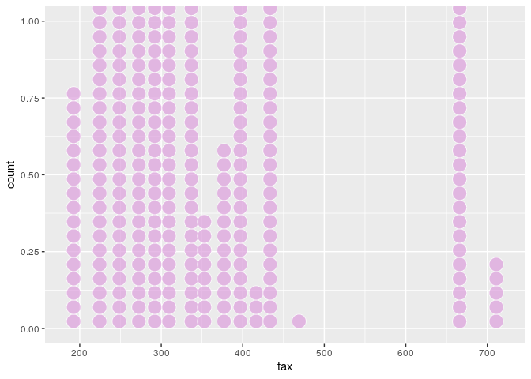

``` r
dotchart(Boston1$tax)
```

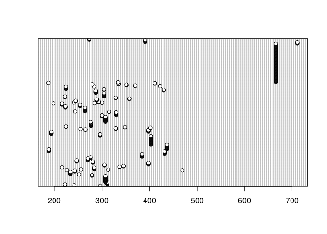

``` r
range(Boston1$ptratio)
```

    ## [1] 12.6 22.0

``` r
arrange(Boston1, desc(ptratio))
```

    ##         crim    zn indus chas    nox    rm   age     dis rad tax ptratio
    ## 1    0.04301  80.0  1.91    0 0.4130 5.663  21.9 10.5857   4 334    22.0
    ## 2    0.10659  80.0  1.91    0 0.4130 5.936  19.5 10.5857   4 334    22.0
    ## 3    0.25915   0.0 21.89    0 0.6240 5.693  96.0  1.7883   4 437    21.2
    ## 4    0.32543   0.0 21.89    0 0.6240 6.431  98.8  1.8125   4 437    21.2
    ## 5    0.88125   0.0 21.89    0 0.6240 5.637  94.7  1.9799   4 437    21.2
    ## 6    0.34006   0.0 21.89    0 0.6240 6.458  98.9  2.1185   4 437    21.2
    ## 7    1.19294   0.0 21.89    0 0.6240 6.326  97.7  2.2710   4 437    21.2
    ## 8    0.59005   0.0 21.89    0 0.6240 6.372  97.9  2.3274   4 437    21.2
    ## 9    0.32982   0.0 21.89    0 0.6240 5.822  95.4  2.4699   4 437    21.2
    ## 10   0.97617   0.0 21.89    0 0.6240 5.757  98.4  2.3460   4 437    21.2
    ## 11   0.55778   0.0 21.89    0 0.6240 6.335  98.2  2.1107   4 437    21.2
    ## 12   0.32264   0.0 21.89    0 0.6240 5.942  93.5  1.9669   4 437    21.2
    ## 13   0.35233   0.0 21.89    0 0.6240 6.454  98.4  1.8498   4 437    21.2
    ## 14   0.24980   0.0 21.89    0 0.6240 5.857  98.2  1.6686   4 437    21.2
    ## 15   0.54452   0.0 21.89    0 0.6240 6.151  97.9  1.6687   4 437    21.2
    ## 16   0.29090   0.0 21.89    0 0.6240 6.174  93.6  1.6119   4 437    21.2
    ## 17   1.62864   0.0 21.89    0 0.6240 5.019 100.0  1.4394   4 437    21.2
    ## 18   0.01360  75.0  4.00    0 0.4100 5.888  47.6  7.3197   3 469    21.1
    ## 19   0.62976   0.0  8.14    0 0.5380 5.949  61.8  4.7075   4 307    21.0
    ## 20   0.63796   0.0  8.14    0 0.5380 6.096  84.5  4.4619   4 307    21.0
    ## 21   0.62739   0.0  8.14    0 0.5380 5.834  56.5  4.4986   4 307    21.0
    ## 22   1.05393   0.0  8.14    0 0.5380 5.935  29.3  4.4986   4 307    21.0
    ## 23   0.78420   0.0  8.14    0 0.5380 5.990  81.7  4.2579   4 307    21.0
    ## 24   0.80271   0.0  8.14    0 0.5380 5.456  36.6  3.7965   4 307    21.0
    ## 25   0.72580   0.0  8.14    0 0.5380 5.727  69.5  3.7965   4 307    21.0
    ## 26   1.25179   0.0  8.14    0 0.5380 5.570  98.1  3.7979   4 307    21.0
    ## 27   0.85204   0.0  8.14    0 0.5380 5.965  89.2  4.0123   4 307    21.0
    ## 28   1.23247   0.0  8.14    0 0.5380 6.142  91.7  3.9769   4 307    21.0
    ## 29   0.98843   0.0  8.14    0 0.5380 5.813 100.0  4.0952   4 307    21.0
    ## 30   0.75026   0.0  8.14    0 0.5380 5.924  94.1  4.3996   4 307    21.0
    ## 31   0.84054   0.0  8.14    0 0.5380 5.599  85.7  4.4546   4 307    21.0
    ## 32   0.67191   0.0  8.14    0 0.5380 5.813  90.3  4.6820   4 307    21.0
    ## 33   0.95577   0.0  8.14    0 0.5380 6.047  88.8  4.4534   4 307    21.0
    ## 34   0.77299   0.0  8.14    0 0.5380 6.495  94.4  4.4547   4 307    21.0
    ## 35   1.00245   0.0  8.14    0 0.5380 6.674  87.3  4.2390   4 307    21.0
    ## 36   1.13081   0.0  8.14    0 0.5380 5.713  94.1  4.2330   4 307    21.0
    ## 37   1.35472   0.0  8.14    0 0.5380 6.072 100.0  4.1750   4 307    21.0
    ## 38   1.38799   0.0  8.14    0 0.5380 5.950  82.0  3.9900   4 307    21.0
    ## 39   1.15172   0.0  8.14    0 0.5380 5.701  95.0  3.7872   4 307    21.0
    ## 40   1.61282   0.0  8.14    0 0.5380 6.096  96.9  3.7598   4 307    21.0
    ## 41   0.06263   0.0 11.93    0 0.5730 6.593  69.1  2.4786   1 273    21.0
    ## 42   0.04527   0.0 11.93    0 0.5730 6.120  76.7  2.2875   1 273    21.0
    ## 43   0.06076   0.0 11.93    0 0.5730 6.976  91.0  2.1675   1 273    21.0
    ## 44   0.10959   0.0 11.93    0 0.5730 6.794  89.3  2.3889   1 273    21.0
    ## 45   0.04741   0.0 11.93    0 0.5730 6.030  80.8  2.5050   1 273    21.0
    ## 46   0.14866   0.0  8.56    0 0.5200 6.727  79.9  2.7778   5 384    20.9
    ## 47   0.11432   0.0  8.56    0 0.5200 6.781  71.3  2.8561   5 384    20.9
    ## 48   0.22876   0.0  8.56    0 0.5200 6.405  85.4  2.7147   5 384    20.9
    ## 49   0.21161   0.0  8.56    0 0.5200 6.137  87.4  2.7147   5 384    20.9
    ## 50   0.13960   0.0  8.56    0 0.5200 6.167  90.0  2.4210   5 384    20.9
    ## 51   0.13262   0.0  8.56    0 0.5200 5.851  96.7  2.1069   5 384    20.9
    ## 52   0.17120   0.0  8.56    0 0.5200 5.836  91.9  2.2110   5 384    20.9
    ## 53   0.13117   0.0  8.56    0 0.5200 6.127  85.2  2.1224   5 384    20.9
    ## 54   0.12802   0.0  8.56    0 0.5200 6.474  97.1  2.4329   5 384    20.9
    ## 55   0.26363   0.0  8.56    0 0.5200 6.229  91.2  2.5451   5 384    20.9
    ## 56   0.10793   0.0  8.56    0 0.5200 6.195  54.4  2.7778   5 384    20.9
    ## 57   0.05083   0.0  5.19    0 0.5150 6.316  38.1  6.4584   5 224    20.2
    ## 58   0.03738   0.0  5.19    0 0.5150 6.310  38.5  6.4584   5 224    20.2
    ## 59   0.03961   0.0  5.19    0 0.5150 6.037  34.5  5.9853   5 224    20.2
    ## 60   0.03427   0.0  5.19    0 0.5150 5.869  46.3  5.2311   5 224    20.2
    ## 61   0.03041   0.0  5.19    0 0.5150 5.895  59.6  5.6150   5 224    20.2
    ## 62   0.03306   0.0  5.19    0 0.5150 6.059  37.3  4.8122   5 224    20.2
    ## 63   0.05497   0.0  5.19    0 0.5150 5.985  45.4  4.8122   5 224    20.2
    ## 64   0.06151   0.0  5.19    0 0.5150 5.968  58.5  4.8122   5 224    20.2
    ## 65   8.98296   0.0 18.10    1 0.7700 6.212  97.4  2.1222  24 666    20.2
    ## 66   3.84970   0.0 18.10    1 0.7700 6.395  91.0  2.5052  24 666    20.2
    ## 67   5.20177   0.0 18.10    1 0.7700 6.127  83.4  2.7227  24 666    20.2
    ## 68   4.26131   0.0 18.10    0 0.7700 6.112  81.3  2.5091  24 666    20.2
    ## 69   4.54192   0.0 18.10    0 0.7700 6.398  88.0  2.5182  24 666    20.2
    ## 70   3.83684   0.0 18.10    0 0.7700 6.251  91.1  2.2955  24 666    20.2
    ## 71   3.67822   0.0 18.10    0 0.7700 5.362  96.2  2.1036  24 666    20.2
    ## 72   4.22239   0.0 18.10    1 0.7700 5.803  89.0  1.9047  24 666    20.2
    ## 73   3.47428   0.0 18.10    1 0.7180 8.780  82.9  1.9047  24 666    20.2
    ## 74   4.55587   0.0 18.10    0 0.7180 3.561  87.9  1.6132  24 666    20.2
    ## 75   3.69695   0.0 18.10    0 0.7180 4.963  91.4  1.7523  24 666    20.2
    ## 76  13.52220   0.0 18.10    0 0.6310 3.863 100.0  1.5106  24 666    20.2
    ## 77   4.89822   0.0 18.10    0 0.6310 4.970 100.0  1.3325  24 666    20.2
    ## 78   5.66998   0.0 18.10    1 0.6310 6.683  96.8  1.3567  24 666    20.2
    ## 79   6.53876   0.0 18.10    1 0.6310 7.016  97.5  1.2024  24 666    20.2
    ## 80   9.23230   0.0 18.10    0 0.6310 6.216 100.0  1.1691  24 666    20.2
    ## 81   8.26725   0.0 18.10    1 0.6680 5.875  89.6  1.1296  24 666    20.2
    ## 82  11.10810   0.0 18.10    0 0.6680 4.906 100.0  1.1742  24 666    20.2
    ## 83  18.49820   0.0 18.10    0 0.6680 4.138 100.0  1.1370  24 666    20.2
    ## 84  19.60910   0.0 18.10    0 0.6710 7.313  97.9  1.3163  24 666    20.2
    ## 85  15.28800   0.0 18.10    0 0.6710 6.649  93.3  1.3449  24 666    20.2
    ## 86   9.82349   0.0 18.10    0 0.6710 6.794  98.8  1.3580  24 666    20.2
    ## 87  23.64820   0.0 18.10    0 0.6710 6.380  96.2  1.3861  24 666    20.2
    ## 88  17.86670   0.0 18.10    0 0.6710 6.223 100.0  1.3861  24 666    20.2
    ## 89  88.97620   0.0 18.10    0 0.6710 6.968  91.9  1.4165  24 666    20.2
    ## 90  15.87440   0.0 18.10    0 0.6710 6.545  99.1  1.5192  24 666    20.2
    ## 91   9.18702   0.0 18.10    0 0.7000 5.536 100.0  1.5804  24 666    20.2
    ## 92   7.99248   0.0 18.10    0 0.7000 5.520 100.0  1.5331  24 666    20.2
    ## 93  20.08490   0.0 18.10    0 0.7000 4.368  91.2  1.4395  24 666    20.2
    ## 94  16.81180   0.0 18.10    0 0.7000 5.277  98.1  1.4261  24 666    20.2
    ## 95  24.39380   0.0 18.10    0 0.7000 4.652 100.0  1.4672  24 666    20.2
    ## 96  22.59710   0.0 18.10    0 0.7000 5.000  89.5  1.5184  24 666    20.2
    ## 97  14.33370   0.0 18.10    0 0.7000 4.880 100.0  1.5895  24 666    20.2
    ## 98   8.15174   0.0 18.10    0 0.7000 5.390  98.9  1.7281  24 666    20.2
    ## 99   6.96215   0.0 18.10    0 0.7000 5.713  97.0  1.9265  24 666    20.2
    ## 100  5.29305   0.0 18.10    0 0.7000 6.051  82.5  2.1678  24 666    20.2
    ## 101 11.57790   0.0 18.10    0 0.7000 5.036  97.0  1.7700  24 666    20.2
    ## 102  8.64476   0.0 18.10    0 0.6930 6.193  92.6  1.7912  24 666    20.2
    ## 103 13.35980   0.0 18.10    0 0.6930 5.887  94.7  1.7821  24 666    20.2
    ## 104  8.71675   0.0 18.10    0 0.6930 6.471  98.8  1.7257  24 666    20.2
    ## 105  5.87205   0.0 18.10    0 0.6930 6.405  96.0  1.6768  24 666    20.2
    ## 106  7.67202   0.0 18.10    0 0.6930 5.747  98.9  1.6334  24 666    20.2
    ## 107 38.35180   0.0 18.10    0 0.6930 5.453 100.0  1.4896  24 666    20.2
    ## 108  9.91655   0.0 18.10    0 0.6930 5.852  77.8  1.5004  24 666    20.2
    ## 109 25.04610   0.0 18.10    0 0.6930 5.987 100.0  1.5888  24 666    20.2
    ## 110 14.23620   0.0 18.10    0 0.6930 6.343 100.0  1.5741  24 666    20.2
    ## 111  9.59571   0.0 18.10    0 0.6930 6.404 100.0  1.6390  24 666    20.2
    ## 112 24.80170   0.0 18.10    0 0.6930 5.349  96.0  1.7028  24 666    20.2
    ## 113 41.52920   0.0 18.10    0 0.6930 5.531  85.4  1.6074  24 666    20.2
    ## 114 67.92080   0.0 18.10    0 0.6930 5.683 100.0  1.4254  24 666    20.2
    ## 115 20.71620   0.0 18.10    0 0.6590 4.138 100.0  1.1781  24 666    20.2
    ## 116 11.95110   0.0 18.10    0 0.6590 5.608 100.0  1.2852  24 666    20.2
    ## 117  7.40389   0.0 18.10    0 0.5970 5.617  97.9  1.4547  24 666    20.2
    ## 118 14.43830   0.0 18.10    0 0.5970 6.852 100.0  1.4655  24 666    20.2
    ## 119 51.13580   0.0 18.10    0 0.5970 5.757 100.0  1.4130  24 666    20.2
    ## 120 14.05070   0.0 18.10    0 0.5970 6.657 100.0  1.5275  24 666    20.2
    ## 121 18.81100   0.0 18.10    0 0.5970 4.628 100.0  1.5539  24 666    20.2
    ## 122 28.65580   0.0 18.10    0 0.5970 5.155 100.0  1.5894  24 666    20.2
    ## 123 45.74610   0.0 18.10    0 0.6930 4.519 100.0  1.6582  24 666    20.2
    ## 124 18.08460   0.0 18.10    0 0.6790 6.434 100.0  1.8347  24 666    20.2
    ## 125 10.83420   0.0 18.10    0 0.6790 6.782  90.8  1.8195  24 666    20.2
    ## 126 25.94060   0.0 18.10    0 0.6790 5.304  89.1  1.6475  24 666    20.2
    ## 127 73.53410   0.0 18.10    0 0.6790 5.957 100.0  1.8026  24 666    20.2
    ## 128 11.81230   0.0 18.10    0 0.7180 6.824  76.5  1.7940  24 666    20.2
    ## 129 11.08740   0.0 18.10    0 0.7180 6.411 100.0  1.8589  24 666    20.2
    ## 130  7.02259   0.0 18.10    0 0.7180 6.006  95.3  1.8746  24 666    20.2
    ## 131 12.04820   0.0 18.10    0 0.6140 5.648  87.6  1.9512  24 666    20.2
    ## 132  7.05042   0.0 18.10    0 0.6140 6.103  85.1  2.0218  24 666    20.2
    ## 133  8.79212   0.0 18.10    0 0.5840 5.565  70.6  2.0635  24 666    20.2
    ## 134 15.86030   0.0 18.10    0 0.6790 5.896  95.4  1.9096  24 666    20.2
    ## 135 12.24720   0.0 18.10    0 0.5840 5.837  59.7  1.9976  24 666    20.2
    ## 136 37.66190   0.0 18.10    0 0.6790 6.202  78.7  1.8629  24 666    20.2
    ## 137  7.36711   0.0 18.10    0 0.6790 6.193  78.1  1.9356  24 666    20.2
    ## 138  9.33889   0.0 18.10    0 0.6790 6.380  95.6  1.9682  24 666    20.2
    ## 139  8.49213   0.0 18.10    0 0.5840 6.348  86.1  2.0527  24 666    20.2
    ## 140 10.06230   0.0 18.10    0 0.5840 6.833  94.3  2.0882  24 666    20.2
    ## 141  6.44405   0.0 18.10    0 0.5840 6.425  74.8  2.2004  24 666    20.2
    ## 142  5.58107   0.0 18.10    0 0.7130 6.436  87.9  2.3158  24 666    20.2
    ## 143 13.91340   0.0 18.10    0 0.7130 6.208  95.0  2.2222  24 666    20.2
    ## 144 11.16040   0.0 18.10    0 0.7400 6.629  94.6  2.1247  24 666    20.2
    ## 145 14.42080   0.0 18.10    0 0.7400 6.461  93.3  2.0026  24 666    20.2
    ## 146 15.17720   0.0 18.10    0 0.7400 6.152 100.0  1.9142  24 666    20.2
    ## 147 13.67810   0.0 18.10    0 0.7400 5.935  87.9  1.8206  24 666    20.2
    ## 148  9.39063   0.0 18.10    0 0.7400 5.627  93.9  1.8172  24 666    20.2
    ## 149 22.05110   0.0 18.10    0 0.7400 5.818  92.4  1.8662  24 666    20.2
    ## 150  9.72418   0.0 18.10    0 0.7400 6.406  97.2  2.0651  24 666    20.2
    ## 151  5.66637   0.0 18.10    0 0.7400 6.219 100.0  2.0048  24 666    20.2
    ## 152  9.96654   0.0 18.10    0 0.7400 6.485 100.0  1.9784  24 666    20.2
    ## 153 12.80230   0.0 18.10    0 0.7400 5.854  96.6  1.8956  24 666    20.2
    ## 154 10.67180   0.0 18.10    0 0.7400 6.459  94.8  1.9879  24 666    20.2
    ## 155  6.28807   0.0 18.10    0 0.7400 6.341  96.4  2.0720  24 666    20.2
    ## 156  9.92485   0.0 18.10    0 0.7400 6.251  96.6  2.1980  24 666    20.2
    ## 157  9.32909   0.0 18.10    0 0.7130 6.185  98.7  2.2616  24 666    20.2
    ## 158  7.52601   0.0 18.10    0 0.7130 6.417  98.3  2.1850  24 666    20.2
    ## 159  6.71772   0.0 18.10    0 0.7130 6.749  92.6  2.3236  24 666    20.2
    ## 160  5.44114   0.0 18.10    0 0.7130 6.655  98.2  2.3552  24 666    20.2
    ## 161  5.09017   0.0 18.10    0 0.7130 6.297  91.8  2.3682  24 666    20.2
    ## 162  8.24809   0.0 18.10    0 0.7130 7.393  99.3  2.4527  24 666    20.2
    ## 163  9.51363   0.0 18.10    0 0.7130 6.728  94.1  2.4961  24 666    20.2
    ## 164  4.75237   0.0 18.10    0 0.7130 6.525  86.5  2.4358  24 666    20.2
    ## 165  4.66883   0.0 18.10    0 0.7130 5.976  87.9  2.5806  24 666    20.2
    ## 166  8.20058   0.0 18.10    0 0.7130 5.936  80.3  2.7792  24 666    20.2
    ## 167  7.75223   0.0 18.10    0 0.7130 6.301  83.7  2.7831  24 666    20.2
    ## 168  6.80117   0.0 18.10    0 0.7130 6.081  84.4  2.7175  24 666    20.2
    ## 169  4.81213   0.0 18.10    0 0.7130 6.701  90.0  2.5975  24 666    20.2
    ## 170  3.69311   0.0 18.10    0 0.7130 6.376  88.4  2.5671  24 666    20.2
    ## 171  6.65492   0.0 18.10    0 0.7130 6.317  83.0  2.7344  24 666    20.2
    ## 172  5.82115   0.0 18.10    0 0.7130 6.513  89.9  2.8016  24 666    20.2
    ## 173  7.83932   0.0 18.10    0 0.6550 6.209  65.4  2.9634  24 666    20.2
    ## 174  3.16360   0.0 18.10    0 0.6550 5.759  48.2  3.0665  24 666    20.2
    ## 175  3.77498   0.0 18.10    0 0.6550 5.952  84.7  2.8715  24 666    20.2
    ## 176  4.42228   0.0 18.10    0 0.5840 6.003  94.5  2.5403  24 666    20.2
    ## 177 15.57570   0.0 18.10    0 0.5800 5.926  71.0  2.9084  24 666    20.2
    ## 178 13.07510   0.0 18.10    0 0.5800 5.713  56.7  2.8237  24 666    20.2
    ## 179  4.34879   0.0 18.10    0 0.5800 6.167  84.0  3.0334  24 666    20.2
    ## 180  4.03841   0.0 18.10    0 0.5320 6.229  90.7  3.0993  24 666    20.2
    ## 181  3.56868   0.0 18.10    0 0.5800 6.437  75.0  2.8965  24 666    20.2
    ## 182  4.64689   0.0 18.10    0 0.6140 6.980  67.6  2.5329  24 666    20.2
    ## 183  8.05579   0.0 18.10    0 0.5840 5.427  95.4  2.4298  24 666    20.2
    ## 184  6.39312   0.0 18.10    0 0.5840 6.162  97.4  2.2060  24 666    20.2
    ## 185  4.87141   0.0 18.10    0 0.6140 6.484  93.6  2.3053  24 666    20.2
    ## 186 15.02340   0.0 18.10    0 0.6140 5.304  97.3  2.1007  24 666    20.2
    ## 187 10.23300   0.0 18.10    0 0.6140 6.185  96.7  2.1705  24 666    20.2
    ## 188 14.33370   0.0 18.10    0 0.6140 6.229  88.0  1.9512  24 666    20.2
    ## 189  5.82401   0.0 18.10    0 0.5320 6.242  64.7  3.4242  24 666    20.2
    ## 190  5.70818   0.0 18.10    0 0.5320 6.750  74.9  3.3317  24 666    20.2
    ## 191  5.73116   0.0 18.10    0 0.5320 7.061  77.0  3.4106  24 666    20.2
    ## 192  2.81838   0.0 18.10    0 0.5320 5.762  40.3  4.0983  24 666    20.2
    ## 193  2.37857   0.0 18.10    0 0.5830 5.871  41.9  3.7240  24 666    20.2
    ## 194  3.67367   0.0 18.10    0 0.5830 6.312  51.9  3.9917  24 666    20.2
    ## 195  5.69175   0.0 18.10    0 0.5830 6.114  79.8  3.5459  24 666    20.2
    ## 196  4.83567   0.0 18.10    0 0.5830 5.905  53.2  3.1523  24 666    20.2
    ## 197  0.15086   0.0 27.74    0 0.6090 5.454  92.7  1.8209   4 711    20.1
    ## 198  0.18337   0.0 27.74    0 0.6090 5.414  98.3  1.7554   4 711    20.1
    ## 199  0.20746   0.0 27.74    0 0.6090 5.093  98.0  1.8226   4 711    20.1
    ## 200  0.10574   0.0 27.74    0 0.6090 5.983  98.8  1.8681   4 711    20.1
    ## 201  0.11132   0.0 27.74    0 0.6090 5.983  83.5  2.1099   4 711    20.1
    ## 202  0.15445  25.0  5.13    0 0.4530 6.145  29.2  7.8148   8 284    19.7
    ## 203  0.10328  25.0  5.13    0 0.4530 5.927  47.2  6.9320   8 284    19.7
    ## 204  0.14932  25.0  5.13    0 0.4530 5.741  66.2  7.2254   8 284    19.7
    ## 205  0.17171  25.0  5.13    0 0.4530 5.966  93.4  6.8185   8 284    19.7
    ## 206  0.11027  25.0  5.13    0 0.4530 6.456  67.8  7.2255   8 284    19.7
    ## 207  0.12650  25.0  5.13    0 0.4530 6.762  43.4  7.9809   8 284    19.7
    ## 208  0.02899  40.0  1.25    0 0.4290 6.939  34.5  8.7921   1 335    19.7
    ## 209  0.06211  40.0  1.25    0 0.4290 6.490  44.4  8.7921   1 335    19.7
    ## 210  0.16760   0.0  7.38    0 0.4930 6.426  52.3  4.5404   5 287    19.6
    ## 211  0.18159   0.0  7.38    0 0.4930 6.376  54.3  4.5404   5 287    19.6
    ## 212  0.35114   0.0  7.38    0 0.4930 6.041  49.9  4.7211   5 287    19.6
    ## 213  0.28392   0.0  7.38    0 0.4930 5.708  74.3  4.7211   5 287    19.6
    ## 214  0.34109   0.0  7.38    0 0.4930 6.415  40.1  4.7211   5 287    19.6
    ## 215  0.19186   0.0  7.38    0 0.4930 6.431  14.7  5.4159   5 287    19.6
    ## 216  0.30347   0.0  7.38    0 0.4930 6.312  28.9  5.4159   5 287    19.6
    ## 217  0.24103   0.0  7.38    0 0.4930 6.083  43.7  5.4159   5 287    19.6
    ## 218  0.06417   0.0  5.96    0 0.4990 5.933  68.2  3.3603   5 279    19.2
    ## 219  0.09744   0.0  5.96    0 0.4990 5.841  61.4  3.3779   5 279    19.2
    ## 220  0.08014   0.0  5.96    0 0.4990 5.850  41.5  3.9342   5 279    19.2
    ## 221  0.17505   0.0  5.96    0 0.4990 5.966  30.2  3.8473   5 279    19.2
    ## 222  0.08826   0.0 10.81    0 0.4130 6.417   6.6  5.2873   4 305    19.2
    ## 223  0.15876   0.0 10.81    0 0.4130 5.961  17.5  5.2873   4 305    19.2
    ## 224  0.09164   0.0 10.81    0 0.4130 6.065   7.8  5.2873   4 305    19.2
    ## 225  0.19539   0.0 10.81    0 0.4130 6.245   6.2  5.2873   4 305    19.2
    ## 226  0.03502  80.0  4.95    0 0.4110 6.861  27.9  5.1167   4 245    19.2
    ## 227  0.07886  80.0  4.95    0 0.4110 7.148  27.7  5.1167   4 245    19.2
    ## 228  0.03615  80.0  4.95    0 0.4110 6.630  23.4  5.1167   4 245    19.2
    ## 229  0.17331   0.0  9.69    0 0.5850 5.707  54.0  2.3817   6 391    19.2
    ## 230  0.27957   0.0  9.69    0 0.5850 5.926  42.6  2.3817   6 391    19.2
    ## 231  0.17899   0.0  9.69    0 0.5850 5.670  28.8  2.7986   6 391    19.2
    ## 232  0.28960   0.0  9.69    0 0.5850 5.390  72.9  2.7986   6 391    19.2
    ## 233  0.26838   0.0  9.69    0 0.5850 5.794  70.6  2.8927   6 391    19.2
    ## 234  0.23912   0.0  9.69    0 0.5850 6.019  65.3  2.4091   6 391    19.2
    ## 235  0.17783   0.0  9.69    0 0.5850 5.569  73.5  2.3999   6 391    19.2
    ## 236  0.22438   0.0  9.69    0 0.5850 6.027  79.7  2.4982   6 391    19.2
    ## 237  0.06899   0.0 25.65    0 0.5810 5.870  69.7  2.2577   2 188    19.1
    ## 238  0.07165   0.0 25.65    0 0.5810 6.004  84.1  2.1974   2 188    19.1
    ## 239  0.09299   0.0 25.65    0 0.5810 5.961  92.9  2.0869   2 188    19.1
    ## 240  0.15038   0.0 25.65    0 0.5810 5.856  97.0  1.9444   2 188    19.1
    ## 241  0.09849   0.0 25.65    0 0.5810 5.879  95.8  2.0063   2 188    19.1
    ## 242  0.16902   0.0 25.65    0 0.5810 5.986  88.4  1.9929   2 188    19.1
    ## 243  0.38735   0.0 25.65    0 0.5810 5.613  95.6  1.7572   2 188    19.1
    ## 244  0.20608  22.0  5.86    0 0.4310 5.593  76.5  7.9549   7 330    19.1
    ## 245  0.19133  22.0  5.86    0 0.4310 5.605  70.2  7.9549   7 330    19.1
    ## 246  0.33983  22.0  5.86    0 0.4310 6.108  34.9  8.0555   7 330    19.1
    ## 247  0.19657  22.0  5.86    0 0.4310 6.226  79.2  8.0555   7 330    19.1
    ## 248  0.16439  22.0  5.86    0 0.4310 6.433  49.1  7.8265   7 330    19.1
    ## 249  0.19073  22.0  5.86    0 0.4310 6.718  17.5  7.8265   7 330    19.1
    ## 250  0.14030  22.0  5.86    0 0.4310 6.487  13.0  7.3967   7 330    19.1
    ## 251  0.21409  22.0  5.86    0 0.4310 6.438   8.9  7.3967   7 330    19.1
    ## 252  0.08221  22.0  5.86    0 0.4310 6.957   6.8  8.9067   7 330    19.1
    ## 253  0.36894  22.0  5.86    0 0.4310 8.259   8.4  8.9067   7 330    19.1
    ## 254  0.04113  25.0  4.86    0 0.4260 6.727  33.5  5.4007   4 281    19.0
    ## 255  0.04462  25.0  4.86    0 0.4260 6.619  70.4  5.4007   4 281    19.0
    ## 256  0.03659  25.0  4.86    0 0.4260 6.302  32.2  5.4007   4 281    19.0
    ## 257  0.03551  25.0  4.86    0 0.4260 6.167  46.7  5.4007   4 281    19.0
    ## 258  0.05789  12.5  6.07    0 0.4090 5.878  21.4  6.4980   4 345    18.9
    ## 259  0.13554  12.5  6.07    0 0.4090 5.594  36.8  6.4980   4 345    18.9
    ## 260  0.12816  12.5  6.07    0 0.4090 5.885  33.0  6.4980   4 345    18.9
    ## 261  0.03113   0.0  4.39    0 0.4420 6.014  48.5  8.0136   3 352    18.8
    ## 262  0.06162   0.0  4.39    0 0.4420 5.898  52.3  8.0136   3 352    18.8
    ## 263  0.03237   0.0  2.18    0 0.4580 6.998  45.8  6.0622   3 222    18.7
    ## 264  0.06905   0.0  2.18    0 0.4580 7.147  54.2  6.0622   3 222    18.7
    ## 265  0.02985   0.0  2.18    0 0.4580 6.430  58.7  6.0622   3 222    18.7
    ## 266  0.07896   0.0 12.83    0 0.4370 6.273   6.0  4.2515   5 398    18.7
    ## 267  0.09512   0.0 12.83    0 0.4370 6.286  45.0  4.5026   5 398    18.7
    ## 268  0.10153   0.0 12.83    0 0.4370 6.279  74.5  4.0522   5 398    18.7
    ## 269  0.08707   0.0 12.83    0 0.4370 6.140  45.8  4.0905   5 398    18.7
    ## 270  0.05646   0.0 12.83    0 0.4370 6.232  53.7  5.0141   5 398    18.7
    ## 271  0.08387   0.0 12.83    0 0.4370 5.874  36.6  4.5026   5 398    18.7
    ## 272  0.01951  17.5  1.38    0 0.4161 7.104  59.5  9.2229   3 216    18.6
    ## 273  0.13642   0.0 10.59    0 0.4890 5.891  22.3  3.9454   4 277    18.6
    ## 274  0.22969   0.0 10.59    0 0.4890 6.326  52.5  4.3549   4 277    18.6
    ## 275  0.25199   0.0 10.59    0 0.4890 5.783  72.7  4.3549   4 277    18.6
    ## 276  0.13587   0.0 10.59    1 0.4890 6.064  59.1  4.2392   4 277    18.6
    ## 277  0.43571   0.0 10.59    1 0.4890 5.344 100.0  3.8750   4 277    18.6
    ## 278  0.17446   0.0 10.59    1 0.4890 5.960  92.1  3.8771   4 277    18.6
    ## 279  0.37578   0.0 10.59    1 0.4890 5.404  88.6  3.6650   4 277    18.6
    ## 280  0.21719   0.0 10.59    1 0.4890 5.807  53.8  3.6526   4 277    18.6
    ## 281  0.14052   0.0 10.59    0 0.4890 6.375  32.3  3.9454   4 277    18.6
    ## 282  0.28955   0.0 10.59    0 0.4890 5.412   9.8  3.5875   4 277    18.6
    ## 283  0.19802   0.0 10.59    0 0.4890 6.182  42.4  3.9454   4 277    18.6
    ## 284  0.09065  20.0  6.96    1 0.4640 5.920  61.5  3.9175   3 223    18.6
    ## 285  0.29916  20.0  6.96    0 0.4640 5.856  42.1  4.4290   3 223    18.6
    ## 286  0.16211  20.0  6.96    0 0.4640 6.240  16.3  4.4290   3 223    18.6
    ## 287  0.11460  20.0  6.96    0 0.4640 6.538  58.7  3.9175   3 223    18.6
    ## 288  0.22188  20.0  6.96    1 0.4640 7.691  51.8  4.3665   3 223    18.6
    ## 289  0.05059   0.0  4.49    0 0.4490 6.389  48.0  4.7794   3 247    18.5
    ## 290  0.05735   0.0  4.49    0 0.4490 6.630  56.1  4.4377   3 247    18.5
    ## 291  0.05188   0.0  4.49    0 0.4490 6.015  45.1  4.4272   3 247    18.5
    ## 292  0.07151   0.0  4.49    0 0.4490 6.121  56.8  3.7476   3 247    18.5
    ## 293  0.05515  33.0  2.18    0 0.4720 7.236  41.1  4.0220   7 222    18.4
    ## 294  0.05479  33.0  2.18    0 0.4720 6.616  58.1  3.3700   7 222    18.4
    ## 295  0.07503  33.0  2.18    0 0.4720 7.420  71.9  3.0992   7 222    18.4
    ## 296  0.04932  33.0  2.18    0 0.4720 6.849  70.3  3.1827   7 222    18.4
    ## 297  0.49298   0.0  9.90    0 0.5440 6.635  82.5  3.3175   4 304    18.4
    ## 298  0.34940   0.0  9.90    0 0.5440 5.972  76.7  3.1025   4 304    18.4
    ## 299  2.63548   0.0  9.90    0 0.5440 4.973  37.8  2.5194   4 304    18.4
    ## 300  0.79041   0.0  9.90    0 0.5440 6.122  52.8  2.6403   4 304    18.4
    ## 301  0.26169   0.0  9.90    0 0.5440 6.023  90.4  2.8340   4 304    18.4
    ## 302  0.26938   0.0  9.90    0 0.5440 6.266  82.8  3.2628   4 304    18.4
    ## 303  0.36920   0.0  9.90    0 0.5440 6.567  87.3  3.6023   4 304    18.4
    ## 304  0.25356   0.0  9.90    0 0.5440 5.705  77.7  3.9450   4 304    18.4
    ## 305  0.31827   0.0  9.90    0 0.5440 5.914  83.2  3.9986   4 304    18.4
    ## 306  0.24522   0.0  9.90    0 0.5440 5.782  71.7  4.0317   4 304    18.4
    ## 307  0.40202   0.0  9.90    0 0.5440 6.382  67.2  3.5325   4 304    18.4
    ## 308  0.47547   0.0  9.90    0 0.5440 6.113  58.8  4.0019   4 304    18.4
    ## 309  0.02763  75.0  2.95    0 0.4280 6.595  21.8  5.4011   3 252    18.3
    ## 310  0.03359  75.0  2.95    0 0.4280 7.024  15.8  5.4011   3 252    18.3
    ## 311  0.07950  60.0  1.69    0 0.4110 6.579  35.9 10.7103   4 411    18.3
    ## 312  0.07244  60.0  1.69    0 0.4110 5.884  18.5 10.7103   4 411    18.3
    ## 313  0.04203  28.0 15.04    0 0.4640 6.442  53.6  3.6659   4 270    18.2
    ## 314  0.02875  28.0 15.04    0 0.4640 6.211  28.9  3.6659   4 270    18.2
    ## 315  0.04294  28.0 15.04    0 0.4640 6.249  77.3  3.6150   4 270    18.2
    ## 316  0.01965  80.0  1.76    0 0.3850 6.230  31.5  9.0892   1 241    18.2
    ## 317  0.12204   0.0  2.89    0 0.4450 6.625  57.8  3.4952   2 276    18.0
    ## 318  0.11504   0.0  2.89    0 0.4450 6.163  69.6  3.4952   2 276    18.0
    ## 319  0.12083   0.0  2.89    0 0.4450 8.069  76.0  3.4952   2 276    18.0
    ## 320  0.08187   0.0  2.89    0 0.4450 7.820  36.9  3.4952   2 276    18.0
    ## 321  0.06860   0.0  2.89    0 0.4450 7.416  62.5  3.4952   2 276    18.0
    ## 322  0.12744   0.0  6.91    0 0.4480 6.770   2.9  5.7209   3 233    17.9
    ## 323  0.14150   0.0  6.91    0 0.4480 6.169   6.6  5.7209   3 233    17.9
    ## 324  0.15936   0.0  6.91    0 0.4480 6.211   6.5  5.7209   3 233    17.9
    ## 325  0.12269   0.0  6.91    0 0.4480 6.069  40.0  5.7209   3 233    17.9
    ## 326  0.17142   0.0  6.91    0 0.4480 5.682  33.8  5.1004   3 233    17.9
    ## 327  0.18836   0.0  6.91    0 0.4480 5.786  33.3  5.1004   3 233    17.9
    ## 328  0.22927   0.0  6.91    0 0.4480 6.030  85.5  5.6894   3 233    17.9
    ## 329  0.25387   0.0  6.91    0 0.4480 5.399  95.3  5.8700   3 233    17.9
    ## 330  0.21977   0.0  6.91    0 0.4480 5.602  62.0  6.0877   3 233    17.9
    ## 331  0.01311  90.0  1.22    0 0.4030 7.249  21.9  8.6966   5 226    17.9
    ## 332  0.01870  85.0  4.15    0 0.4290 6.516  27.7  8.5353   4 351    17.9
    ## 333  0.02731   0.0  7.07    0 0.4690 6.421  78.9  4.9671   2 242    17.8
    ## 334  0.02729   0.0  7.07    0 0.4690 7.185  61.1  4.9671   2 242    17.8
    ## 335  0.05660   0.0  3.41    0 0.4890 7.007  86.3  3.4217   2 270    17.8
    ## 336  0.05302   0.0  3.41    0 0.4890 7.079  63.1  3.4145   2 270    17.8
    ## 337  0.04684   0.0  3.41    0 0.4890 6.417  66.1  3.0923   2 270    17.8
    ## 338  0.03932   0.0  3.41    0 0.4890 6.405  73.9  3.0921   2 270    17.8
    ## 339  0.10084   0.0 10.01    0 0.5470 6.715  81.6  2.6775   6 432    17.8
    ## 340  0.12329   0.0 10.01    0 0.5470 5.913  92.9  2.3534   6 432    17.8
    ## 341  0.22212   0.0 10.01    0 0.5470 6.092  95.4  2.5480   6 432    17.8
    ## 342  0.14231   0.0 10.01    0 0.5470 6.254  84.2  2.2565   6 432    17.8
    ## 343  0.17134   0.0 10.01    0 0.5470 5.928  88.2  2.4631   6 432    17.8
    ## 344  0.13158   0.0 10.01    0 0.5470 6.176  72.5  2.7301   6 432    17.8
    ## 345  0.15098   0.0 10.01    0 0.5470 6.021  82.6  2.7474   6 432    17.8
    ## 346  0.13058   0.0 10.01    0 0.5470 5.872  73.1  2.4775   6 432    17.8
    ## 347  0.14476   0.0 10.01    0 0.5470 5.731  65.2  2.7592   6 432    17.8
    ## 348  0.05780   0.0  2.46    0 0.4880 6.980  58.4  2.8290   3 193    17.8
    ## 349  0.06588   0.0  2.46    0 0.4880 7.765  83.3  2.7410   3 193    17.8
    ## 350  0.06888   0.0  2.46    0 0.4880 6.144  62.2  2.5979   3 193    17.8
    ## 351  0.09103   0.0  2.46    0 0.4880 7.155  92.2  2.7006   3 193    17.8
    ## 352  0.10008   0.0  2.46    0 0.4880 6.563  95.6  2.8470   3 193    17.8
    ## 353  0.08308   0.0  2.46    0 0.4880 5.604  89.8  2.9879   3 193    17.8
    ## 354  0.06047   0.0  2.46    0 0.4880 6.153  68.8  3.2797   3 193    17.8
    ## 355  0.05602   0.0  2.46    0 0.4880 7.831  53.6  3.1992   3 193    17.8
    ## 356  0.05644  40.0  6.41    1 0.4470 6.758  32.9  4.0776   4 254    17.6
    ## 357  0.09604  40.0  6.41    0 0.4470 6.854  42.8  4.2673   4 254    17.6
    ## 358  0.10469  40.0  6.41    1 0.4470 7.267  49.0  4.7872   4 254    17.6
    ## 359  0.06127  40.0  6.41    1 0.4470 6.826  27.6  4.8628   4 254    17.6
    ## 360  0.07978  40.0  6.41    0 0.4470 6.482  32.1  4.1403   4 254    17.6
    ## 361  0.02543  55.0  3.78    0 0.4840 6.696  56.4  5.7321   5 370    17.6
    ## 362  0.03049  55.0  3.78    0 0.4840 6.874  28.1  6.4654   5 370    17.6
    ## 363  0.35809   0.0  6.20    1 0.5070 6.951  88.5  2.8617   8 307    17.4
    ## 364  0.40771   0.0  6.20    1 0.5070 6.164  91.3  3.0480   8 307    17.4
    ## 365  0.62356   0.0  6.20    1 0.5070 6.879  77.7  3.2721   8 307    17.4
    ## 366  0.61470   0.0  6.20    0 0.5070 6.618  80.8  3.2721   8 307    17.4
    ## 367  0.31533   0.0  6.20    0 0.5040 8.266  78.3  2.8944   8 307    17.4
    ## 368  0.52693   0.0  6.20    0 0.5040 8.725  83.0  2.8944   8 307    17.4
    ## 369  0.38214   0.0  6.20    0 0.5040 8.040  86.5  3.2157   8 307    17.4
    ## 370  0.41238   0.0  6.20    0 0.5040 7.163  79.9  3.2157   8 307    17.4
    ## 371  0.29819   0.0  6.20    0 0.5040 7.686  17.0  3.3751   8 307    17.4
    ## 372  0.44178   0.0  6.20    0 0.5040 6.552  21.4  3.3751   8 307    17.4
    ## 373  0.53700   0.0  6.20    0 0.5040 5.981  68.1  3.6715   8 307    17.4
    ## 374  0.46296   0.0  6.20    0 0.5040 7.412  76.9  3.6715   8 307    17.4
    ## 375  0.57529   0.0  6.20    0 0.5070 8.337  73.3  3.8384   8 307    17.4
    ## 376  0.33147   0.0  6.20    0 0.5070 8.247  70.4  3.6519   8 307    17.4
    ## 377  0.44791   0.0  6.20    1 0.5070 6.726  66.5  3.6519   8 307    17.4
    ## 378  0.33045   0.0  6.20    0 0.5070 6.086  61.5  3.6519   8 307    17.4
    ## 379  0.52058   0.0  6.20    1 0.5070 6.631  76.5  4.1480   8 307    17.4
    ## 380  0.51183   0.0  6.20    0 0.5070 7.358  71.6  4.1480   8 307    17.4
    ## 381  0.02055  85.0  0.74    0 0.4100 6.383  35.7  9.1876   2 313    17.3
    ## 382  0.03150  95.0  1.47    0 0.4030 6.975  15.3  7.6534   3 402    17.0
    ## 383  0.01778  95.0  1.47    0 0.4030 7.135  13.9  7.6534   3 402    17.0
    ## 384  0.01501  80.0  2.01    0 0.4350 6.635  29.7  8.3440   4 280    17.0
    ## 385  0.01709  90.0  2.02    0 0.4100 6.728  36.1 12.1265   5 187    17.0
    ## 386  0.06617   0.0  3.24    0 0.4600 5.868  25.8  5.2146   4 430    16.9
    ## 387  0.06724   0.0  3.24    0 0.4600 6.333  17.2  5.2146   4 430    16.9
    ## 388  0.04544   0.0  3.24    0 0.4600 6.144  32.2  5.8736   4 430    16.9
    ## 389  0.05023  35.0  6.06    0 0.4379 5.706  28.4  6.6407   1 304    16.9
    ## 390  0.03466  35.0  6.06    0 0.4379 6.031  23.3  6.6407   1 304    16.9
    ## 391  0.08873  21.0  5.64    0 0.4390 5.963  45.7  6.8147   4 243    16.8
    ## 392  0.04337  21.0  5.64    0 0.4390 6.115  63.0  6.8147   4 243    16.8
    ## 393  0.05360  21.0  5.64    0 0.4390 6.511  21.1  6.8147   4 243    16.8
    ## 394  0.04981  21.0  5.64    0 0.4390 5.998  21.4  6.8147   4 243    16.8
    ## 395  0.13914   0.0  4.05    0 0.5100 5.572  88.5  2.5961   5 296    16.6
    ## 396  0.09178   0.0  4.05    0 0.5100 6.416  84.1  2.6463   5 296    16.6
    ## 397  0.08447   0.0  4.05    0 0.5100 5.859  68.7  2.7019   5 296    16.6
    ## 398  0.06664   0.0  4.05    0 0.5100 6.546  33.1  3.1323   5 296    16.6
    ## 399  0.07022   0.0  4.05    0 0.5100 6.020  47.2  3.5549   5 296    16.6
    ## 400  0.05425   0.0  4.05    0 0.5100 6.315  73.4  3.3175   5 296    16.6
    ## 401  0.06642   0.0  4.05    0 0.5100 6.860  74.4  2.9153   5 296    16.6
    ## 402  0.08244  30.0  4.93    0 0.4280 6.481  18.5  6.1899   6 300    16.6
    ## 403  0.09252  30.0  4.93    0 0.4280 6.606  42.2  6.1899   6 300    16.6
    ## 404  0.11329  30.0  4.93    0 0.4280 6.897  54.3  6.3361   6 300    16.6
    ## 405  0.10612  30.0  4.93    0 0.4280 6.095  65.1  6.3361   6 300    16.6
    ## 406  0.10290  30.0  4.93    0 0.4280 6.358  52.9  7.0355   6 300    16.6
    ## 407  0.12757  30.0  4.93    0 0.4280 6.393   7.8  7.0355   6 300    16.6
    ## 408  0.03871  52.5  5.32    0 0.4050 6.209  31.3  7.3172   6 293    16.6
    ## 409  0.04590  52.5  5.32    0 0.4050 6.315  45.6  7.3172   6 293    16.6
    ## 410  0.04297  52.5  5.32    0 0.4050 6.565  22.9  7.3172   6 293    16.6
    ## 411  0.04560   0.0 13.89    1 0.5500 5.888  56.0  3.1121   5 276    16.4
    ## 412  0.07013   0.0 13.89    0 0.5500 6.642  85.1  3.4211   5 276    16.4
    ## 413  0.11069   0.0 13.89    1 0.5500 5.951  93.8  2.8893   5 276    16.4
    ## 414  0.11425   0.0 13.89    1 0.5500 6.373  92.4  3.3633   5 276    16.4
    ## 415  0.04819  80.0  3.64    0 0.3920 6.108  32.0  9.2203   1 315    16.4
    ## 416  0.03548  80.0  3.64    0 0.3920 5.876  19.1  9.2203   1 315    16.4
    ## 417  0.03584  80.0  3.37    0 0.3980 6.290  17.8  6.6115   4 337    16.1
    ## 418  0.04379  80.0  3.37    0 0.3980 5.787  31.1  6.6115   4 337    16.1
    ## 419  0.03537  34.0  6.09    0 0.4330 6.590  40.4  5.4917   7 329    16.1
    ## 420  0.09266  34.0  6.09    0 0.4330 6.495  18.4  5.4917   7 329    16.1
    ## 421  0.10000  34.0  6.09    0 0.4330 6.982  17.7  5.4917   7 329    16.1
    ## 422  0.08265   0.0 13.92    0 0.4370 6.127  18.4  5.5027   4 289    16.0
    ## 423  0.08199   0.0 13.92    0 0.4370 6.009  42.3  5.5027   4 289    16.0
    ## 424  0.12932   0.0 13.92    0 0.4370 6.678  31.1  5.9604   4 289    16.0
    ## 425  0.05372   0.0 13.92    0 0.4370 6.549  51.0  5.9604   4 289    16.0
    ## 426  0.14103   0.0 13.92    0 0.4370 5.790  58.0  6.3200   4 289    16.0
    ## 427  0.01538  90.0  3.75    0 0.3940 7.454  34.2  6.3361   3 244    15.9
    ## 428  0.02498   0.0  1.89    0 0.5180 6.540  59.7  6.2669   1 422    15.9
    ## 429  0.02187  60.0  2.93    0 0.4010 6.800   9.9  6.2196   1 265    15.6
    ## 430  0.01439  60.0  2.93    0 0.4010 6.604  18.8  6.2196   1 265    15.6
    ## 431  0.01301  35.0  1.52    0 0.4420 7.241  49.3  7.0379   1 284    15.5
    ## 432  0.00632  18.0  2.31    0 0.5380 6.575  65.2  4.0900   1 296    15.3
    ## 433  0.00906  90.0  2.97    0 0.4000 7.088  20.8  7.3073   1 285    15.3
    ## 434  0.01096  55.0  2.25    0 0.3890 6.453  31.9  7.3073   1 300    15.3
    ## 435  0.08829  12.5  7.87    0 0.5240 6.012  66.6  5.5605   5 311    15.2
    ## 436  0.14455  12.5  7.87    0 0.5240 6.172  96.1  5.9505   5 311    15.2
    ## 437  0.21124  12.5  7.87    0 0.5240 5.631 100.0  6.0821   5 311    15.2
    ## 438  0.17004  12.5  7.87    0 0.5240 6.004  85.9  6.5921   5 311    15.2
    ## 439  0.22489  12.5  7.87    0 0.5240 6.377  94.3  6.3467   5 311    15.2
    ## 440  0.11747  12.5  7.87    0 0.5240 6.009  82.9  6.2267   5 311    15.2
    ## 441  0.09378  12.5  7.87    0 0.5240 5.889  39.0  5.4509   5 311    15.2
    ## 442  0.07875  45.0  3.44    0 0.4370 6.782  41.1  3.7886   5 398    15.2
    ## 443  0.12579  45.0  3.44    0 0.4370 6.556  29.1  4.5667   5 398    15.2
    ## 444  0.08370  45.0  3.44    0 0.4370 7.185  38.9  4.5667   5 398    15.2
    ## 445  0.09068  45.0  3.44    0 0.4370 6.951  21.5  6.4798   5 398    15.2
    ## 446  0.06911  45.0  3.44    0 0.4370 6.739  30.8  6.4798   5 398    15.2
    ## 447  0.08664  45.0  3.44    0 0.4370 7.178  26.3  6.4798   5 398    15.2
    ## 448  0.01432 100.0  1.32    0 0.4110 6.816  40.5  8.3248   5 256    15.1
    ## 449  0.21038  20.0  3.33    0 0.4429 6.812  32.2  4.1007   5 216    14.9
    ## 450  0.03578  20.0  3.33    0 0.4429 7.820  64.5  4.6947   5 216    14.9
    ## 451  0.03705  20.0  3.33    0 0.4429 6.968  37.2  5.2447   5 216    14.9
    ## 452  0.06129  20.0  3.33    1 0.4429 7.645  49.7  5.2119   5 216    14.9
    ## 453  0.06466  70.0  2.24    0 0.4000 6.345  20.1  7.8278   5 358    14.8
    ## 454  0.05561  70.0  2.24    0 0.4000 7.041  10.0  7.8278   5 358    14.8
    ## 455  0.04417  70.0  2.24    0 0.4000 6.871  47.4  7.8278   5 358    14.8
    ## 456  3.32105   0.0 19.58    1 0.8710 5.403 100.0  1.3216   5 403    14.7
    ## 457  4.09740   0.0 19.58    0 0.8710 5.468 100.0  1.4118   5 403    14.7
    ## 458  2.77974   0.0 19.58    0 0.8710 4.903  97.8  1.3459   5 403    14.7
    ## 459  2.37934   0.0 19.58    0 0.8710 6.130 100.0  1.4191   5 403    14.7
    ## 460  2.15505   0.0 19.58    0 0.8710 5.628 100.0  1.5166   5 403    14.7
    ## 461  2.36862   0.0 19.58    0 0.8710 4.926  95.7  1.4608   5 403    14.7
    ## 462  2.33099   0.0 19.58    0 0.8710 5.186  93.8  1.5296   5 403    14.7
    ## 463  2.73397   0.0 19.58    0 0.8710 5.597  94.9  1.5257   5 403    14.7
    ## 464  1.65660   0.0 19.58    0 0.8710 6.122  97.3  1.6180   5 403    14.7
    ## 465  1.49632   0.0 19.58    0 0.8710 5.404 100.0  1.5916   5 403    14.7
    ## 466  1.12658   0.0 19.58    1 0.8710 5.012  88.0  1.6102   5 403    14.7
    ## 467  2.14918   0.0 19.58    0 0.8710 5.709  98.5  1.6232   5 403    14.7
    ## 468  1.41385   0.0 19.58    1 0.8710 6.129  96.0  1.7494   5 403    14.7
    ## 469  3.53501   0.0 19.58    1 0.8710 6.152  82.6  1.7455   5 403    14.7
    ## 470  2.44668   0.0 19.58    0 0.8710 5.272  94.0  1.7364   5 403    14.7
    ## 471  1.22358   0.0 19.58    0 0.6050 6.943  97.4  1.8773   5 403    14.7
    ## 472  1.34284   0.0 19.58    0 0.6050 6.066 100.0  1.7573   5 403    14.7
    ## 473  1.42502   0.0 19.58    0 0.8710 6.510 100.0  1.7659   5 403    14.7
    ## 474  1.27346   0.0 19.58    1 0.6050 6.250  92.6  1.7984   5 403    14.7
    ## 475  1.46336   0.0 19.58    0 0.6050 7.489  90.8  1.9709   5 403    14.7
    ## 476  1.83377   0.0 19.58    1 0.6050 7.802  98.2  2.0407   5 403    14.7
    ## 477  1.51902   0.0 19.58    1 0.6050 8.375  93.9  2.1620   5 403    14.7
    ## 478  2.24236   0.0 19.58    0 0.6050 5.854  91.8  2.4220   5 403    14.7
    ## 479  2.92400   0.0 19.58    0 0.6050 6.101  93.0  2.2834   5 403    14.7
    ## 480  2.01019   0.0 19.58    0 0.6050 7.929  96.2  2.0459   5 403    14.7
    ## 481  1.80028   0.0 19.58    0 0.6050 5.877  79.2  2.4259   5 403    14.7
    ## 482  2.30040   0.0 19.58    0 0.6050 6.319  96.1  2.1000   5 403    14.7
    ## 483  2.44953   0.0 19.58    0 0.6050 6.402  95.2  2.2625   5 403    14.7
    ## 484  1.20742   0.0 19.58    0 0.6050 5.875  94.6  2.4259   5 403    14.7
    ## 485  2.31390   0.0 19.58    0 0.6050 5.880  97.3  2.3887   5 403    14.7
    ## 486  0.03445  82.5  2.03    0 0.4150 6.162  38.4  6.2700   2 348    14.7
    ## 487  0.02177  82.5  2.03    0 0.4150 7.610  15.7  6.2700   2 348    14.7
    ## 488  0.03510  95.0  2.68    0 0.4161 7.853  33.2  5.1180   4 224    14.7
    ## 489  0.02009  95.0  2.68    0 0.4161 8.034  31.9  5.1180   4 224    14.7
    ## 490  0.01381  80.0  0.46    0 0.4220 7.875  32.0  5.6484   4 255    14.4
    ## 491  0.01501  90.0  1.21    1 0.4010 7.923  24.8  5.8850   1 198    13.6
    ## 492  0.61154  20.0  3.97    0 0.6470 8.704  86.9  1.8010   5 264    13.0
    ## 493  0.66351  20.0  3.97    0 0.6470 7.333 100.0  1.8946   5 264    13.0
    ## 494  0.65665  20.0  3.97    0 0.6470 6.842 100.0  2.0107   5 264    13.0
    ## 495  0.54011  20.0  3.97    0 0.6470 7.203  81.8  2.1121   5 264    13.0
    ## 496  0.53412  20.0  3.97    0 0.6470 7.520  89.4  2.1398   5 264    13.0
    ## 497  0.52014  20.0  3.97    0 0.6470 8.398  91.5  2.2885   5 264    13.0
    ## 498  0.82526  20.0  3.97    0 0.6470 7.327  94.5  2.0788   5 264    13.0
    ## 499  0.55007  20.0  3.97    0 0.6470 7.206  91.6  1.9301   5 264    13.0
    ## 500  0.76162  20.0  3.97    0 0.6470 5.560  62.8  1.9865   5 264    13.0
    ## 501  0.78570  20.0  3.97    0 0.6470 7.014  84.6  2.1329   5 264    13.0
    ## 502  0.57834  20.0  3.97    0 0.5750 8.297  67.0  2.4216   5 264    13.0
    ## 503  0.54050  20.0  3.97    0 0.5750 7.470  52.6  2.8720   5 264    13.0
    ## 504  0.04011  80.0  1.52    0 0.4040 7.287  34.1  7.3090   2 329    12.6
    ## 505  0.04666  80.0  1.52    0 0.4040 7.107  36.6  7.3090   2 329    12.6
    ## 506  0.03768  80.0  1.52    0 0.4040 7.274  38.3  7.3090   2 329    12.6
    ##      black lstat medv
    ## 1   382.80  8.05 18.2
    ## 2   376.04  5.57 20.6
    ## 3   392.11 17.19 16.2
    ## 4   396.90 15.39 18.0
    ## 5   396.90 18.34 14.3
    ## 6   395.04 12.60 19.2
    ## 7   396.90 12.26 19.6
    ## 8   385.76 11.12 23.0
    ## 9   388.69 15.03 18.4
    ## 10  262.76 17.31 15.6
    ## 11  394.67 16.96 18.1
    ## 12  378.25 16.90 17.4
    ## 13  394.08 14.59 17.1
    ## 14  392.04 21.32 13.3
    ## 15  396.90 18.46 17.8
    ## 16  388.08 24.16 14.0
    ## 17  396.90 34.41 14.4
    ## 18  396.90 14.80 18.9
    ## 19  396.90  8.26 20.4
    ## 20  380.02 10.26 18.2
    ## 21  395.62  8.47 19.9
    ## 22  386.85  6.58 23.1
    ## 23  386.75 14.67 17.5
    ## 24  288.99 11.69 20.2
    ## 25  390.95 11.28 18.2
    ## 26  376.57 21.02 13.6
    ## 27  392.53 13.83 19.6
    ## 28  396.90 18.72 15.2
    ## 29  394.54 19.88 14.5
    ## 30  394.33 16.30 15.6
    ## 31  303.42 16.51 13.9
    ## 32  376.88 14.81 16.6
    ## 33  306.38 17.28 14.8
    ## 34  387.94 12.80 18.4
    ## 35  380.23 11.98 21.0
    ## 36  360.17 22.60 12.7
    ## 37  376.73 13.04 14.5
    ## 38  232.60 27.71 13.2
    ## 39  358.77 18.35 13.1
    ## 40  248.31 20.34 13.5
    ## 41  391.99  9.67 22.4
    ## 42  396.90  9.08 20.6
    ## 43  396.90  5.64 23.9
    ## 44  393.45  6.48 22.0
    ## 45  396.90  7.88 11.9
    ## 46  394.76  9.42 27.5
    ## 47  395.58  7.67 26.5
    ## 48   70.80 10.63 18.6
    ## 49  394.47 13.44 19.3
    ## 50  392.69 12.33 20.1
    ## 51  394.05 16.47 19.5
    ## 52  395.67 18.66 19.5
    ## 53  387.69 14.09 20.4
    ## 54  395.24 12.27 19.8
    ## 55  391.23 15.55 19.4
    ## 56  393.49 13.00 21.7
    ## 57  389.71  5.68 22.2
    ## 58  389.40  6.75 20.7
    ## 59  396.90  8.01 21.1
    ## 60  396.90  9.80 19.5
    ## 61  394.81 10.56 18.5
    ## 62  396.14  8.51 20.6
    ## 63  396.90  9.74 19.0
    ## 64  396.90  9.29 18.7
    ## 65  377.73 17.60 17.8
    ## 66  391.34 13.27 21.7
    ## 67  395.43 11.48 22.7
    ## 68  390.74 12.67 22.6
    ## 69  374.56  7.79 25.0
    ## 70  350.65 14.19 19.9
    ## 71  380.79 10.19 20.8
    ## 72  353.04 14.64 16.8
    ## 73  354.55  5.29 21.9
    ## 74  354.70  7.12 27.5
    ## 75  316.03 14.00 21.9
    ## 76  131.42 13.33 23.1
    ## 77  375.52  3.26 50.0
    ## 78  375.33  3.73 50.0
    ## 79  392.05  2.96 50.0
    ## 80  366.15  9.53 50.0
    ## 81  347.88  8.88 50.0
    ## 82  396.90 34.77 13.8
    ## 83  396.90 37.97 13.8
    ## 84  396.90 13.44 15.0
    ## 85  363.02 23.24 13.9
    ## 86  396.90 21.24 13.3
    ## 87  396.90 23.69 13.1
    ## 88  393.74 21.78 10.2
    ## 89  396.90 17.21 10.4
    ## 90  396.90 21.08 10.9
    ## 91  396.90 23.60 11.3
    ## 92  396.90 24.56 12.3
    ## 93  285.83 30.63  8.8
    ## 94  396.90 30.81  7.2
    ## 95  396.90 28.28 10.5
    ## 96  396.90 31.99  7.4
    ## 97  372.92 30.62 10.2
    ## 98  396.90 20.85 11.5
    ## 99  394.43 17.11 15.1
    ## 100 378.38 18.76 23.2
    ## 101 396.90 25.68  9.7
    ## 102 396.90 15.17 13.8
    ## 103 396.90 16.35 12.7
    ## 104 391.98 17.12 13.1
    ## 105 396.90 19.37 12.5
    ## 106 393.10 19.92  8.5
    ## 107 396.90 30.59  5.0
    ## 108 338.16 29.97  6.3
    ## 109 396.90 26.77  5.6
    ## 110 396.90 20.32  7.2
    ## 111 376.11 20.31 12.1
    ## 112 396.90 19.77  8.3
    ## 113 329.46 27.38  8.5
    ## 114 384.97 22.98  5.0
    ## 115 370.22 23.34 11.9
    ## 116 332.09 12.13 27.9
    ## 117 314.64 26.40 17.2
    ## 118 179.36 19.78 27.5
    ## 119   2.60 10.11 15.0
    ## 120  35.05 21.22 17.2
    ## 121  28.79 34.37 17.9
    ## 122 210.97 20.08 16.3
    ## 123  88.27 36.98  7.0
    ## 124  27.25 29.05  7.2
    ## 125  21.57 25.79  7.5
    ## 126 127.36 26.64 10.4
    ## 127  16.45 20.62  8.8
    ## 128  48.45 22.74  8.4
    ## 129 318.75 15.02 16.7
    ## 130 319.98 15.70 14.2
    ## 131 291.55 14.10 20.8
    ## 132   2.52 23.29 13.4
    ## 133   3.65 17.16 11.7
    ## 134   7.68 24.39  8.3
    ## 135  24.65 15.69 10.2
    ## 136  18.82 14.52 10.9
    ## 137  96.73 21.52 11.0
    ## 138  60.72 24.08  9.5
    ## 139  83.45 17.64 14.5
    ## 140  81.33 19.69 14.1
    ## 141  97.95 12.03 16.1
    ## 142 100.19 16.22 14.3
    ## 143 100.63 15.17 11.7
    ## 144 109.85 23.27 13.4
    ## 145  27.49 18.05  9.6
    ## 146   9.32 26.45  8.7
    ## 147  68.95 34.02  8.4
    ## 148 396.90 22.88 12.8
    ## 149 391.45 22.11 10.5
    ## 150 385.96 19.52 17.1
    ## 151 395.69 16.59 18.4
    ## 152 386.73 18.85 15.4
    ## 153 240.52 23.79 10.8
    ## 154  43.06 23.98 11.8
    ## 155 318.01 17.79 14.9
    ## 156 388.52 16.44 12.6
    ## 157 396.90 18.13 14.1
    ## 158 304.21 19.31 13.0
    ## 159   0.32 17.44 13.4
    ## 160 355.29 17.73 15.2
    ## 161 385.09 17.27 16.1
    ## 162 375.87 16.74 17.8
    ## 163   6.68 18.71 14.9
    ## 164  50.92 18.13 14.1
    ## 165  10.48 19.01 12.7
    ## 166   3.50 16.94 13.5
    ## 167 272.21 16.23 14.9
    ## 168 396.90 14.70 20.0
    ## 169 255.23 16.42 16.4
    ## 170 391.43 14.65 17.7
    ## 171 396.90 13.99 19.5
    ## 172 393.82 10.29 20.2
    ## 173 396.90 13.22 21.4
    ## 174 334.40 14.13 19.9
    ## 175  22.01 17.15 19.0
    ## 176 331.29 21.32 19.1
    ## 177 368.74 18.13 19.1
    ## 178 396.90 14.76 20.1
    ## 179 396.90 16.29 19.9
    ## 180 395.33 12.87 19.6
    ## 181 393.37 14.36 23.2
    ## 182 374.68 11.66 29.8
    ## 183 352.58 18.14 13.8
    ## 184 302.76 24.10 13.3
    ## 185 396.21 18.68 16.7
    ## 186 349.48 24.91 12.0
    ## 187 379.70 18.03 14.6
    ## 188 383.32 13.11 21.4
    ## 189 396.90 10.74 23.0
    ## 190 393.07  7.74 23.7
    ## 191 395.28  7.01 25.0
    ## 192 392.92 10.42 21.8
    ## 193 370.73 13.34 20.6
    ## 194 388.62 10.58 21.2
    ## 195 392.68 14.98 19.1
    ## 196 388.22 11.45 20.6
    ## 197 395.09 18.06 15.2
    ## 198 344.05 23.97  7.0
    ## 199 318.43 29.68  8.1
    ## 200 390.11 18.07 13.6
    ## 201 396.90 13.35 20.1
    ## 202 390.68  6.86 23.3
    ## 203 396.90  9.22 19.6
    ## 204 395.11 13.15 18.7
    ## 205 378.08 14.44 16.0
    ## 206 396.90  6.73 22.2
    ## 207 395.58  9.50 25.0
    ## 208 389.85  5.89 26.6
    ## 209 396.90  5.98 22.9
    ## 210 396.90  7.20 23.8
    ## 211 396.90  6.87 23.1
    ## 212 396.90  7.70 20.4
    ## 213 391.13 11.74 18.5
    ## 214 396.90  6.12 25.0
    ## 215 393.68  5.08 24.6
    ## 216 396.90  6.15 23.0
    ## 217 396.90 12.79 22.2
    ## 218 396.90  9.68 18.9
    ## 219 377.56 11.41 20.0
    ## 220 396.90  8.77 21.0
    ## 221 393.43 10.13 24.7
    ## 222 383.73  6.72 24.2
    ## 223 376.94  9.88 21.7
    ## 224 390.91  5.52 22.8
    ## 225 377.17  7.54 23.4
    ## 226 396.90  3.33 28.5
    ## 227 396.90  3.56 37.3
    ## 228 396.90  4.70 27.9
    ## 229 396.90 12.01 21.8
    ## 230 396.90 13.59 24.5
    ## 231 393.29 17.60 23.1
    ## 232 396.90 21.14 19.7
    ## 233 396.90 14.10 18.3
    ## 234 396.90 12.92 21.2
    ## 235 395.77 15.10 17.5
    ## 236 396.90 14.33 16.8
    ## 237 389.15 14.37 22.0
    ## 238 377.67 14.27 20.3
    ## 239 378.09 17.93 20.5
    ## 240 370.31 25.41 17.3
    ## 241 379.38 17.58 18.8
    ## 242 385.02 14.81 21.4
    ## 243 359.29 27.26 15.7
    ## 244 372.49 12.50 17.6
    ## 245 389.13 18.46 18.5
    ## 246 390.18  9.16 24.3
    ## 247 376.14 10.15 20.5
    ## 248 374.71  9.52 24.5
    ## 249 393.74  6.56 26.2
    ## 250 396.28  5.90 24.4
    ## 251 377.07  3.59 24.8
    ## 252 386.09  3.53 29.6
    ## 253 396.90  3.54 42.8
    ## 254 396.90  5.29 28.0
    ## 255 395.63  7.22 23.9
    ## 256 396.90  6.72 24.8
    ## 257 390.64  7.51 22.9
    ## 258 396.21  8.10 22.0
    ## 259 396.90 13.09 17.4
    ## 260 396.90  8.79 20.9
    ## 261 385.64 10.53 17.5
    ## 262 364.61 12.67 17.2
    ## 263 394.63  2.94 33.4
    ## 264 396.90  5.33 36.2
    ## 265 394.12  5.21 28.7
    ## 266 394.92  6.78 24.1
    ## 267 383.23  8.94 21.4
    ## 268 373.66 11.97 20.0
    ## 269 386.96 10.27 20.8
    ## 270 386.40 12.34 21.2
    ## 271 396.06  9.10 20.3
    ## 272 393.24  8.05 33.0
    ## 273 396.90 10.87 22.6
    ## 274 394.87 10.97 24.4
    ## 275 389.43 18.06 22.5
    ## 276 381.32 14.66 24.4
    ## 277 396.90 23.09 20.0
    ## 278 393.25 17.27 21.7
    ## 279 395.24 23.98 19.3
    ## 280 390.94 16.03 22.4
    ## 281 385.81  9.38 28.1
    ## 282 348.93 29.55 23.7
    ## 283 393.63  9.47 25.0
    ## 284 391.34 13.65 20.7
    ## 285 388.65 13.00 21.1
    ## 286 396.90  6.59 25.2
    ## 287 394.96  7.73 24.4
    ## 288 390.77  6.58 35.2
    ## 289 396.90  9.62 23.9
    ## 290 392.30  6.53 26.6
    ## 291 395.99 12.86 22.5
    ## 292 395.15  8.44 22.2
    ## 293 393.68  6.93 36.1
    ## 294 393.36  8.93 28.4
    ## 295 396.90  6.47 33.4
    ## 296 396.90  7.53 28.2
    ## 297 396.90  4.54 22.8
    ## 298 396.24  9.97 20.3
    ## 299 350.45 12.64 16.1
    ## 300 396.90  5.98 22.1
    ## 301 396.30 11.72 19.4
    ## 302 393.39  7.90 21.6
    ## 303 395.69  9.28 23.8
    ## 304 396.42 11.50 16.2
    ## 305 390.70 18.33 17.8
    ## 306 396.90 15.94 19.8
    ## 307 395.21 10.36 23.1
    ## 308 396.23 12.73 21.0
    ## 309 395.63  4.32 30.8
    ## 310 395.62  1.98 34.9
    ## 311 370.78  5.49 24.1
    ## 312 392.33  7.79 18.6
    ## 313 395.01  8.16 22.9
    ## 314 396.33  6.21 25.0
    ## 315 396.90 10.59 20.6
    ## 316 341.60 12.93 20.1
    ## 317 357.98  6.65 28.4
    ## 318 391.83 11.34 21.4
    ## 319 396.90  4.21 38.7
    ## 320 393.53  3.57 43.8
    ## 321 396.90  6.19 33.2
    ## 322 385.41  4.84 26.6
    ## 323 383.37  5.81 25.3
    ## 324 394.46  7.44 24.7
    ## 325 389.39  9.55 21.2
    ## 326 396.90 10.21 19.3
    ## 327 396.90 14.15 20.0
    ## 328 392.74 18.80 16.6
    ## 329 396.90 30.81 14.4
    ## 330 396.90 16.20 19.4
    ## 331 395.93  4.81 35.4
    ## 332 392.43  6.36 23.1
    ## 333 396.90  9.14 21.6
    ## 334 392.83  4.03 34.7
    ## 335 396.90  5.50 23.6
    ## 336 396.06  5.70 28.7
    ## 337 392.18  8.81 22.6
    ## 338 393.55  8.20 22.0
    ## 339 395.59 10.16 22.8
    ## 340 394.95 16.21 18.8
    ## 341 396.90 17.09 18.7
    ## 342 388.74 10.45 18.5
    ## 343 344.91 15.76 18.3
    ## 344 393.30 12.04 21.2
    ## 345 394.51 10.30 19.2
    ## 346 338.63 15.37 20.4
    ## 347 391.50 13.61 19.3
    ## 348 396.90  5.04 37.2
    ## 349 395.56  7.56 39.8
    ## 350 396.90  9.45 36.2
    ## 351 394.12  4.82 37.9
    ## 352 396.90  5.68 32.5
    ## 353 391.00 13.98 26.4
    ## 354 387.11 13.15 29.6
    ## 355 392.63  4.45 50.0
    ## 356 396.90  3.53 32.4
    ## 357 396.90  2.98 32.0
    ## 358 389.25  6.05 33.2
    ## 359 393.45  4.16 33.1
    ## 360 396.90  7.19 29.1
    ## 361 396.90  7.18 23.9
    ## 362 387.97  4.61 31.2
    ## 363 391.70  9.71 26.7
    ## 364 395.24 21.46 21.7
    ## 365 390.39  9.93 27.5
    ## 366 396.90  7.60 30.1
    ## 367 385.05  4.14 44.8
    ## 368 382.00  4.63 50.0
    ## 369 387.38  3.13 37.6
    ## 370 372.08  6.36 31.6
    ## 371 377.51  3.92 46.7
    ## 372 380.34  3.76 31.5
    ## 373 378.35 11.65 24.3
    ## 374 376.14  5.25 31.7
    ## 375 385.91  2.47 41.7
    ## 376 378.95  3.95 48.3
    ## 377 360.20  8.05 29.0
    ## 378 376.75 10.88 24.0
    ## 379 388.45  9.54 25.1
    ## 380 390.07  4.73 31.5
    ## 381 396.90  5.77 24.7
    ## 382 396.90  4.56 34.9
    ## 383 384.30  4.45 32.9
    ## 384 390.94  5.99 24.5
    ## 385 384.46  4.50 30.1
    ## 386 382.44  9.97 19.3
    ## 387 375.21  7.34 22.6
    ## 388 368.57  9.09 19.8
    ## 389 394.02 12.43 17.1
    ## 390 362.25  7.83 19.4
    ## 391 395.56 13.45 19.7
    ## 392 393.97  9.43 20.5
    ## 393 396.90  5.28 25.0
    ## 394 396.90  8.43 23.4
    ## 395 396.90 14.69 23.1
    ## 396 395.50  9.04 23.6
    ## 397 393.23  9.64 22.6
    ## 398 390.96  5.33 29.4
    ## 399 393.23 10.11 23.2
    ## 400 395.60  6.29 24.6
    ## 401 391.27  6.92 29.9
    ## 402 379.41  6.36 23.7
    ## 403 383.78  7.37 23.3
    ## 404 391.25 11.38 22.0
    ## 405 394.62 12.40 20.1
    ## 406 372.75 11.22 22.2
    ## 407 374.71  5.19 23.7
    ## 408 396.90  7.14 23.2
    ## 409 396.90  7.60 22.3
    ## 410 371.72  9.51 24.8
    ## 411 392.80 13.51 23.3
    ## 412 392.78  9.69 28.7
    ## 413 396.90 17.92 21.5
    ## 414 393.74 10.50 23.0
    ## 415 392.89  6.57 21.9
    ## 416 395.18  9.25 20.9
    ## 417 396.90  4.67 23.5
    ## 418 396.90 10.24 19.4
    ## 419 395.75  9.50 22.0
    ## 420 383.61  8.67 26.4
    ## 421 390.43  4.86 33.1
    ## 422 396.90  8.58 23.9
    ## 423 396.90 10.40 21.7
    ## 424 396.90  6.27 28.6
    ## 425 392.85  7.39 27.1
    ## 426 396.90 15.84 20.3
    ## 427 386.34  3.11 44.0
    ## 428 389.96  8.65 16.5
    ## 429 393.37  5.03 31.1
    ## 430 376.70  4.38 29.1
    ## 431 394.74  5.49 32.7
    ## 432 396.90  4.98 24.0
    ## 433 394.72  7.85 32.2
    ## 434 394.72  8.23 22.0
    ## 435 395.60 12.43 22.9
    ## 436 396.90 19.15 27.1
    ## 437 386.63 29.93 16.5
    ## 438 386.71 17.10 18.9
    ## 439 392.52 20.45 15.0
    ## 440 396.90 13.27 18.9
    ## 441 390.50 15.71 21.7
    ## 442 393.87  6.68 32.0
    ## 443 382.84  4.56 29.8
    ## 444 396.90  5.39 34.9
    ## 445 377.68  5.10 37.0
    ## 446 389.71  4.69 30.5
    ## 447 390.49  2.87 36.4
    ## 448 392.90  3.95 31.6
    ## 449 396.90  4.85 35.1
    ## 450 387.31  3.76 45.4
    ## 451 392.23  4.59 35.4
    ## 452 377.07  3.01 46.0
    ## 453 368.24  4.97 22.5
    ## 454 371.58  4.74 29.0
    ## 455 390.86  6.07 24.8
    ## 456 396.90 26.82 13.4
    ## 457 396.90 26.42 15.6
    ## 458 396.90 29.29 11.8
    ## 459 172.91 27.80 13.8
    ## 460 169.27 16.65 15.6
    ## 461 391.71 29.53 14.6
    ## 462 356.99 28.32 17.8
    ## 463 351.85 21.45 15.4
    ## 464 372.80 14.10 21.5
    ## 465 341.60 13.28 19.6
    ## 466 343.28 12.12 15.3
    ## 467 261.95 15.79 19.4
    ## 468 321.02 15.12 17.0
    ## 469  88.01 15.02 15.6
    ## 470  88.63 16.14 13.1
    ## 471 363.43  4.59 41.3
    ## 472 353.89  6.43 24.3
    ## 473 364.31  7.39 23.3
    ## 474 338.92  5.50 27.0
    ## 475 374.43  1.73 50.0
    ## 476 389.61  1.92 50.0
    ## 477 388.45  3.32 50.0
    ## 478 395.11 11.64 22.7
    ## 479 240.16  9.81 25.0
    ## 480 369.30  3.70 50.0
    ## 481 227.61 12.14 23.8
    ## 482 297.09 11.10 23.8
    ## 483 330.04 11.32 22.3
    ## 484 292.29 14.43 17.4
    ## 485 348.13 12.03 19.1
    ## 486 393.77  7.43 24.1
    ## 487 395.38  3.11 42.3
    ## 488 392.78  3.81 48.5
    ## 489 390.55  2.88 50.0
    ## 490 394.23  2.97 50.0
    ## 491 395.52  3.16 50.0
    ## 492 389.70  5.12 50.0
    ## 493 383.29  7.79 36.0
    ## 494 391.93  6.90 30.1
    ## 495 392.80  9.59 33.8
    ## 496 388.37  7.26 43.1
    ## 497 386.86  5.91 48.8
    ## 498 393.42 11.25 31.0
    ## 499 387.89  8.10 36.5
    ## 500 392.40 10.45 22.8
    ## 501 384.07 14.79 30.7
    ## 502 384.54  7.44 50.0
    ## 503 390.30  3.16 43.5
    ## 504 396.90  4.08 33.3
    ## 505 354.31  8.61 30.3
    ## 506 392.20  6.62 34.6

``` r
ggplot(Boston1, aes(x = ptratio)) +
  geom_dotplot(alpha = .7, col = "white", fill = "plum")
```

    ## `stat_bindot()` using `bins = 30`. Pick better value with `binwidth`.

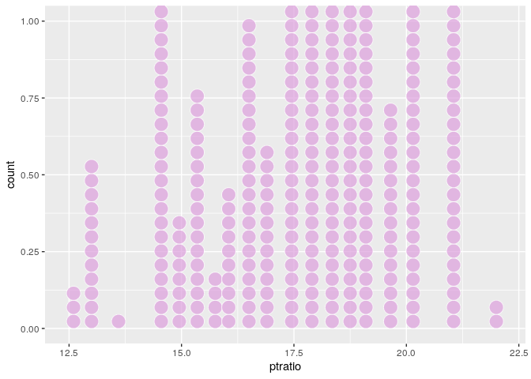

There are some suburbs with high crime rate, with some suburbs being as high as 88.98, 73.53, but with many super low also (.00632). I know sometimes per capita is multiplied by 100k so that its not really small, but for there to be towns with .0063 percent, I feel like this is not the case, so this seems to be a pretty large range, to go from almost 0 to 80.

There are five suburbs with tax rates of 711, but there are a bunch of suburbs where the tax is 666. However past that, there is a big gap between the next suburbs, and then theres a lot of variation once you hit the 460~ mark. I would say this range is pretty large. The property tax from 711-187 is a pretty different level of standard of living.

For pupil teacher ratio, I wouldnt say there are any suburbs with especially high ratios, the highest are at 22, and then it pretty gradually drops down to 12.5. I don't really think that range for this is that high either.. The difference between a 20 kid classroom and a 12 isnt that bad.

#### Exercise 5

``` r
sum(Boston1$chas)
```

    ## [1] 35

There are 35 suburbs next to the Charles River.

#### Exercise 6

``` r
median(Boston1$ptratio)
```

    ## [1] 19.05

The median pupil teacher ratio is 19.05 students to a teacher

#### Exercise 7

``` r
#medvcor <- function(pred) {
 # correlation <- cor(Boston1$medv, Boston1$pred)
  #return(correlation)
#}

#cor(Boston1$medv, Boston1$crim)
#medvcor(crim)
#not sure why doesnt work

cor(Boston1$medv, Boston1$crim)
```

    ## [1] -0.3883046

``` r
cor(Boston1$medv, Boston1$zn)
```

    ## [1] 0.3604453

``` r
cor(Boston1$medv, Boston1$indus)
```

    ## [1] -0.4837252

``` r
cor(Boston1$medv, Boston1$chas)
```

    ## [1] 0.1752602

``` r
cor(Boston1$medv, Boston1$nox)
```

    ## [1] -0.4273208

``` r
cor(Boston1$medv, Boston1$rad)
```

    ## [1] -0.3816262

``` r
cor(Boston1$medv, Boston1$age)
```

    ## [1] -0.3769546

``` r
cor(Boston1$medv, Boston1$dis)
```

    ## [1] 0.2499287

``` r
cor(Boston1$medv, Boston1$rad)
```

    ## [1] -0.3816262

``` r
cor(Boston1$medv, Boston1$tax)
```

    ## [1] -0.4685359

``` r
cor(Boston1$medv, Boston1$ptratio)
```

    ## [1] -0.5077867

``` r
cor(Boston1$medv, Boston1$black)
```

    ## [1] 0.3334608

``` r
cor(Boston1$medv, Boston1$lstat)
```

    ## [1] -0.7376627

The model's response would be the median value of the home of a suburb. Our inputs would be the values of the suburb's different variables: crim, zn, indus, nox, rad, age, dis, tax, ptratio, black, and lstat. I wouldnt include whether they are next to the Charles River or if the Distance from employment centers because the strength of the relationship between median homevalue and these variables are not as powerful when compared to the others.
